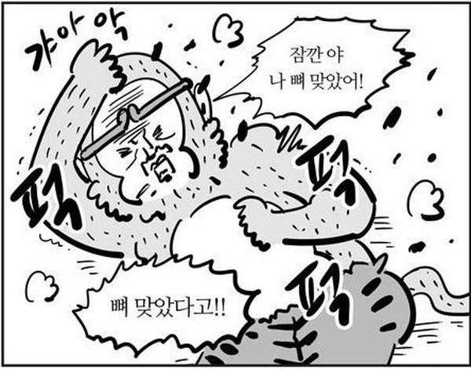

<br>

## 📓 독서후기

**「클린코드」** 1 ~ 4장 독서 후기

- 1장. 깨끗한 코드
- 2장. 의미 있는 이름
- 3장. 함수
- 4장. 주석

<br>
<br>

어떤 개발 언어를 사용하느냐 혹은 직무가 어떻느냐와 관여없이 개발자라면 필히 읽어봐야한다는 바이블 같은 책을 드디어 읽게 되었다.

부끄러운 얘기지만 개발 서적 한권을 온전하게 A-Z 완독해본적이 없다. 😥

실제로 몇몇 책들은 필요하거나 흥미로운 부분만 읽은 다음 내팽겨치고 모니터 받침대로 쓰이곤했고, ~~(이건 그나마 형편이 낫다.)~~ 일부 책들은 책장을 열심히 장식하는데에만 힘을 쏟고 있는 중이다.

스스로 반성하는 의미로 "혼나는 기분"을 돈 주고 경험할 수 있을 수 있는 **「클린코드」** 서적을 선택해서 읽어보려한다.

<br>
<br>

### 1. 깨끗한 코드

---

이 장에서 기억에 남는 문구를 꼽자면 아래의 문장을 꼽을 것 같다.

<br>

> <center>"깨끗한 코드는 잘 쓴 문장처럼 읽혀야한다."</center>

<br>
<br>

사실 머리로는 아는데 참 적용하기 힘들다.

2주만 지나도 아니, 금요일에 짠 코드를 주말을 보내고 월요일 출근 후 다시 살펴 볼 때에도 잘 안 읽힐 ~~(내가 짠 코드인데..)~~ 때가 있다.

그런 상황을 마주했을 때 보통 두가지 분기로 나눠진다.

<br>

1. "이 부분은 나중에 리팩토링 하도록 하고 우선 서비스 개발에 집중하자."

   - 써내려간 코드의 길이가 길고 서비스 로직상 중요한 부분인 경우.. 그나마 낫다. ~~(생각이라도 한다.)~~

2. 무념무상 😳

   

<br>
<br>

급하게 생각의 흐름대로 만들어낸 내 코드들이 일으키는 불협화음 때문에 잘 쓴 문장처럼 읽히기는 커녕 외국어 서적을 보는 기분을 느끼게한다. ~~(그리고 보통 저러한 코드들로 인해 각종 버그들이 유발된다.)~~

단순히 일정을 탓하며 내 코드의 퀄리티를 포기하기보다는 이러한 잘못된 코드로 인한 서비스의 위험성을 동료에게 공유하고 관리자에게 이해시키며 일정에 휘둘려서 코드 품질을 포기하는 수동적인 자세보다는 **「클린코드」** 를 지키기 위한 자세를 가져야겠다라는 생각을했다.

<br>
<br>

### 2. 의미 있는 이름

---

이 장에서 기억에 남는 문구를 꼽자면 아래의 문장을 꼽을 것 같다.

<br>

> <center>"좋은 이름을 지으려면 시간이 걸리지만 좋은 이름으로 절약하는 시간이 훨씬 더 많다."</center>

<br>
<br>

여긴 너무 공감이 쉽게 되었다.

실제로 업무시간 나의 크롬 탭에서 <a href="https://papago.naver.com/" target="_blank">PAPAGO</a>와 <a href="https://translate.google.co.kr/?hl=ko" target="_blank">구글 번역기</a>는 항상 꺼지지 않는 탭이다.

변수를 짓거나 메서드 명을 짓는데에는 실제로 많은 고민을 하고 있으며, 고민이 길어질 때에는 동료에게 "변수 작명 이슈(?)"를 공유해서 민주주의적인 절차를 거쳐 선정하고 있다.

네이밍 부분은 이미 잘(~~그나마~~) 하고 있다 생각하지만, 책에서 제시하는 디테일한 부분들 또한 참고하기 좋아서 몇가지만 나열해보려한다.

- 클래스명은 명사 혹은 명사구로 구성하자.

- 메서드명은 동사로 구성하자.

  > 특히 메서드명 앞에는 get(접근자) / set(변경자) / is(조건자)등의 접두사가 자주 쓰인다.

- 기발한 이름은 피하자.
  > "성명"을 "성"과 "이름" 두가지 변수로 구분해야한다면..
  >
  > 성을 `name1` 이름을 `name2` 으로 짓는 기발한(?) 행위는 피하자. `firstName / lastName`이라는 좋은 선택지가 있다.

<br>

프로그래밍 영역에서 좋은 이름을 선택하는 과정은 회화 영역에서는 "묘사를 잘한다." 사진 영역에서는 "구도를 잘 잡는다." 와 비슷하다 느껴진다.

개발을 잘하고와 못하고와는 무관하게 사실 이런 좋은 이름을 선택하는 능력을 기르는건 어려운 일이라 느껴진다.

대신 **"충분히 고민했다!"** 라는 진심은 느껴지게 끔 이름을 짓는 습관은 들여보도록하겠다.

<br>
<br>

### 3. 함수

---

이 장에서 기억에 남는 문구를 꼽자면 아래의 문장을 꼽을 것 같다.

<br>

> <center>"함수는 한 가지를 잘해야 한다. 그리고 그 한 가지를 잘 해야 한다."</center>

<br>
<br>

위 문장을 택한 이유를 한가지만 말해보라하면..

**"코드가 길어지고 여러 기능이 묶여서 깊이가 깊어질 수록 버그가 숨어들 공간이 많아진다."** 라는 이유를 말할것 같다.

그리고 해결책을 말해보라하면..

첫째 규칙은 **'작게!'** 둘째도 **'작게!'** 기능 단위로 코드를 함수로 묶은 뒤, 그 함수를 유닛 테스트등을 통해 각각의 부분들이 정확하게 동작하는지 확인해야 한다라고 말할것 같다.

<br>
<br>

나는 저자가 쓴 3장의 목적을 인지는 하고 있다.. ~~(실천을 안할 뿐)~~

깊히 반성을하고 다음 장으로 읽어내려갔다.

<br>
<br>

### 4. 주석

---

주석 부분은 새벽에 혼자 피식피식 웃으며 읽어내려갔다.

재밌고 잘 읽혀서도 있지만 **"어쩜 이렇게 정곡을 찌르지?"** 라는 감정 때문에 읽는 내내 실소가 나왔다.

이 장에서 기억에 남는 문구를 꼽자면 아래의 문장을 꼽을 것 같다. ~~(이번에는 인용문이다.)~~

<br>

> <center>"나쁜 코드에 주석을 달지마라. 새로 짜라"</center>
>
> <center>브라이언 W. 커니핸, P.J 플라우거</center>

<br>
<br>



<br>

개인적으로 주석을 잘 다는건 당연히 좋은 습관이라 생각했는데, 그보다 더 중요한건 좋은 코드를 먼저 쓰는거다.

위 1 ~ 3장에서 제시한 원칙대로 잘 지켰다고 가정을 해보자.

**"문장처럼 잘 읽히는 코드로 짜여진 의미있는 이름을 가진 작은 함수들로 채워진 아름다운 모듈"** 이 있다면, 덕지덕지 주석이 과연 필요할까?라는 생각이 든다.

그동안 "습관성 주석 증후군(?)" 마냥 달아온 주석들이 창피해졌다.

내일부터 불필요한 주석을 다는데 시간을 할애하기보다는 **근본적인 본질(깨끗한 코드, 의미 있는 네이밍, 기능 단위로 작게 쪼개진 함수)** 에 노력을 쌀알 한톨 만큼이라도 더 써보도록 실천해봐야겠다.

<br>
<br>

```toc

```
