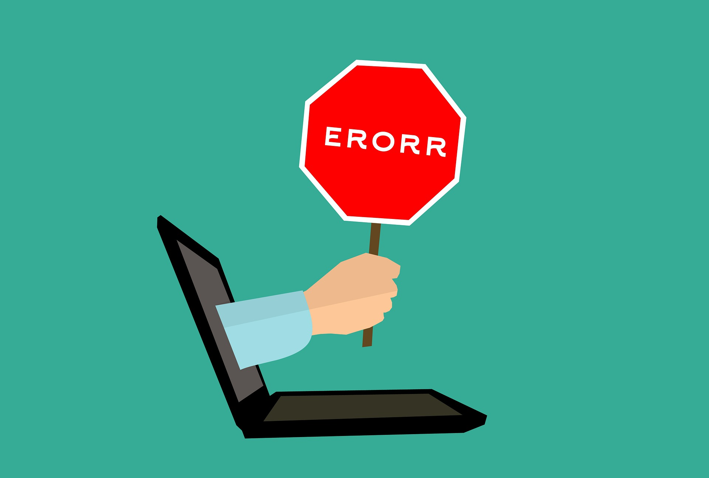

<br>

## 📓 독서후기

---

**「클린코드」** 5 ~ 8장 독서 후기

- 5장. 형식 맞추기
- 6장. 객체와 자료 구조
- 7장. 오류 처리
- 8장. 경계

<br>
<br>

1주일에 4장씩 읽기가 목표이며 읽은 후기를 블로그에 후기로 정리까지 해보려한다.

이번주는 5장 **「형식 맞추기」** ~ 8장 **「경계」** 까지 읽은 후기를 간략히 남겨보았다.

<br>
<br>

### 5. 형식 맞추기

---

주요 토픽은 프로그래머라면 형식을 깔끔하게 맞춰 코드를 짜야한다는 내용이다.

<br>

> <center>"형식에 답은 없다. 팀으로 일한다면 팀이 합의해 모두가 따를 수 있는 형식을 정하고 실천해야한다."</center>

<br>
<br>

전적으로 동의한다. 그래야 소프트웨어가 일관적인 스타일을 보인다.

이번 장에서는 "행 길이", "빈 행 구분", "들여쓰기" 등 코드 컨벤션(관리하기 쉬운 코드를 작성하기 위한 일종의 코딩 스타일 규약)을 주로 언급한다.

사실 이 부분은 요즘은 IDE에서 제공하는 익스텐션(자바스크립트 환경에서의 ESLint, Prettier 등등)의 설정 파일을 공유하는 것 만으로 팀의 코딩 컨벤션을 맞출 수 있는 등 너무나 편리한 도구들이 제공되고 있다.

이미 실천하고 있는 부분이기 때문에 가볍게 읽고 넘어갔다.

<br>
<br>

### 6. 객체와 자료 구조

---

이 장에서는 자료 구조로 알맞은 클래스를 구성할 때 절차지향적인 코드와 객체 지향 코드와의 차이점을 언급한다.

경우에 따라 다른 자료구조를 선택야 함을 알려주며, 항상 복잡한 자료구조가 정답이 아님을 언급한다.

때로는 단순한 자료 구조와 절차적인 코드가 가장 적합할 수 있으며, 이를 구분할 줄 알아야한다는 사실을 강조한다.

<br>

> <center>"분별 있는 프로그래머는 모든 것이 객체라는 생각이 미신임을 잘 안다. 때로는 단순한 자료 구조와 절차적인 코드가 가장 적합한 상황도 있다."</center>

<br>
<br>

따라서 시스템을 구현할 때, 새료운 **자료 타입**을 추가하는 유연성(객체가 적합)이 필요할 지, 새로운 **동작**을 추가하는 유연성(자료 구조와 절차적인 코드가 적합)이 필요한지 판단 후 최적인 해결책을 선택해야한다고 언급한다.

책을 읽는 도중 현재 내가 가장 많이 쓰고 있는 자료 구조(DTO)에 대한 언급이 있어 ~~반가워서..~~ 정리를 한번 하고 다음장으로 넘어가겠다.

<br>
<br>

#### 6-1. 자료 전달 객체 (DTO)

---

자료 구조체란 변수만 있고 함수가 없는 특징이 있는 클래스를 일컫는다.

자료 구조체는 목적이 분명하므로 자료 전달 객체(Data Transfer Object, **DTO**)라 한다.

- DTO는 가공되지 않은 정보를 코드에서 사용할 객체로 변환하는 단계에서 가장 처음으로 사용하는 구조체이다.

<br>
<br>

### 7. 오류 처리

---

이 장에서 기억에 남는 문구를 꼽자면 아래의 문장을 꼽을 것 같다.

<br>

> <center>"뭔가 잘 못될 가능성은 늘 존재한다."</center>

<br>
<br>

책에는 예외를 지원하지 않는 프로그래밍에 대한 언어부터 설명을 이어가지만, 현재 예외 처리 기법은 상당히 다양해졌으며 내가 쓰고 있는 **NestJS** 프레임워크에서는 예외를 내장 레이어(프로그래머가 예외 처리를 하지 않아도 자동으로 해당 레이어에서 처리됨)로 구분하여 자동으로 처리를하고 있다.

> 참고: <a href="https://docs.nestjs.com/exception-filters" target="_blank">NestJS xception-filters</a>

<br>
<br>



<br>
<br>

에러를 그대로 노출시키지 않게 처리하는 과정인 오류 처리는 개발자에겐 당연한 소양이라 생각한다.

이 책에서 또한 에러는 try-catch문 처럼 프로그램 논리와 오류 처리를 분리해 독자적인 사안으로 고려해야 튼튼하고 깨끗한 코드를 작성할 수 있음을 다시한번 강조한다.

<br>
<br>

### 8. 경계

---

챕터 제목만 보고는 무슨 내용인지 감이 잘 안잡혔다. ~~(경계..?)~~

읽고 나니 외부 라이브러리 등 외부 코드를 우리 코드에 녹여내는 과정 중 주의해야 할 점을 언급했다.

<br>

> <center>"외부 코드를 익히기는 어렵다. 외부 코드를 통합하기는 더욱 어렵다. 두 가지를 동시에 하기는 두배 이상 어렵다."</center>

<br>
<br>

즉, 이 챕터를 읽고 느낀점은 "외부 코드(패키지 등)는 통제하기 어렵다."라는 결론이다.

따라서 개발자는 통제할 수 있는 영역을 구분해야하며 **경계에 위치하는 코드**는 깔끔히 분리해야한다.

우리는 외부 패키지를 세세하게 모두 알아야 할 필요는 없다.

통제가 불가능한 외부 패키지를 고려하기 보다는 우리 코드에 의존해서 시스템을 설계해야한다 강조한다.

<br>
<br>

```toc

```
