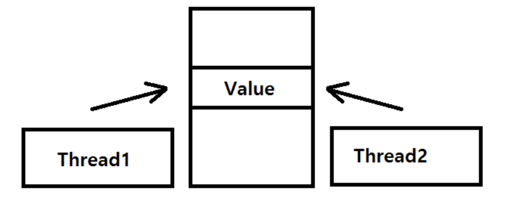

<br>

## 📓 독서후기

---

**「클린코드」** 13 ~ 17장 독서 후기

- 13장. 동시성
- 14장. 점진적인 개선
- 15장. JUnit 들여다보기
- 16장. SerialDate 리팩터링
- 17장. 냄새와 휴리스틱

<br>
<br>

1주일에 4장씩 읽기가 목표이며 읽은 후기를 블로그에 후기로 정리까지 해보려한다.

이번주는 13장 **「동시성」** ~ 17장 **「냄새와 휴리스틱」** 까지 읽은 후기를 간략히 남겨보았다.<br>
사실상 정규 챕터는 오늘로써 모두 읽었다! 👏👏👏

다음주에는 부록까지 ~~(다 읽을 수 있을진 모르겠다..)~~ 모두 읽고난 뒤 완독 후기를 남기는게 목표이다.

<br>
<br>

### 13. 동시성

---

이번장은 **"동시성"** 이 무엇인지에 대해서 설명하는 장이다.

무엇(What)과 언제(When)을 분리하는 것.<br>
동시성은 즉, **결합**을 없애는 전략이다.

동시성은 잘못 개발할 시 큰 난관을 겪는다. 예를 들면 객체 하나를 공유한 후 동일 필드를 수정하던 두 스레드가 서로 간섭하는 경우 예상할 수 없는 에러가 발생하기도 한다.

이러한 문제를 해결하기 위해 **임계영역** 을 최대한 줄여야하며, 자료를 캡슐화하라 권장한다.

<br>



> Value라는 한가지 값에 접근하는 두개의 Thread로 인해 예상할 수 없는 에러가 발생할 수 있다.

<br>

이번 **"동시성"** 챕터에서는 해당 문제를 해결하기 위한 많은 방법론 ~~(너무 많은 방법을 제시하기에 생략..)~~ 을 제시한다.

내가 쓰는 프레임워크인 Node.js는 기본적으로 단일 스레드라 알고 있었기때문에, 멀티 스레드에서 발생할 수 있는 이런 경우를 프로그래밍 단계에서 고민해본적이 없다.

이 장을 읽고 Node.js 환경에서 "동시성" 처리에 대해서 찾아보니 결국 JavaScript 엔진 레벨에서만 싱글 스레드 기반이라는 점을 알았고, 브라우저 레벨과 Node.js 레벨에서 동시성을 처리해준다는 사실을 어렴풋이 알았다. ~~(공부를 조금더 해봐야겠다.)~~

<br>
<br>

### 14. 점진적인 개선

---

이 장은 한가지 사실만을 강조한다.

<br>

> <center>"깨끗하고 우아한 프로그램을 한 방에 뚝딱 내놓으리라 기대하지 않는다."</center>

<br>
<br>

기본적 소양에 대한 내용을 다시 강조하는 장이다.

점진적으로 나아지는 코드 블럭을 가져와서 아주 자세히 그리고 명확히 설명해준다.

초기 기획에 가까운 코드를 테스트 코드를 기준으로 리팩토링하는 과정을 보여주었다. (관심사 분리!)

그저 돌아가는 코드에 만족하지 말고 끊임없이 개선을 하려 노력해야겠다.

<br>
<br>

```toc

```
