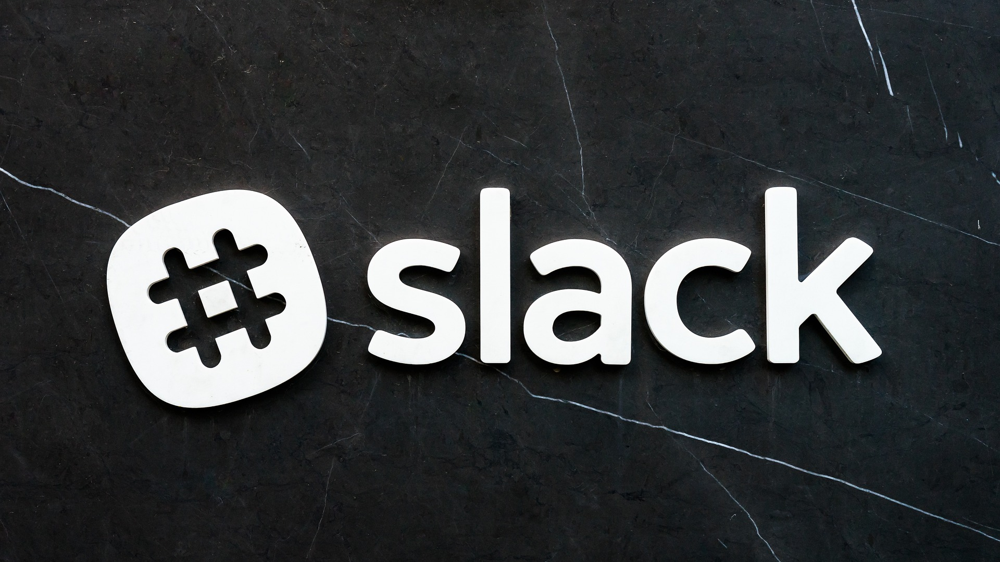

<br>

## 슬랙 앱(봇)이란 🤔?

현재 사내 메신저는 슬랙을 사용하고 있다. 여러 이유로 슬랙을 사용하지만 다른 메신저와 차별화된 큰 강점중 하나는 서드파티 앱(슬랙 앱)을 통한 확장성이라 생각한다.

별도 앱을 사용하면 메신저를 통해 발생한 특정 액션을 외부 서비스 혹은 DB에 전달을 할 수 있으며, 반대로 외부에서 발생한 이벤트를 메신저 내부로 가져올 수도 있다.

참고로 현재 우리팀에서 자주 사용 중인 슬랙 앱은 아래와 같다.

- <a href="https://insahr.slack.com/apps/A04E6JX41-polly?tab=more_info" target="_blank">Polly</a>: 투표 기능을 가진 슬랙 앱
- <a href="https://insahr.slack.com/apps/A0HFW7MR6-simple-poll?tab=more_info" target="_blank">Simple Poll</a>: 간단한 서베이 기능을 가진 슬랙 앱
- <a href="https://insahr.slack.com/apps/A2RPP3NFR-jira-cloud?tab=more_info" target="_blank">Jira Cloud</a>: 지라 ISSUE 알림 슬랙 앱

기타 기재한 외부에서 개발된 슬랙 앱들을 업무 효율 증진 ~~및 점심식사 메뉴 추천(??)~~ 용도로 잘 활용중이다.

<br>
<br>

### 1. 개발 목적

#### 1-1. 사내 도서 히스토리 추적의 어려움

---

이번 도서관 앱을 개발한 가장 큰 이유는 <strong>"히스토리 관리"</strong>이다. 이것이 가장 큰 이유이자 앱 개발을 시작한 근본적인 이유이다.

사내 복지 중 훌륭한 복지라 생각하는 직원 역량 강화를 위한 도서 지원을 사용하려면, 우선 원하는 책이 사내에 이미 존재하고 있는지 확인 후 없다면 구매 신청을 해야한다.

원하는 책이 사내에 존재하는지 확인하려면 일일히 찾아야 하는 불편함이 있었다.

<br>


<center>표시된 곳에 도서가 우선 있는지 부터 확인해야하는 불편함..😮‍💨</center><br>

또한 도서가 존재하는지 확인을 했더라도 <strong>"도서 대출 관리 대장"</strong>을 수기로 적어가며 도서를 대여 & 반납하던 구조였다.

- 수기로 적는 도서 대출 관리 시스템의 한계상 도서를 대여했으나 깜빡하고 적지 않는 문제라던지, 반납을 하지 않고 수중에 도서를 지니고 있는 직원의 사례가 너무도 많았다. (~~원하는 도서를 빌리러 모든 직원에게 수소문을 해야하는 상황!!..~~ 다시 겪고 싶지 않았다.)

이를 해결하기 위해, 혼자 업무 시간외에 사이드 프로젝트를 시작하다보니 애초에 무겁게 여러가지 기능을 지닌 앱을 만들 생각은 없었으며, 위 불편함을 해소하기 위한 간단한 기능(조회 / 대여 / 반납 / 미납알림)을 지닌 슬랙 앱을 개발하고자 기획하였다.

<br>
<br>

#### 1-2. 비개발자를 위한 업무 자동화

---

도서 관리는 개발팀의 업무가 당연히 아니다.

따라서, 비개발자인 경영지원팀이 스스로 도서를 추가하고 관리 할 수 있도록 노션을 DB 저장소로 활용하는 방안을 생각했다.

<br>

슬랙 앱을 통해 노션에 기재된 DB를 활용하여 도서 목록을 불러오고, 해당 DB의 상태를 업데이트(대여 상태 & 반납 상태)하여 도서를 관리하는 기능과 신규 도서 구매를 신청할 수 있는 기능을 구현할 생각이었다.

노션 DB에 우선 사내에 있는 도서를 모두 등록해보았다.

- 99개의 도서가 등록되었으며, 그동안 얼마나 히스토리 관리가 어려웠는지 다시 깨닳을 수 있었다.

  <br>

  <br>

<br>
<br>

### 2. 개발 과정 중 문제점

#### 2-1. Notion API

---

생각보다 <a href="https://developers.notion.com/docs/getting-started" target="_blank">공식문서</a>는 친절하였으며 필요한 개발에 필요한 기능은 충분히 제공하였다.

다만, 개발을 모두 마친 뒤 뒤 늦게 깨닳은점은 **"응답속도가 느리다."** 였다.

- 슬랙 앱은 타임아웃이 3초이다. <a href="https://api.slack.com/interactivity/slash-commands#responding_to_a_command" target="_blank">공식문서</a>에 기재된 내용이다. ~~너무 늦게 알아챘다.~~

결론부터 얘기하면 노션 DB 저장소에 도서가 많아지다보니 종종 응답값을 가져오는데 3초 이상의 시간을 소모해버리므로 슬랙 앱에서는 타임아웃 에러를 겪고 있다.

아래와 같이 <strong>"⚠️ 네트워크 환경으로 일시적인 오류가 발생했습니다..."</strong> 라는 예외 메시지처리는 해두었으나 어디까지나 임시조치이다.

<br>

우선 오늘 5월 1일이 슬랙 도서관 앱 출시를 약속한 마감일자이기 때문에 수정은 못하였으나, 추후 1순위로 리팩토링 대상이다.

<br>
<br>

#### 2-2. Slack API

---

`Express` 프레임워크에 지원되는 <strong>Slack Bolt</strong>라는 외부 라이브러리를 사용하였다. 슬랙 API <a href="https://slack.dev/bolt-js/concepts" target="_blank">공식문서</a>에서도 권장하는 라이브러리였으며 사용하며 큰 이슈는 없었다.

`NestJS`를 주로 사용하고 있었기때문에 `Express`를 사용하며 겪은 너무나도 자유료운 어색함(?)외에는 개발 과정에서 큰 어려움은 없었다.

<br>
<br>

### 3. 결과

---

우선 출시 후 부족한 슬랙 앱이지만, 임직원 분들이 잘 사용해주고 계신다. 🙇‍♂️

<br>

다만 위에서 언급했던 노션 API와 슬랙 API 간의 속도 문제는 Redis를 물릴까 생각중이다.

  <br>

혼자서 기획을 주도하고 개발까지 완료하여 출시한 서비스는 처음이다. 물론 타임아웃 및 기술적인 이슈들이 아직 많기에 해결해 나가야할게 많지만 임직원들의 적극적인 QA로 하나씩 고쳐나가 볼 예정이다.

<br>
<br>

```toc

```
