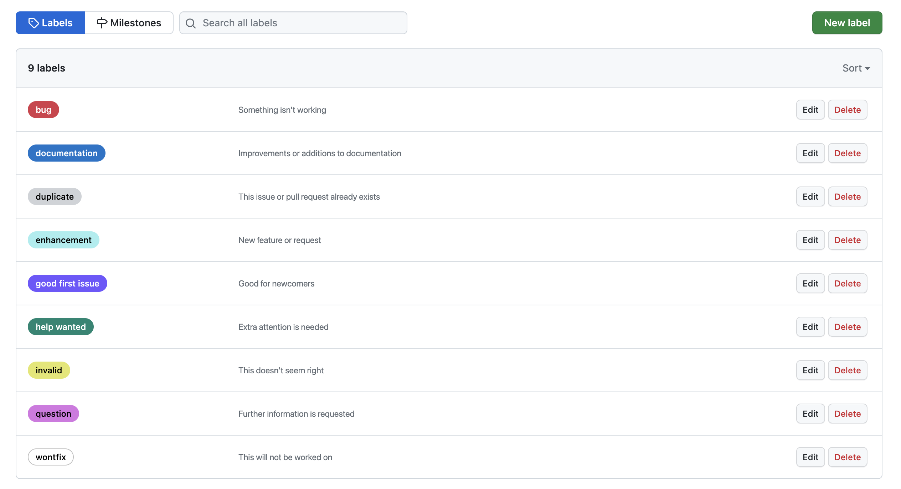
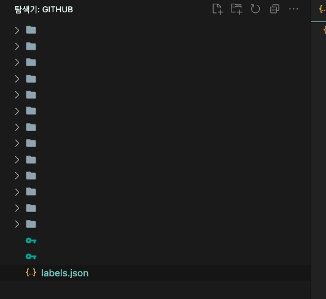
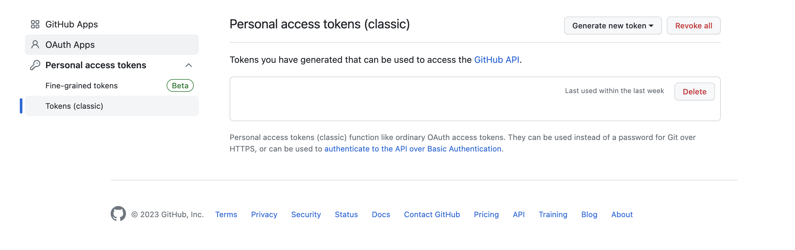
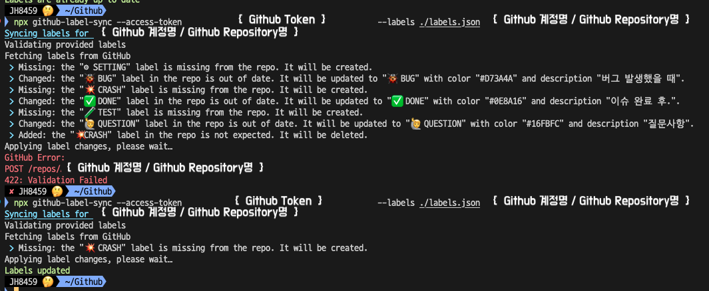

<br>

## ✍️ **T**oday **I** **L**earned

<br>

- Repository를 생성할때 마다 생기는 기본값 Github ISSUE Label.. ~~(일단 참 못생김..!!)~~

  

  해당 Label을 실제로 사용하기엔 조금 부족하고.. 결정적으로 이쁘지 않다!!

  원하는 Label 기본값을 Template으로 관리하고 개인 & 팀 Repository에 적용하는 방법을 블로그에 남겨보려한다.

<br>
<br>

### 1. 준비물

---


- 아주 간단하다. 2가지만 준비하면된다.

  ✅ 라벨을 관리할 .json 파일<br>
  ✅ Github Access Token

  <br>
  <br>

1. 우선 .json 파일을 준비하자. (로컬 저장소에서 관리를해야한다.)

   필자는 Github Repository를 보관하는 로컬 폴더 최상단에 **labels.json** 파일로 생성하였다.

   

   양식은 다음과 같이 작성하였다.

    <br>
    <br>

   ```json
   [
     {
       "name": "⚙️ SETTING",
       "color": "#756675",
       "description": "설정값 변경"
     },
     {
       "name": "📦 NPM",
       "color": "#42113B",
       "description": "패키지 설치"
     },
     {
       "name": "🐞 BUG",
       "color": "#D73A4A",
       "description": "버그 발생했을 때"
     },
     {
       "name": "🔥 HOT FIX",
       "color": "#F5501E",
       "description": "버그 수정 완료 후"
     },
     {
       "name": "💥 CRASH",
       "color": "#531BFA",
       "description": "병합 충돌"
     },
     {
       "name": "🏃 IN PROGRESS",
       "color": "#D93F0B",
       "description": "이슈 작업 진행시"
     },
     {
       "name": "✅ DONE",
       "color": "#0E8A16",
       "description": "이슈 완료 후."
     },
     {
       "name": "🚜 REFACTOR",
       "color": "#84ED36",
       "description": "거 갈아엎기 딱 좋은 날씨네"
     },
     {
       "name": "😎 DEPLOY",
       "color": "#D806D8",
       "description": "배포"
     },
     {
       "name": "🧪 TEST",
       "color": "#3FABBB",
       "description": "테스트"
     },
     {
       "name": "🙋 QUESTION",
       "color": "#16FBFC",
       "description": "질문사항"
     }
   ]
   ```

   <br>
   <br>

2. 그리고 Github Access Token을 발급받아야한다.

   Github Develper Settings(https://github.com/settings/apps) 페이지로 접근해서 Personal access tokens 탭으로 접근해서 토큰을 발급받아주자.

   

   <br>

   > 위 토큰 권한을 토대로 원격 Repository에 접근하여 ISSUE Label을 덮어 씌어준다!
   >
   > 따라서 팀 Repository의 ISSUE Label을 변경하고 싶다면 해당 팀 Repository의 수정 권한을 얻는게 우선이다!

   <br>

   해당 발급받은 토큰은 잘 **복사**해 두자!

<br>
<br>

### 2. labels.json Template 적용하기

---

- 위 두가지 준비물이 준비되었다면 ISSUE Label을 덮어 씌우는 작업은 너무나도 간단하다.

  **labes.json**이 위치한 디렉토리로 이동 후 터미널에 아래 명령어를 입력해주면 곧바로 적용이 완료된다.

  ```
  npx github-label-sync --access-token {Github Token} --labels ./labels.json {Github 계정명/Repository 이름}
  ```

  예를 들면 아래와 같이 입력해주면 적용이 바로 된다.

  ```
  npx github-label-sync --access-token ghp_토큰값을붙혀넣기해주세요 --labels ./labels.json JH8459/REPOSITORY-EXAMPLE
  ```

  <br>
  <br>

  

<br>
<br>

## 🤔 Understanding

- 매번 Repository를 만들때마다 ISSUE Label 설정을 만지작거리다 열받아서 여기저기 찾아보고 내 로컬에 셋팅을 해두었다.

  팀 Notion에 해당 방법 공유 후 이참에 Label convention도 맞춰볼까 생각중이다.. ~~(.json Template을 하나로 통일하면 편하지 않을까!?)~~

  자고로 개발자라면 반복작업과는 거리가 멀어야하지 않을까라는 생각으로 찾아보았는데 어렵지 않은 방법으로 해결이 된 듯하다.

<br>
<br>

```toc

```
