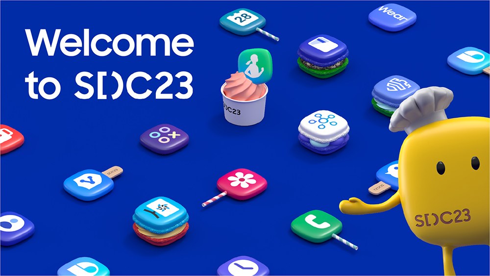
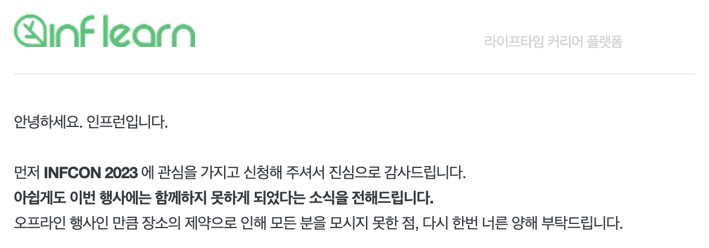
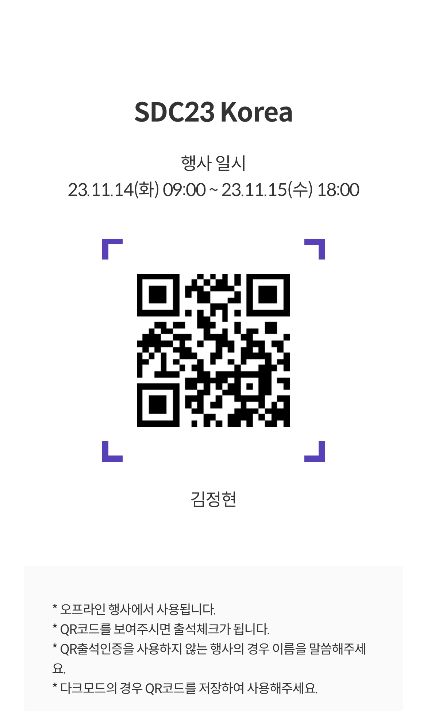
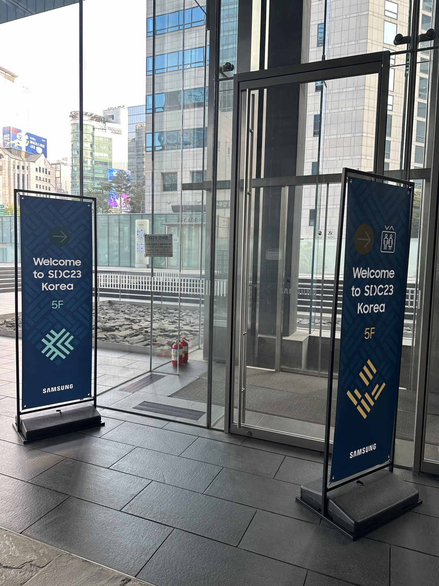
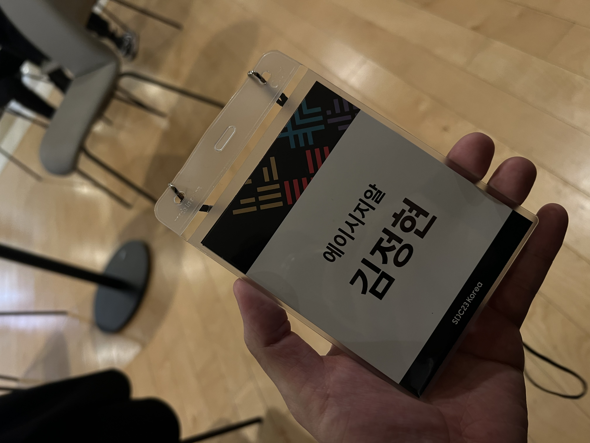
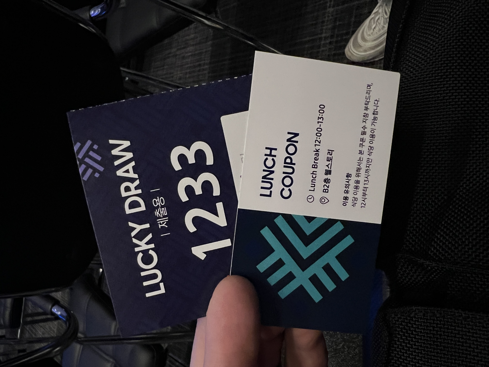
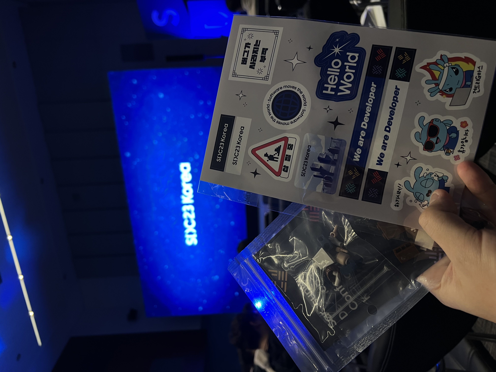
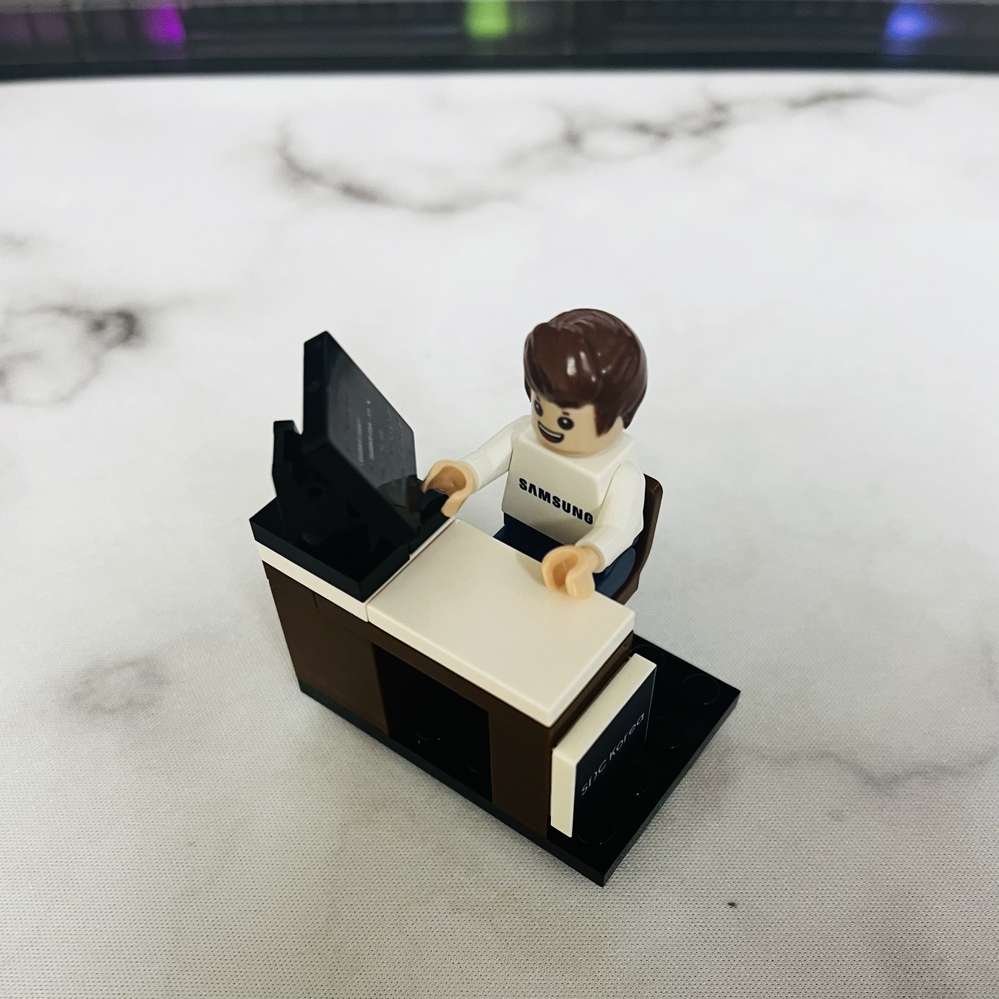
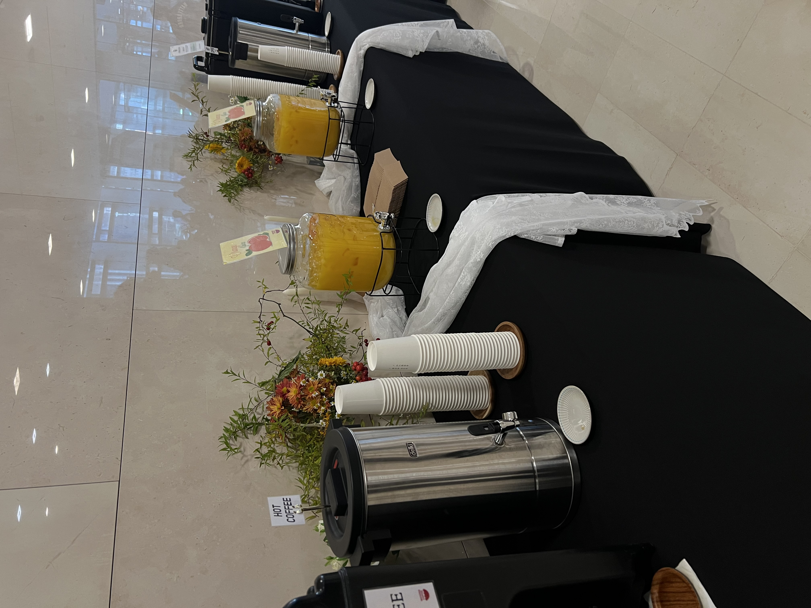
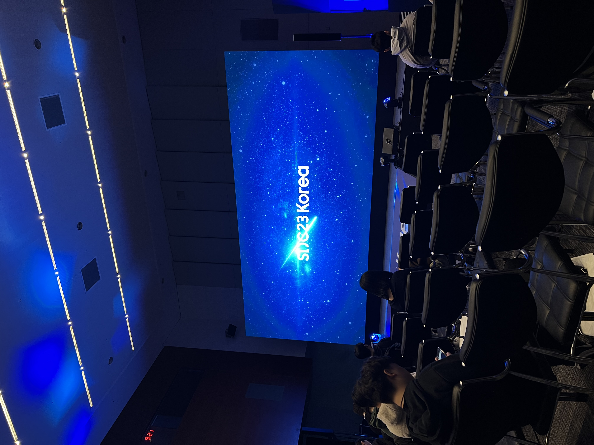

<br>

## 🤔 SDC23 Korea (삼성 개발자 컨퍼런스)

---

- 개발 관련 오프라인 컨퍼런스 참석을 올 한해동안 수차례 지원하였으나. 끊임없이 탈락하였다..

  <br>

  

  <br>

  <center><b>특히 인프콘!!.. 너무 가고 싶었는데..</b></center>

  <br>

- 그러던 중 10월 중순 쯤 팀원이 공유해준 **SDC23 삼성 개발자 컨퍼런스**가 눈에 띄었다.

  (사전등록 참여자 링크 → https://www.sdc-korea.com/registration)

  대단한게 추첨제가 아닌, 신청한 인원 전원이 오프라인 / 온라인으로 동시 운영(역시 국내 최고의 기업..)이 된다는 점이 너무 신선하게 다가왔다.

- 사전등록 Benefit으로는 웰컴키트 제공 + 사전에 입장 QR코드를 먼저 제공 받았다.

  

<br>
<br>

## 행사장

---

- 강남역 8번출구쪽으로 가다보면 삼성전자 서초사옥이 나온다.

  컨퍼런스 행사장 위치는 삼성전자 서초사옥 5F 다목적홀에 위치하였었으며, 강남역 8번 출구로 오면 행사장 안내 입간판을 너무나도 쉽고 많이 찾을 수 있었다.

    <br>

  

    <br>

  컨퍼런스 행사장 내부는 너무나도 깔끔한 강연장이었다.

  미리 지급받은 사전등록 입장 QR코드로 간편하게 입장을 진행하였으며, 소속과 이름이 적힌 네임택과 경품 추첨 응모권 그리고 무려 점심식사 식권(!?)도 함께 지급받았다.

  <br>

  |  |  |
  | ------------------------------- | --------------------------------------- |

  <br>

- 사전등록 Benefit으로 받은 웰컴키트에는 간단한 펜 / 노트 / 개발자(?) 스티커 / 레고 굿즈 총 4개로 구성된 주머니를 받았다.

  <br>

  |  |  |
  | --------------------------- | ------------------------- |

  <br>

  <center>굿즈 퀄리티도 상당히 훌륭해서 만족스러웠다 👏👏👏</center>

  <br>

- 그리고 행사장 내부에는 Session이 진행되는 강연장 외에도 하드웨어 관련 (삼성헬스, SmartThings 등등..) 기술 전시부스가 상시로 운영되고 있었으며, 간단한 음료가 제공되는 서빙바가 있었다.

<br>



<br>

<center>👏👏👏</center>

<br>

- SDC23의 각 Session들은 2개의 트랙으로 나뉘어 운영되었다.

  같은 시간에 시작하는 서로 다른 트랙의 두개의 Session이 각각의 강연장에서 운영되며 원하는 Session을 선택해서 듣는 구조로 운영되었다.

  다소 아쉬운점은 아무래도 발표주제에 따라 너무 전문분야 Session(Ex. 의료 분야 기술)과 대중적인 기술 관련 Session이 동시간대에 구성이 되면 한 쪽 강연장으로 너무 인원이 몰려 앉을 자리는 커녕 서서 듣기도 어려운 상황이 종종 발생되었다.

  사전 등록 후 일찍 도착한 우리는 다행히 듣고 싶은 Session이 오전 타임엔 Track1에 연달아 구성되어 있어서 좋은 자리에 앉아서 질 좋은 강연을 듣게 되었다.

  <br>

  

  <br>

<br>
<br>

## Sessions - 오전

---

- (작성중)

<br>
<br>

## Sessions - 오후

---

- (작성중)

<br>
<br>

## 후기

---

- (작성중)

<br>
<br>

```toc

```
