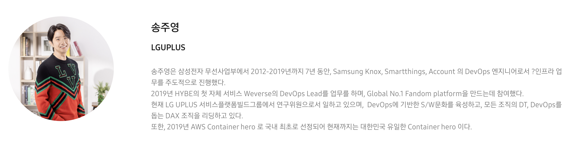
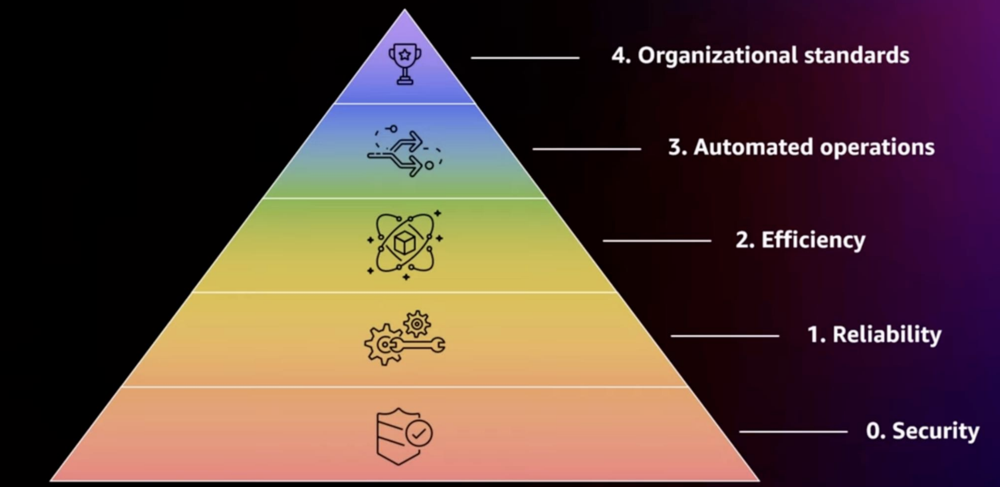
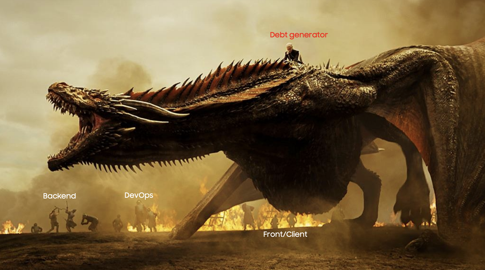
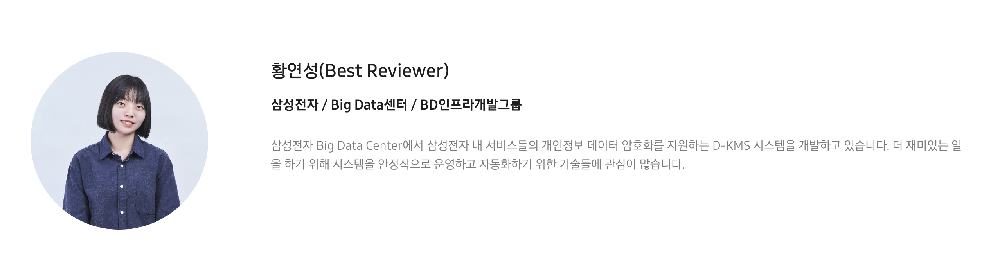
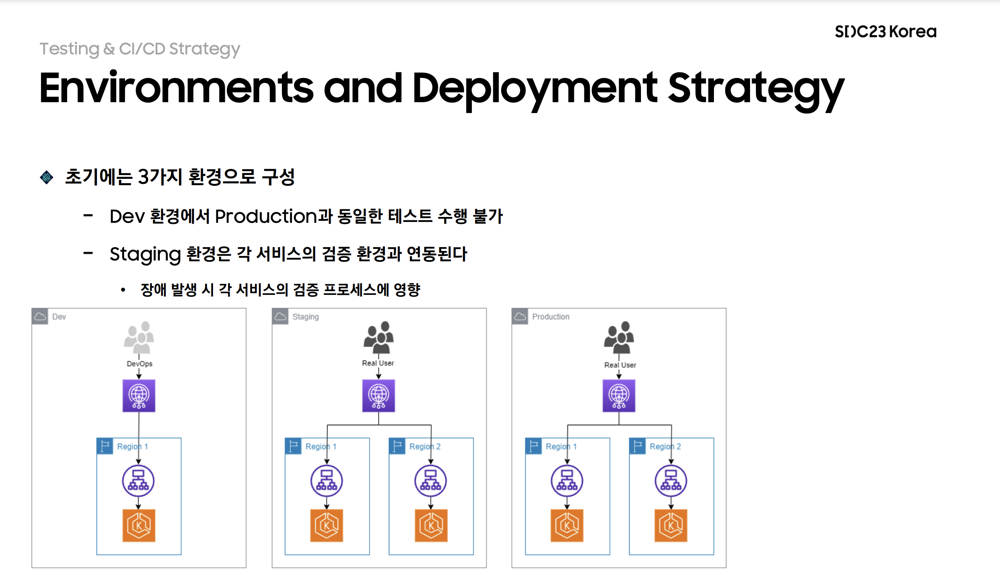
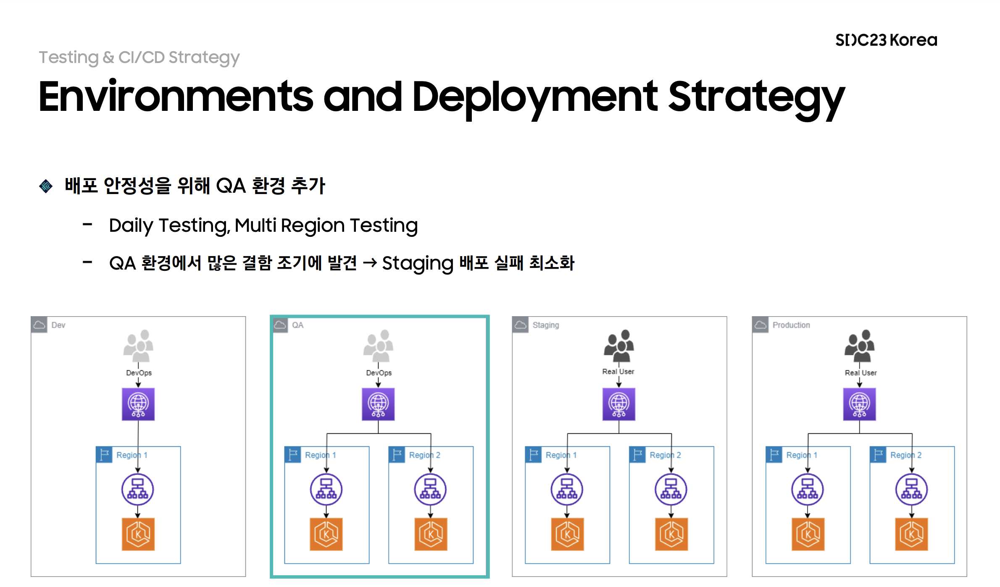

<br>

## 🤔 SDC23 Korea (삼성 개발자 컨퍼런스)

---

- 개발 관련 오프라인 컨퍼런스 참석을 올 한해동안 수차례 지원하였으나. 끊임없이 탈락하였다..

  <br>

  

  <br>

  <center><b>특히 인프콘!!.. 너무 가고 싶었는데..</b></center>

  <br>

- 그러던 중 10월 중순 쯤 팀원이 공유해준 **SDC23 삼성 개발자 컨퍼런스**가 눈에 띄었다.

  (사전등록 참여자 링크 → https://www.sdc-korea.com/registration)

  대단한게 추첨제가 아닌, 신청한 인원 전원이 오프라인 / 온라인으로 동시 운영(역시 국내 최고의 기업..)이 된다는 점이 너무 신선하게 다가왔다.

- 사전등록 Benefit으로는 웰컴키트 제공 + 사전에 입장 QR코드를 먼저 제공 받았다.

  

<br>
<br>

## 행사장

---

- 강남역 8번출구쪽으로 가다보면 삼성전자 서초사옥이 나온다.

  컨퍼런스 행사장 위치는 삼성전자 서초사옥 5F 다목적홀에 위치하였었으며, 강남역 8번 출구로 오면 행사장 안내 입간판을 너무나도 쉽고 많이 찾을 수 있었다.

    <br>

  

    <br>

  컨퍼런스 행사장 내부는 너무나도 깔끔한 강연장이었다.

  미리 지급받은 사전등록 입장 QR코드로 간편하게 입장을 진행하였으며, 소속과 이름이 적힌 네임택과 경품 추첨 응모권 그리고 무려 점심식사 식권(!?)도 함께 지급받았다.

  <br>

  |  |  |
  | ------------------------------- | --------------------------------------- |

  <br>

- 사전등록 Benefit으로 받은 웰컴키트에는 간단한 필기구 / 노트 / 개발자(?) 스티커 / 레고 블럭 굿즈로 구성된 주머니를 받았다.

  <br>

  |  |  |
  | --------------------------- | ------------------------- |

  <br>

  <center>굿즈 퀄리티도 상당히 훌륭해서 만족스러웠다 👏👏👏</center>

  <br>

- 그리고 행사장 내부에는 Session이 진행되는 강연장 외에도 하드웨어 관련 (삼성헬스, SmartThings 등등..) 기술 전시부스가 상시로 운영되고 있었으며, 간단한 음료가 제공되는 서빙바가 있었다.

<br>


<br>

<center>👏👏👏</center>

<br>

- SDC23의 각 Session들은 2개의 트랙으로 나뉘어 운영되었다.

  같은 시간에 시작하는 서로 다른 트랙의 두개의 Session이 각각의 강연장에서 운영되며 원하는 Session을 선택해서 듣는 구조로 운영되었다.

  다소 아쉬운점은 아무래도 발표주제에 따라 너무 전문 분야 Session(Ex. 의료 분야 기술)과 대중적인 기술 관련 Session이 동시간대에 구성이 되면 한 쪽 강연장으로 너무 인원이 몰려 앉을 자리는 커녕 서서 듣기도 어려운 상황이 종종 발생되었다.

  <br>
  <center><del>사람이 너무 몰린 Session은 입장조차 하질 못했다. 😂</del></center>
  <br>

  사전 등록 후 일찍 도착한 우리는 다행히 듣고 싶은 Session이 오전 타임엔 Track1에 연달아 구성되어 있어서 좋은 자리에 앉아서 질 좋은 강연을 듣게 되었다.

  <br>

  

  <br>

<br>
<br>

## Sessions - 오전

---

- 오전에는 **Track 1** 강연장에서 진행하는 3개의 Session을 연달아 들었다.

  순서대로 진행된 Session을 나열하면 다음과 같다.

  <br>

  > **23.12.2(토)** VOD 다시보기가 열린다하니 관심있으신 분은 링크를 통해 수강이 가능합니다! 🥲

  <br>

  1. <a href="https://www.sdc-korea.com/session/SN2023100900055" target="_blank">DevOps Acceleration : 엔터프라이즈에서 동작하는 DevOps 모델</a>

  2. <a href="https://www.sdc-korea.com/session/SN2023100900054" target="_blank">언제나 Samsung Account는 소리없이 움직인다 : 대규모 트래픽속에서 무중단 클라우드 인프라 업그레이드 아키텍처 소개 및 경험기</a>

  3. <a href="https://www.sdc-korea.com/session/SN2023100900033" target="_blank">Agile에 안정성을 담기 위한 CI/CD 전략</a> ⭐️

  <br>

  ⭐️를 표기한 Session은 너무도 유익하고 재밌게 들어서 ~(지극히 주관적입니다.)~ 다시보기 VOD가 나오면 다시한번 듣고자 표시를 해두었다.

  오전에 들은 각 Session 중 인상 깊었던 Session만 추려서 간단히 이번 포스팅에 적어보려 한다.

<br>
<br>

### DevOps Acceleration : 엔터프라이즈에서 동작하는 DevOps 모델

---



- LG UPLUS 송주영님(대단하신 분이다!.. Google에 "Devops 송주영" 키워드만으로도 알아볼 수 있다.)의 연사로 컨퍼런스는 시작되었다.

  <br>
  <center>👉 <a href="https://www.sdc-korea.com/session/SN2023100900055" target="_blank">SDC23 해당 Session 바로가기</a></center>
  <br>

  위 링크를 통해 들어가면 **발표자료**도 공개되어 있다.

  <br>
  <br>

- 이번 Session의 주된 내용은 엔터프라이즈급(조직 구성원수 10,000명 이상) 기업의 문제점을 꼽아주셨다.

  그 중 가장 크게 작용하는 요인으로는 올바른 방향성과 역량을 가진 리더의 중요성을 두번 세번 강조하셨다.

  

  <br>

  위 사진은 서비스가 만들어지기까지 차곡차곡 쌓여야하는 원칙이다.

  1. Security (보안성)
  2. Reliability (신뢰성)
  3. Efficiency (효율성)
  4. Automated operation (자동화)
  5. Organizational standards (표준화)

  <br>

  **"위 순서를 지키지 않는 기업의 서비스는 망가질 수 밖에 없다"** 라는 말에 크게 공감하였다.

  특히 잘못된 리더일수록 위 원칙을 거꾸로 수행하려하는 사람이 많다라는 말에 너무도 공감하였다.

  <br>
  <br>

- 위 원칙을 지키지 않을 수록 **"기술 부채"** 는 쌓여갈 수 밖에 없으며, 이는 엔지니어의 생산성 저하로 이어져 서비스의 퍼포먼스가 우 하향할 수 밖에 없는 구조이다.

  

  <br>

  따라서 모범이 되고 증명할 수 있는 모범이 되는 리더의 필요성을 말씀하셨다.

  <br>
  <br>

- 투명한 조직 또한 강조하였는데 여기서 말하는 투명성은 조직 문화였다.

  - 디자인 된 문서로 업무 진행 내역을 누구나 볼 수 있게 시각화해야 한다. ⭐️
  - 항상 모든 내용을 측정하고, 축적해야하며 투명하게 공개해야한다.⭐️⭐️
  - 평가 또한 공정하고 일관된 기준으로 성과를 평가해야 한다.

  투명성 관련하여 언급해주신 내용은 위 3개가 주된 내용이었으며, 공감하는만큼 ⭐️를 달아보았다.

  <br>

  실제로 개발 직무로 1년반 가량을 지내보며 느낀건 시각화하지 않고 방치된 업무 내용 혹은 서비스는 도태될 수 밖에 없다고 절실히 느끼고 있다.

  <center><b>"코드만 잘 짜면되지 않아?"</b></center><br>

  라고 말하기엔, 논리적인 순서로 도식화된 문서가 쌓인 서비스와 그렇지 않은 서비스는 하늘과 땅차이라 생각한다.

  축적된 체계잡힌 문서들은 개개인 혹은 팀의 큰 자산이 될 수 밖에 없다.

  <br>
  <br>

  그리고 가장 인상깊게 들은 점은 **"측정"** 과 **"축적"** 키워드였다.

  측정하지 않은 건 아무것도 아니며, 축적하지 않은건 버려진 것이다라 말씀해주셨다.

  <br>
  <center><del>사실 좀 뼈아팠다. 😂</del></center>
  <br>

  바쁘단 핑계로 측정을 미루고 의미 없을거라 마음대로 재단하여 버려진 무수히 많은 실패 경험들도 떠오르고.. 내 자신을 많이 뒤돌아 보게한 연사였다.

  첫번째 Session인 만큼 훌륭한 분이 나와 좋은 경험담(삼성페이 서비스 장애 발생 경험담도 너무 재밌게 들었다. 👍)과 더불어 훌륭한 리더의 덕목 그리고 주니어 개발자로써 해야할 기본 소양까지 모두 버릴게 없는 구성이었다.

<br>
<br>

### Agile에 안정성을 담기 위한 CI/CD 전략

---



- 다음으로 기억남는 건 세번째 Session이다.

  삼성전자 Big Data 센터의 황연성님이 발표를 해주셨다.

  사실 해당 Session은 너무나도 많은 개념을 배웠기 때문에 감사했다. VOD가 나오면 다시한번 꼭 돌려 볼 예정이다.

  <br>
  <center>👉 <a href="https://www.sdc-korea.com/session/SN2023100900033" target="_blank">SDC23 해당 Session 바로가기</a></center>
  <br>

  위 링크를 통해 들어가면 **발표자료**도 공개되어 있다.

  <br>
  <br>

- D-KMS(Data Key Management System)를 담당하는 팀 소속이셨다.

  너무도 훌륭한 팀이고 대단한 서비스임이 분명했지만, 사실 이런 이유들 때문이 아니라 사실 첫번째 Session에서 중요하다 꼽은 **"측정"** 키워드를 어떻게 해나가야 하는지 명확한 방향을 제시해주셨다.

  <br>

- 삼성전자 Big Data 센터에서 사용하는 빠르고 장애가 적은 CI/CD 전략을 투명하게 공개해주셨다.

  배포 전략에 사용한 도구와 측정 툴들을 가감없이 공개해서 보여주셨으며, 이는 우리 팀에서도 적용이 가능한지 다시한번 VOD를 보며 검토해보고 싶다.

  특히나 실제 Prodiction 레벨까지 가는 배포 환경에 대해서 무척 강조하셨다.

  <br>

  

  

  <br>

  Dev(개발 환경)레벨과 Production(운영 환경)레벨은 보통 다르게 구성되어있다.

  개발 환경에서의 테스트와 운영 환경에서의 테스트가 동일하다 확신할 수 있는 기업은 단 한곳도 없을 것이다.

  > 실제로 우리 팀도 .env 환경 변수가 다르다는 이유로 장애도 경험해보았다.

  <br>

  이런 경험을 축적해온 선배 개발자들의 실무 사례를 너무도 자세하게 간접 경험할 수 있었으며, 더 나아가 해당 ISSUE를 어떻게 극복해 냈는지 투명하게 들을 수 있었던 너무도 좋은 Session 이었다. 👏👏👏

  위에 꼽은 두 Session은 사실 일맥상통하였다.

  <center><b>"측정"</b> 그리고 <b>"축적"</b></center><br>

  - 측정하지 않은 것은 개선할 수 없다.

  - 또한, 축적하지 않으면 학습할 수 없다.

  <br>

  다시 한번 포스팅을 남기는 지금도 마음에 새기고 또 새겨야겠다.

<br>
<br>

## Sessions - 오후

---

- (작성중)

<br>
<br>

## 후기

---

- (작성중)

<br>
<br>

```toc

```
