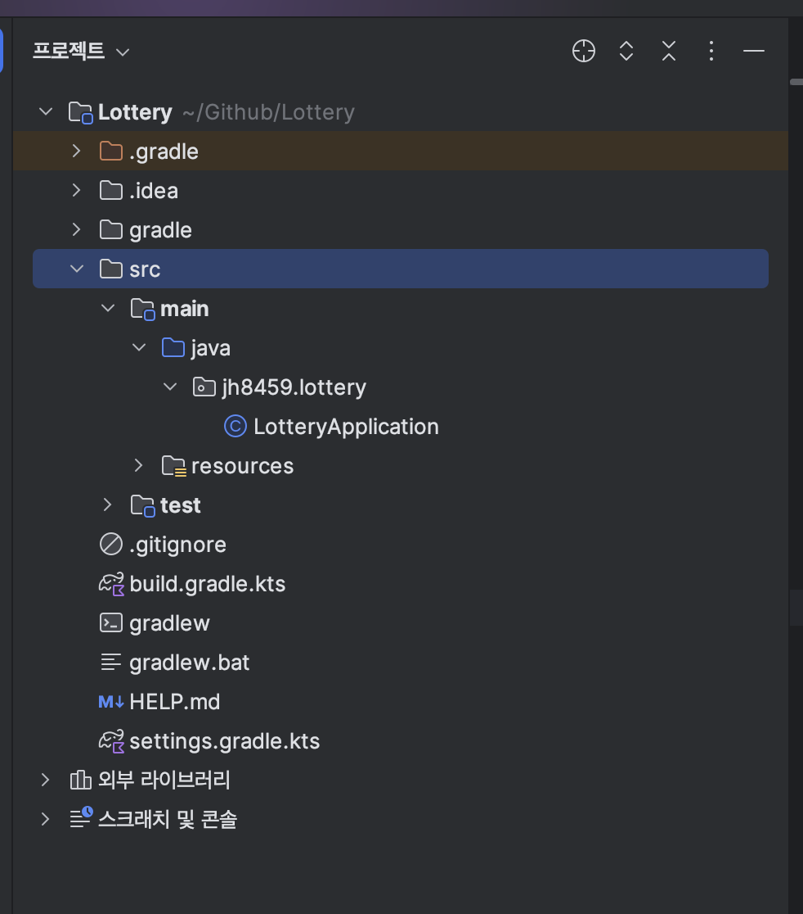
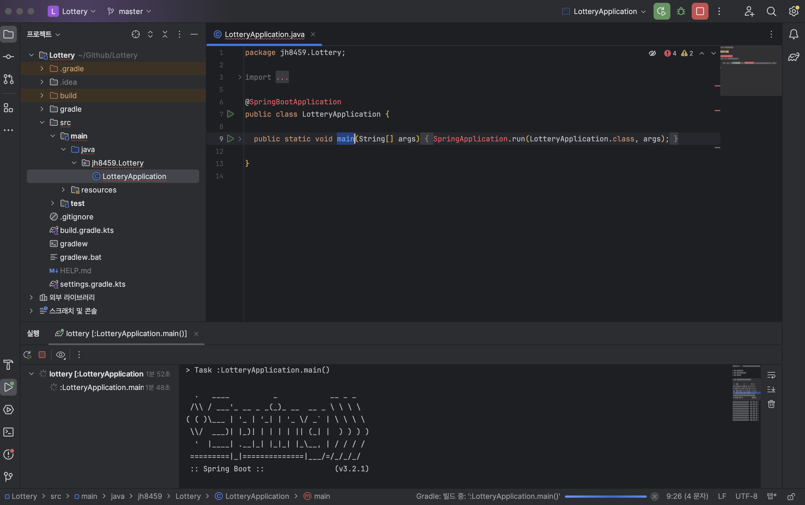
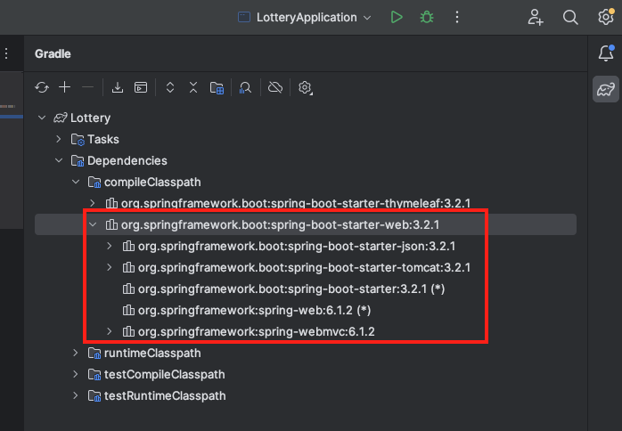
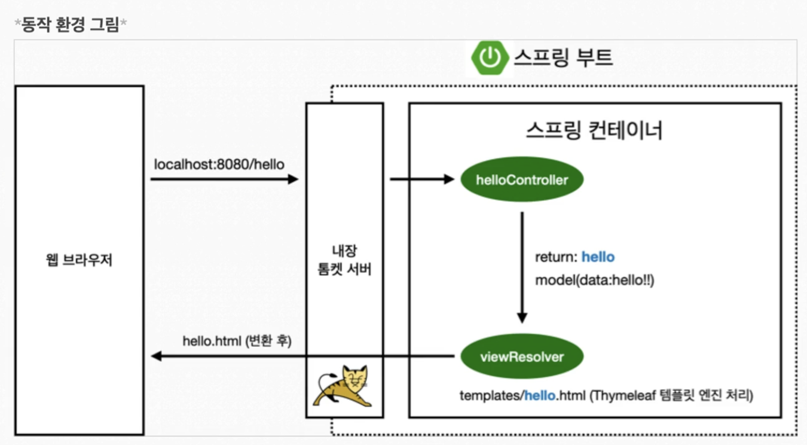
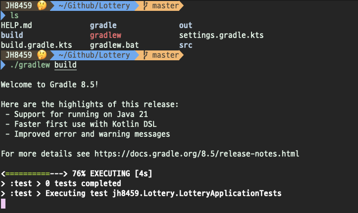
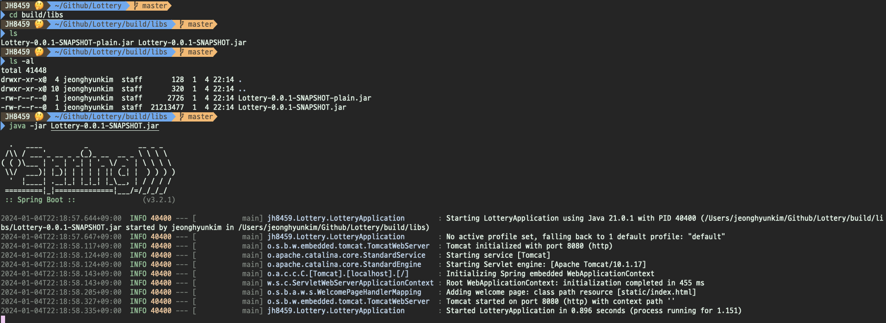

<br>

## ✍️ **T**oday **I** **L**earned

---

<br>

- 미루고 미뤄왔던 Java 언어 공부 ~~(알고리즘 풀이를 Java로 선택하여 공부 대체중..)~~ 와 Spring Frame Work에 대한 공부를 해보려한다.

  

  우선 가장 대중적인 강의를 선택하였다.

  > <a href="https://www.inflearn.com/course/%EC%8A%A4%ED%94%84%EB%A7%81-%EC%9E%85%EB%AC%B8-%EC%8A%A4%ED%94%84%EB%A7%81%EB%B6%80%ED%8A%B8" target="_blank">인프런 - 스프링 입문 - 코드로 배우는 스프링 부트, 웹 MVC, DB 접근 기술 [김영한]</a>

  <br>

  

  작성일(2023.12.06) 기준 5530개의 수강평과 별점이 무려 5.0(!?)이나 되는 명강의로. 백엔드 주니어 개발자들의 필독 강의이자 스테디셀러로 이미 유명하다.

<br>
<br>

### 1. 프로젝트 환경설정

---

- 우선 프로젝트 환경설정에 앞서서 사전 준비물을 구성해주어야한다.
  - Java: **Java 21 LTS (23.12.06 기준)**
  - IDE: **IntelliJ**

  위 두가지 개발 도구들을 미리 설치하고 강의 수강을 진행하자.

  <br>

- 우선 Java를 선행해서 설치해 주어야 한다. 강의에서는 11버전을 언급하였으나, [강의자료]를 참조하면 자바 17 이상을 사용해달라 권고한다.

  17 버전은 공식문서에 따르면 2024년 9월까지 업데이트 지원이 예정되어있으며, 21 버전은 2026년 9월까지 업데이트 지원이 예정되어 있었다.

  이왕이면 사후관리가 조금 더 긴 21 LTS 버전을 선택하여 <a href="https://www.oracle.com/java/technologies/downloads/#java17" target="_blank">Oracle 공식 홈페이지</a>를 통하여 설치해주었다.

  

  MAC 환경의 유저라면 DMG 설치 마법사 패키지를 통하여 쉽게 설치할 수 있다.

  

  Java 설치 후 `java --version` 명령어를 통해 설치 여부를 확인해주자.

  <br>

- IDE는 <a href="https://www.jetbrains.com/ko-kr/idea/download/?section=mac" target="_blank">IntelliJ 공식 홈페이지</a>를 통하여 설치해주었다.

  

  **Community Edition**을 설치해주어야 무료로 사용 가능하니 이점 참고해서 설치를 해주자.


  <br>
  <br>

#### 1-1. 프로젝트 생성

---

- 기본 개발 환경이 구성되었다면, 🔗 <a href="https://start.spring.io/" target="_blank">Spring Boot 스타터 사이트</a>를 통해 아래와 같은 세팅으로 프로젝트를 생성해준다.

  

  - **Project: Gradle - Kotlin**

    > 🔗 https://github.com/gradle/gradle 참조
    > 
    > Gradle 은 빌드 자동화 및 다국어 개발 지원에 중점을 둔 빌드 도구입니다.
    > 어떤 플랫폼에서든 소프트웨어를 구축, 테스트, 게시 및 배포하는 경우 Gradle은 코드 컴파일 및 패키징부터 웹 사이트 게시까지 전체 개발 수명주기를 지원할 수 있는 유연한 모델을 제공합니다.
    >
    > Gradle은 Java, Scala, Android, Kotlin, C/C++, Groovy를 포함한 여러 언어 및 플랫폼에서 빌드 자동화를 지원하도록 설계되었으며 Eclipse, IntelliJ, Jenkins를 포함한 개발 도구 및 지속적인 통합 서버와 긴밀하게 통합됩니다.

    Gradle을 선택한 뒤 Groovy / Kotlin는 크게 중요하지 않은 듯 하다.

    다만, Kotlin을 사용시 추후 확장성(?)에서 조금 유리하지 않을까 싶어서 선택하였다.

  - **Language: Java**

  - **Spring boot: 3.2.1**

    SNAPSHOT은 아직 개발중인 버전이다. 또한, M1등은 아직 정식 릴리즈 버전이 아니므로 괄호로 쌓여있는 버전이 아닌 LTS 버전을 택해주자.

  - **Project Metadata**

    - **Group**: 기업명 등을 적어준다. (개인 프로젝트이므로 깃허브 계정을 적었다.)
    - **Artifact**: Build 결과물. (프로젝트명을 적어주었다.)
    
  - **Dependencies**

    Spring Boot 기반으로 프로젝트 생성시 기본으로 가져올 외부 라이브러리 모음

    - **Spring Web**: Spring MVC 패턴을 가진 RESTful한 웹 서버를 만들때 사용한다.
    - **Thymeleaf**: html 템플릿 엔진이 필요한 경우 사용한다.

  위 설정 세팅 후 **GENERATE** 버튼을 눌러 프로젝트를 생성해준다.

  <br>

- 위 과정을 거쳐 생성된 프로젝트 .zip 파일을 압축을 푼 뒤 IntelliJ에서 열기를 실행해주면 아래와 같은 폴더 구조를 가진 프로젝트가 생성되어있음을 확인할 수 있다.

  

  차례대로 `.idea` 폴더는 IntelliJ 개발 환경에 관련된 폴더이고 `gradle`은 빌드 도구 관련 폴더이다.

  여타 프레임워크와 마찬가지로 `src` 폴더에 주요 소스코드들이 자리잡고있다.

- 이 중 중요한 파일은 `build.gradle.kts` 파일이다.

  ```java
  plugins {
    java
    id("org.springframework.boot") version "3.2.1"
    id("io.spring.dependency-management") version "1.1.4"
  }

  group = "jh8459"
  version = "0.0.1-SNAPSHOT"

  java {
    sourceCompatibility = JavaVersion.VERSION_21
  }

  repositories {
    mavenCentral()
  }

  dependencies {
    implementation("org.springframework.boot:spring-boot-starter-thymeleaf")
    implementation("org.springframework.boot:spring-boot-starter-web")
    testImplementation("org.springframework.boot:spring-boot-starter-test")
  }

  tasks.withType<Test> {
    useJUnitPlatform()
  }
  ```

  Spring Boot를 통해 선택한 여러 설정값들이 위 파일에 모두 녹아있음을 확인 할 수 있다.

- 이 외에 `.gitignore` 등 여러 프로젝트에 필요한 필수 요소 혹은 유용한 파일들이 자동적으로 생성된다.

- `src/main/java` 폴더 안의 프로젝트 파일을 실행해보면 아래와 같은 화면을 확인할 수 있다.

  

  실행 로그를 확인하면 `Tomcat started on port 8080 (http) with context path ''` 라는 문구를 확인할 수 있다.

  

  > Spring Boot에 내장된 tomcat 웹서버가 8080번 포트로 올라갔다라는 의미이므로 localhost:8080 으로 진입하여 Error 페이지를 확인해보자.

  <br>

  정상적으로 Error 페이지가 랜딩된다면 프로젝트 환경 설정은 성공적인 것이다.


  <br>
  <br>

#### 1-2. 라이브러리 살펴보기

---

- Gradle 혹은 Maven 툴을 사용하게 되면 의존 관계에 얽힌 모든 외부 라이브러리들을 자동으로 관리해준다.

  예를 들면 Spring Boot 초기 설정에서 설정한 **Spring Web** 라이브러리에 필요한 의존성 모듈들을 Gradle이 알아서 관리를 해주는 모습을 아래 사진에서 볼 수 있다.

  

  따라서, 아까 실행시 나왔던 `tomcat` 웹 서버가 어떻게 설치되어 실행되었는지 알 수 있다.

  <br>
  <br>

#### 1-3. View 환경설정

---

- Welcome Page를 만들어보았다.

  간단한 뷰만 원한다면 `src/main/resouces/static` 폴더 내부에 정적 파일로 `index.html` 파일을 만들어주면 된다.

  ```html
  <!DOCTYPE HTML>
  <html>
    <head>
      <title>Hello</title>
      <meta https-equiv="Content-Type" content="text/html; charset=UTF-8" />
    </head>
    <body>
      Hello
      <a href="/hello">hello</a>
    </body>
  </html>
  ```

  해당 내용에 대한 설명은 <a href="https://docs.spring.io/spring-boot/docs/current/reference/html/web.html#web.servlet.spring-mvc.welcome-page" target="_blank">Spring.io</a>에 기재되어 있다.

- 단순한 정적 파일이며, hello 문자열을 누르면 `/hello`로 라우팅되는 구조이다.

  <br>

- 하지만 위 내용대로 기재된 페이지는 그저 정적 페이지를 띄운 뒤 라우팅을 하는 것에 불과하기 때문에 프로그래밍이라 보긴 어렵다.
  제대로된 웹 페이지 뷰를 구현하기 위해서는 템플릿 엔진을 사용해야한다.

  우리는 Spring Boot 프로젝트 설정시 **Thymeleaf**라는 외부 라이브러리를 사용하겠다 설정하였다.

  이번 챕터에서는 해당 템플릿 엔진을 통해 동적으로 작동하는 Welcome Page를 만드는게 목적이다.

  <br>

- 우선 `Controller`를 만들어 주었다.

  ```java
  package jh8459.Lottery.controller;

  import org.springframework.stereotype.Controller;
  import org.springframework.ui.Model;
  import org.springframework.web.bind.annotation.GetMapping;

  @Controller
  public class LotteryController {

    @GetMapping("hello")
    public String hello(Model model){
      model.addAttribute("data", "hello!!");

      return "hello";
    }
  }
  ```
  
  그리고 `src/main/resouces/template` 폴더 내부에 아래와 같은 `hello.html` 파일을 만들어 주었다.

  ```html
  <!DOCTYPE HTML>
  <html xmlns:th="http://www.thymeleaf.org">
    <head>
      <title>Hello</title>
      <meta https-equiv="Content-Type" content="text/html; charset=UTF-8" />
    </head>
    <body>
      <p th:text="'안녕하세요. ' + ${data}" >안녕하세요. 손님</p>
    </body>
  </html>
  ```

- 작동 원리는 아래와 같다.

  

  컨트롤러에서 리턴 값으로 문자를 반환하면 `viewResolver`가 화면을 찾아서 처리한다.

  > Spring Boot 템플릿 엔진 기본 `viewName` 매핑 공식은 아래와 같다.
  > 
  > `src/main/resouces/template` + `viewName` + `.html`
  

  <br>
  <br>

#### 1-4. 빌드하고 실행하기

---

- 빌드는 간단하다.

  프로젝트 폴더로 이동한 뒤 `./gradlew build` 명령어를 실행해주면 필요시 라이브러리를 다운로드 받으며 빌드가 실행된다.

  > 빌드가 잘 안되는 경우?
  > 
  > `./gradlew clean build` 명령어를 사용해보자. 기존 build 폴더를 삭제한 뒤 다시 빌드해주는 명령어이다.

  

  <br>

  몇초 기다리면 빌드가 완성되며 `cd build/libs` 명령어로 빌드된 파일을 확인해보면 21MB 가량의 `.jar` 확장자 파일을 확인할 수 있다.

  > **.jar**
  >
  > JAR(Java Archive, 자바 아카이브)는 여러개의 자바 클래스 파일과, 클래스들이 이용하는 관련 리소스(텍스트, 그림 등) 및 메타데이터를 하나의 파일로 모아서 자바 플랫폼에 응용 소프트웨어나 라이브러리를 배포하기 위한 소프트웨어 패키지 파일 포맷이다.

  <br>

  실행을 시켜보면 IDE 도구에서 실행했을 떄와 마찬가지로 8080 포트로 진입이 가능하다.

  

  <br>

- Spring Boot를 이용하면 서버 배포시 여러 과정을 거치지 않고 빌드 결과물인 `.jar` 확장자 파일만 EC2등 서버에 넣어준 뒤 실행시켜주면 간단하게 스프링 기반의 웹 서버를 구동시킬 수 있다.

  <br>
  <br>

### 2. 스프링 웹 개발 기초

---

  <br>
  <br>

#### 2-1. 정적 컨텐츠

---

  <br>
  <br>

#### 2-2. MVC와 템플릿 엔진

---

  <br>
  <br>

#### 2-3. API

---

  <br>
  <br>

### 3. 회원 관리 예제 - 백엔드 개발

---

  <br>
  <br>

#### 3-1. 비즈니스 요구사항 정리

---

  <br>
  <br>

#### 3-2. 회원 도메인과 리포지토리 만들기

---

  <br>
  <br>

#### 3-3. 회원 리포지토리 테스트 케이스 작성

---

  <br>
  <br>

#### 3-4. 회원 서비스 개발

---

  <br>
  <br>

#### 3-5. 회원 서비스 테스트

---

  <br>
  <br>

### 4. 스프링 빈과 의존관계

---

<br>
<br>

#### 4-1. 컴포넌트 스캔과 자동 의존관계 설정

---

  <br>
  <br>

#### 4-2. 자바 코드로 직접 스프링 빈 등록하기

---

  <br>
  <br>

### 5. 회원 관리 예제 - 웹 MVC 개발

---

  <br>
  <br>

#### 5-1. 회원 웹 기능 - 홈 화면 추가

---

  <br>
  <br>

#### 5-2. 회원 웹 기능 - 등록

---

  <br>
  <br>

#### 5-3. 회원 웹 기능 - 조회

---

  <br>
  <br>

### 6. 스프링 DB 접근 기술

---

  <br>
  <br>

#### 6-1. H2 데이터베이스 설치

---

  <br>
  <br>

#### 6-2. 순수 JDBC

---

  <br>
  <br>

#### 6-3. 스프링 통합 테스트

---

  <br>
  <br>

#### 6-4. 스프링 JdbcTemplate

---

  <br>
  <br>

#### 6-5. JPA

---

  <br>
  <br>

#### 6-6. 스프링 데이터 JPA

---

  <br>
  <br>

### 7. AOP

---

  <br>
  <br>

#### 7-1. AOP가 필요한 상황

---

  <br>
  <br>

#### 7-2. AOP 적용

---

  <br>
  <br>

### 8. 다음으로

---

  <br>
  <br>

#### 8-1. 다음으로

---

  <br>
  <br>

## 🤔 Understanding

---

-

<br>
<br>

```toc

```
