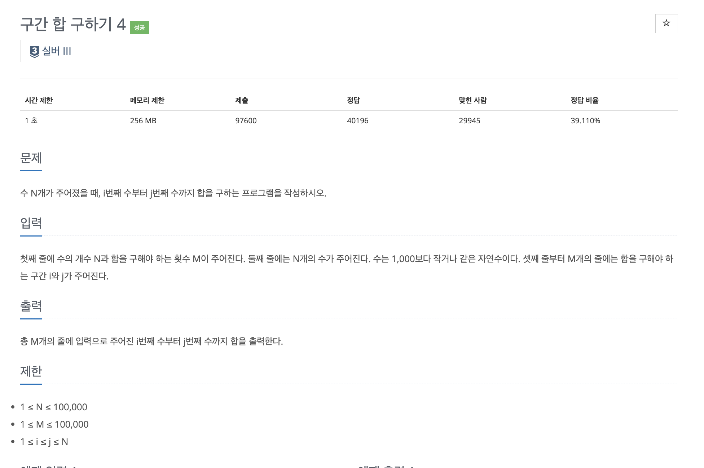
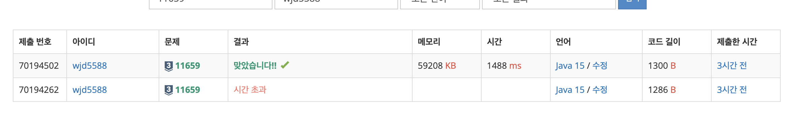

<br>

## ✍️ **T**oday **I** **L**earned

<br>

- 백준 <a href="https://www.acmicpc.net/problem/11659" target="_blank">11659번</a>알고리즘 문제 풀이 과정 중 학습한 내용을 간단히 포스팅으로 남기려한다.

<br>
<br>

### 1. 문제

---



<br>

- 문제의 의도는 간단하다. 시간 제한이 1초 즉, 1억번 이내의 연산을 기준으로 잡고있다.

- 하지만 변수의 범위를 살펴보면 다음과 같다.

  - 1 <= N <= 100,000
  - 1 <= M <= 100,000

  위 범위를 적용해 본다면 최악의 경우라면 아래의 연산 횟수가 나온다.

  > 100,000 X 100,000 = 10,000,000,000(100억)

<br>

- 따라서 구간 합을 미리 구하는 알고리즘을 구현하여 **시간 복잡도**를 최적화해야하는 문제이다.

  <br>
  <br>

#### 1-1. 풀이과정

---

- N개의 수를 입력받음과 동시에 누적 합을 계산하는 배열을 생성하였다.

  ```java
    long[] nSumArr = new long[n + 1]; // 합배열 nSumArr

    String nS = br.readLine(); // 줄에 담긴 수를 받을 문자열

    for (int cnt = 1; cnt <= n; cnt++) {
        int num = Integer.parseInt(nS.split(" ")[cnt - 1]);

        nSumArr[cnt] = nSumArr[cnt - 1] + num;
    }
  ```

  위와 같이 합 배열을 미리 구해 두면, 기존 배열의 일정 범위의 합을 구하는 시간 복잡도가 O(n) => O(1)로 감소하게 된다.

- 그리하여 합배열에 누적시킨 값을 토대로 시작(i) ~ 종료(j) 위치를 받아서 구간 합을 구하는 공식을 세워 문제를 제출하였다.

  ```java
    for (int cnt = 0; cnt < m; cnt++) {
        String ijS = br.readLine();

        int i = Integer.parseInt(ijS.split(" ")[0]); // 시작 위치
        int j = Integer.parseInt(ijS.split(" ")[1]); // 종료 위치

        bw.write(nSumArr[j] - nSumArr[i - 1] + "\n");
    }
  ```

- 완성된 코드는 다음과 같다.

  ```java
    import java.io.*;

    public class Main {
      public static void main(String args[]) throws IOException {
        BufferedReader br = new BufferedReader(new InputStreamReader(System.in));
        BufferedWriter bw = new BufferedWriter(new OutputStreamWriter(System.out));

        String s = br.readLine();

        int n = Integer.parseInt(s.split(" ")[0]); // 줄에 수의 갯수 N
        int m = Integer.parseInt(s.split(" ")[1]); // 합을 구해야 하는 횟수 M

        long[] nSumArr = new long[n + 1]; // 합배열 nSumArr

        String nS = br.readLine(); // 줄에 담긴 수를 받을 문자열

        for (int cnt = 1; cnt <= n; cnt++) {
          int num = Integer.parseInt(nS.split(" ")[cnt - 1]);

          nSumArr[cnt] = nSumArr[cnt - 1] + num;
        }

        for (int cnt = 0; cnt < m; cnt++) {
          String ijS = br.readLine();

          int i = Integer.parseInt(ijS.split(" ")[0]); // 시작 위치
          int j = Integer.parseInt(ijS.split(" ")[1]); // 종료 위치

          bw.write(nSumArr[j] - nSumArr[i - 1] + "\n");
        }

        bw.flush();
      }
    }
  ```

<br>
<br>

#### 1-2. 문제점

---

- 디버깅및 예제 출력도 모두 IDE에서는 가능했지만, 시간 초과로 위 코드는 제출에 실패하였다.

  이유를 찾아보니 시간복잡도가 빡빡한 문제는 BufferReeader로 받은 문자열을 단순 공백을 구분으로 나눌땐 `.split()` 메서드로 처리하면 느리다(?)라는 게시글을 찾았다.

  > <a href="https://blog.naver.com/PostView.nhn?blogId=makga87&logNo=221949199317&parentCategoryNo=&categoryNo=17&viewDate=&isShowPopularPosts=true&from=search" target="_blank">[StringTokenizer VS String.split] 누가 더 빠른가</a>
  >
  > [출처] [StringTokenizer VS String.split] 누가 더 빠른가

<br>

- 짧게 요약하자면 우선 `StringTokenizer`는 레거시이며 `split`을 Java에서는 권장하지만 특정 상황에서는 퍼포먼스 차이가 유의미하게 존재한다.

  위 내용을 토대로 코드를 바꾸어 보았다.

- 변경한 코드는 아래와 같다.

  ```java
    import java.io.*;
    import java.util.*;

    public class Main {
      public static void main(String args[]) throws IOException {
        BufferedReader br = new BufferedReader(new InputStreamReader(System.in));
        StringTokenizer st = new StringTokenizer(br.readLine());

        int n = Integer.parseInt(st.nextToken()); // 줄에 수의 갯수 N
        int m = Integer.parseInt(st.nextToken()); // 합을 구해야 하는 횟수 M

        long[] nSumArr = new long[n + 1]; // 합배열 nSumArr

        st = new StringTokenizer(br.readLine()); // 줄에 담긴 수를 받을 문자열

        for (int cnt = 1; cnt <= n; cnt++) {
            int num = Integer.parseInt(st.nextToken());

            nSumArr[cnt] = nSumArr[cnt - 1] + num;
        }

        for (int cnt = 0; cnt < m; cnt++) {
            st = new StringTokenizer(br.readLine()); // 줄에 담긴 수를 받을 문자열

            int i = Integer.parseInt(st.nextToken()); // 시작 위치
            int j = Integer.parseInt(st.nextToken()); // 종료 위치

            System.out.println(nSumArr[j] - nSumArr[i - 1]);
        }
      }
    }
  ```

  <br>

- 입출력 관련 로직을 변경하니 제출에 성공하였다.

  

<br>
<br>

## 🤔 Understanding

- 연산횟수에 제한이 있는 경우의 문제여서 풀이가 까다로웠다.

  새로운 언어(Java)를 학습하며 알고리즘 풀이를 해나가고 있기 떄문에, 다소 기초적인 (I/O 입출력 관리) 영역에서 시간을 많이 뺏겼다.

- 때로는 레거시가 유효할 수 있다는 사실을 알고나니 공부할 영역이 조금 더.. 넓어진듯하다.

  같은 고민을 하는 개발자들에게 도움이 되고자 포스팅을 남긴다.

<br>
<br>

