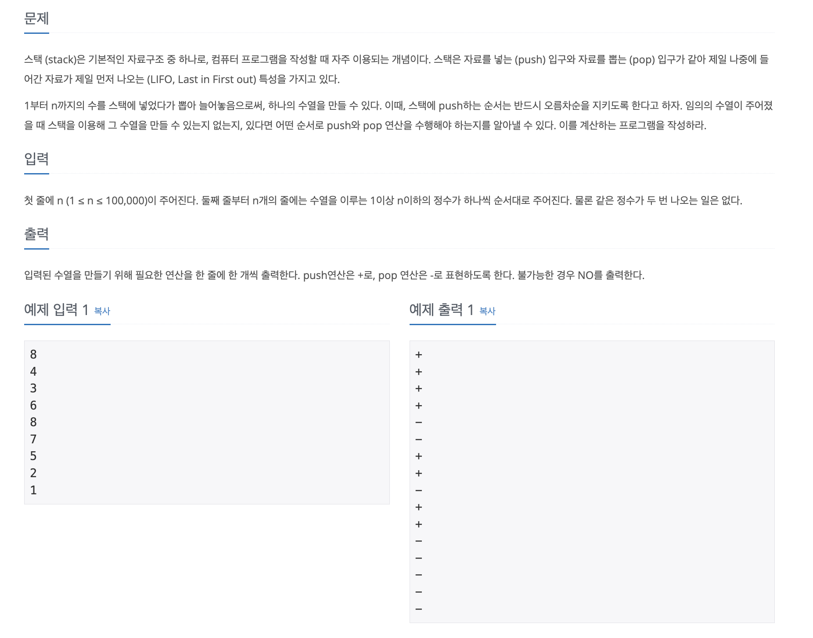
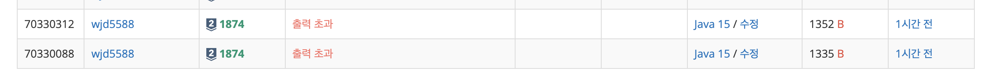
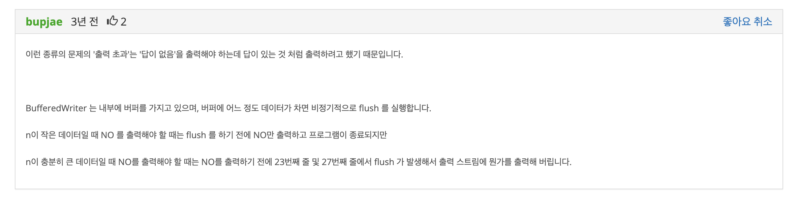

<br>

## ✍️ **T**oday **I** **L**earned

<br>

- 백준 <a href="https://www.acmicpc.net/problem/1874" target="_blank">11659번</a>알고리즘 문제 풀이 과정 중 학습한 내용을 간단히 포스팅으로 남기려한다.

<br>
<br>

### 1. 문제

---



<br>

- 알고리즘은 간단하다. 

  스택을 구현 한 뒤 스택에 담긴 값을 토대로 "-", "+" 그리고 불가능한 경우엔 "NO" 중 알맞은 CASE 대로 출력하면 된다.

- 하지만 수의 갯수인 N의 범위를 살펴보면 다음과 같다.

  - 1 <= N <= 100,000

  이 문제의 걸림돌은 알고리즘 구현이 아닌, Java `BufferedWriter` 사용법이었다.


  <br>
  <br>

#### 1-1. 풀이과정

---

- 우선 풀이과정을 설명하자면, 스택의 원리를 정확하게 알고 있는지를 묻는 문제이다.

  스택 자료구조의 특징(후입선출)과 pop, push 연산만 알고있다면 쉽게 풀어낼 수 있다.

  완성한 코드는 아래와 같다.

  ```java
    public static void main(String args[]) throws IOException {
      BufferedReader br = new BufferedReader(new InputStreamReader(System.in));
      BufferedWriter bw = new BufferedWriter(new OutputStreamWriter(System.out));
      StringTokenizer st = new StringTokenizer(br.readLine());

      int n = Integer.parseInt(st.nextToken()); // n개의 수
      int[] nArr = new int[n];

      for (int i = 0; i < n; i++) {
        st = new StringTokenizer(br.readLine());
        nArr[i] = Integer.parseInt(st.nextToken());
      }

      Stack<Integer> stack = new Stack<>(); // stack 선언

      int num = 1;
      boolean isPossible = true;  // 불가능 경우를 판단하는 변수

      for (int i = 0; i < n; i++) {
        int target = nArr[i];

        if (target >= num) {
          while (target >= num) {
            stack.push(num++);
            bw.write("+\n");
          }

          stack.pop();
          bw.write("-\n");
        } else {
          int temp = stack.pop();

          if (temp > target) {
            System.out.println("NO");
            isPossible = false;
            break;
          } else {
            bw.write("-\n");
          }
        }
      }

      if (isPossible) {
        bw.flush();
      }

      bw.close();
    }
  ```

  위의 코드로 IDE에서 모든 예제 출력이 원활히 되었고 스스로 생각해낸 반례도 모두 통과를 하여 제출을 하였고 문제는 이떄부터 시작되었다.

<br>
<br>

#### 1-2. 문제점

---

- 디버깅및 예제 출력도 모두 IDE에서는 가능했지만, **"출력 초과"** 로 위 코드는 제출에 실패하였다.

  

  해당 이유는 백준 질문 게시판의 3년전 게시글을 통해 확인하였다.

  

  `BufferedWriter`을 사용시 동작하는 내부 버퍼가 모두 차서 비정기적으로 flush가 실행되는 문제였다. 🤔

<br>

- 짧게 요약하자면 ***"너무 큰 양의 데이터를 처리할 땐 `BufferedWriter`를 사용하는건 올바르지 않다."***

  위 내용을 토대로 코드를 바꾸어 보았다.

- 변경한 코드는 아래와 같다.

  ```java
    public static void main(String args[]) throws IOException {
      BufferedReader br = new BufferedReader(new InputStreamReader(System.in));
      StringBuffer bf = new StringBuffer();
      StringTokenizer st = new StringTokenizer(br.readLine());

      int n = Integer.parseInt(st.nextToken()); // n개의 수
      int[] nArr = new int[n];

      for (int i = 0; i < n; i++) {
        st = new StringTokenizer(br.readLine());
        nArr[i] = Integer.parseInt(st.nextToken());
      }

      Stack<Integer> stack = new Stack<>(); // stack 선언

      int num = 1;
      boolean isPossible = true;  // 불가능 경우를 판단하는 변수

      for (int i = 0; i < n; i++) {
        int target = nArr[i];

        if (target >= num) {
          while (target >= num) {
            stack.push(num++);
            bf.append("+\n");
          }

          stack.pop();
          bf.append("-\n");
        } else {
          int temp = stack.pop();

          if (temp > target) {
            System.out.println("NO");
            isPossible = false;
            break;
          } else {
            bf.append("-\n");
          }
        }
      }

      if (isPossible) {
        System.out.println(bf);
      }
    }
  ```

  <br>

- 입력 관련 로직을 `StringBuffer`로 변경하였고 제출에 성공하였다.

<br>
<br>

## 🤔 Understanding

- 버퍼의 특이점 덕분에 스택 공부는 제대로 하였다. 👍

- Java 언어를 깊게 학습하지 않고 알고리즘으로 부딫히다 보니 이런 기초적인 개념이 부족하여 헤딩하는 경험이 잦은듯 하다.

  하지만 어렵게 학습한 만큼 기억에는 오래 남을듯하다.

  같은 고민을 하는 개발자들에게 도움이 되고자 포스팅을 남긴다.

<br>
<br>

```toc

```
