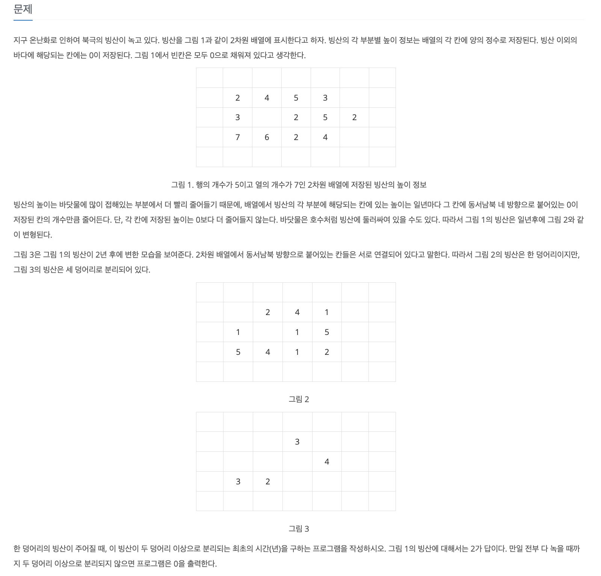
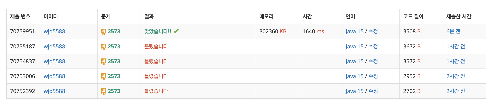
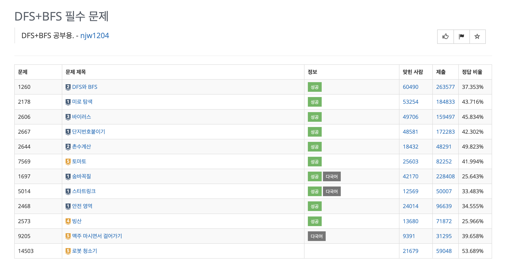

<br>

## ✍️ **T**oday **I** **L**earned

<br>

- 백준 <a href="https://www.acmicpc.net/problem/2573" target="_blank">2573번</a>알고리즘 문제 풀이 과정 중 학습한 내용을 간단히 포스팅으로 남기려한다.

<br>
<br>

### 1. 문제

---



<br>

- 문제의 조건은 다음과 같다.

  1. N(행의 개수), M(열의 개수)의 정수 값을 입력 받는다.
  2. 각 행마다 빈칸을 구분으로 빙산(0 이상의 값)과 바닷물(0)에 대한 정보를 입력 받는다.
  3. 인접한 바닷물의 갯수만큼 빙산이 빠르게 녹는다.
  4. 입력 받은 빙산이 두 덩어리 이상으로 분리되는 최초의 시간(년)을 구해야 한다.
  5. 모든 빙산이 녹을 때 까지 두 덩어리 이상으로 분리가 안된다면 0을 출력한다.

- 풀이 하는데 오래 걸렸다.. 🥲 ~~(2시간 넘게..??)~~

  

  조건 분기가 많이 필요하고 아직 BFS / DFS 개념이 부족해서 시간이 오래 걸린듯하다.

- 해당 문제는 BFS / DFS를 학습하기에 아주 좋은 문제라 생각되며 풀이 과정 중 많은 고민이 필요했던 문제기에 포스팅으로도 남기기로 결정하였다.


  <br>
  <br>

#### 1-1. 풀이과정

---

- 크게 두가지 로직을 함수로 구현하여 알고리즘을 구현하였다.

  - 빙하 덩어리 갯수를 구하는 함수 (DFS)
  - 빙하에 인접한 4방향을 탐색하며 빙하를 녹이는 함수 (BFS)

  위 두 함수를 구현 한 뒤 실행 순서는 다음과 같다.

  > 1. 빙하가 모두 녹아 덩어리 갯수가 0이 되거나 빙하 덩어리 갯수가 2개 이상의 조건을 충족하는 경우가 될 때까지 아래 함수를 실행
  > 2. 햇수(년도)를 증가시키며 빙하를 녹힌 뒤(BFS) 다시 빙하 덩어리 갯수를 측정(DFS)

- 우선 빙하 덩어리 갯수를 구하는 함수는 다음과 같이 구현하였다.

  ```java
    public static int getBigIceCnt() {
      int bigIceCnt = 0;
      boolean[][] isChecked = new boolean[n][m];
      // 빙하 지도를 탐색하며 이어져 있는 빙하 단위로 dfs 실시
      for (int i = 0; i < n; i++) {
        for (int j = 0; j < m; j++) {
          if (!isChecked[i][j] && map[i][j] > 0) {
            dfs(i, j, isChecked);
            bigIceCnt++;
          }
        }
      }

      return bigIceCnt;
    }

    public static void dfs(int nowX, int nowY, boolean[][] isChecked) {
      isChecked[nowX][nowY] = true;

      for (int i = 0; i < 4; i++) {
        int nextX = nowX + dx[i];
        int nextY = nowY + dy[i];
        // 4방향 유효성 검사
        if (nextX >= 0 && nextX < n && nowY >= 0 && nowY < m) {
          if (!isChecked[nextX][nextY] && map[nextX][nextY] > 0) {
            dfs(nextX, nextY, isChecked);
          }
        }
      }
    }
  ```

  위 함수 변수 `bigIceCnt`를 통해 현재 기준 빙하 정보가 저장된 `map` 배열을 토대로 빙하가 몇 덩어리로 구성되어 있는지 헤아린다.

- 빙하를 인접한 바닷물값에 따라 녹이는 함수는 다음과 같이 구현하였다.

  ```java
    public static void bfs() {
      Queue<IceInfo> queue = new LinkedList<IceInfo>();  // 빙하 위치를 담을 연결 리스트
      isVisited = new boolean[n][m];

      for (int i = 0; i < n; i++) {
        for (int j = 0; j < m; j++) {
          if (map[i][j] > 0) {
            queue.add(new IceInfo(i, j));
            isVisited[i][j] = true;
          }
        }
      }

      while (!queue.isEmpty()) {
        IceInfo now = queue.poll(); // 큐에 담긴 빙하 정보를 가져온다
        // 현재 빙하 기준 4방향 유효성 검사
        for (int i = 0; i < 4; i++) {
          int nextX = now.x + dx[i];
          int nextY = now.y + dy[i];

          if (nextX >= 0 && nextX < n && nextY >= 0 && nextY < m) {

            if (!isVisited[nextX][nextY]) {
              int nextValue = map[nextX][nextY];

              // 다음으로 이동할 곳이 바닷물(0)이라면 빙하값을 1깎는다
              if (nextValue == 0) {
                // 빙하가 녹을 수 있는 한도 내에서 수행한다
                if (map[now.x][now.y] > 0) {
                  map[now.x][now.y] -= 1;
                }
              }
            }
          }
        }
      }
    }
  ```

  즉, 해당 함수가 1회 작동하면 `map`에 저장된 빙하의 인접한 바닷물 영역에 따라 빙하를 녹인다.

- 따라서 위 두 함수를 햇수를 증가시키며 적절히 반복해서 원하는 결과값을 도출해낸다.

  최종 코드는 다음과 같다.

  ```java
    import java.io.*;
    import java.util.*;

    public class Main {

      // 빙하 위치 정보를 담을 클래스 선언
      public static class IceInfo {

        int x, y;

        public IceInfo(int x, int y) {
          this.x = x;
          this.y = y;
        }
      }

      public static int n, m;  // 세로 n && 가로 m
      public static int[] dx = {1, 0, -1, 0};
      public static int[] dy = {0, -1, 0, 1};
      public static int[][] map;
      static boolean[][] isVisited;

      public static void main(String args[]) throws IOException {
        BufferedReader br = new BufferedReader(new InputStreamReader(System.in));
        BufferedWriter bw = new BufferedWriter(new OutputStreamWriter(System.out));

        String s = br.readLine();
        n = Integer.parseInt(s.split(" ")[0]);
        m = Integer.parseInt(s.split(" ")[1]);

        map = new int[n][m];

        for (int i = 0; i < n; i++) {
          String line = br.readLine();

          for (int j = 0; j < m; j++) {
            map[i][j] = Integer.parseInt(line.split(" ")[j]);
          }
        }

        int year = 0; // 결과를 담을 년도 변수 선언

        while (true) {
          int bigIceCnt = getBigIceCnt(); // 빙하 덩어리를 세는 dfs 실시

          if (bigIceCnt >= 2) { // 2덩어리 이상이 된다면 반복문 탈출
            break;
          } else if (bigIceCnt == 0) {  // 빙하가 모두 녹아 덩어리가 없다면 year = 0
            year = 0;
            break;
          }

          bfs();  // 빙하를 녹이는 bfs 실시
          year++;
        }

        bw.write(year + "\n");
        bw.flush();
        bw.close();
      }

      public static int getBigIceCnt() {
        int bigIceCnt = 0;
        boolean[][] isChecked = new boolean[n][m];
        // 빙하 지도를 탐색하며 이어져 있는 빙하 단위로 dfs 실시
        for (int i = 0; i < n; i++) {
          for (int j = 0; j < m; j++) {
            if (!isChecked[i][j] && map[i][j] > 0) {
              dfs(i, j, isChecked);
              bigIceCnt++;
            }
          }
        }

        return bigIceCnt;
      }

      public static void dfs(int nowX, int nowY, boolean[][] isChecked) {
        isChecked[nowX][nowY] = true;

        for (int i = 0; i < 4; i++) {
          int nextX = nowX + dx[i];
          int nextY = nowY + dy[i];
          // 4방향 유효성 검사
          if (nextX >= 0 && nextX < n && nowY >= 0 && nowY < m) {
            if (!isChecked[nextX][nextY] && map[nextX][nextY] > 0) {
              dfs(nextX, nextY, isChecked);
            }
          }
        }
      }

      public static void bfs() {
        Queue<IceInfo> queue = new LinkedList<IceInfo>();  // 다음 빙하 위치를 담을 연결 리스트
        isVisited = new boolean[n][m];

        for (int i = 0; i < n; i++) {
          for (int j = 0; j < m; j++) {
            if (map[i][j] > 0) {
              queue.add(new IceInfo(i, j));
              isVisited[i][j] = true;
            }
          }
        }

        while (!queue.isEmpty()) {
          IceInfo now = queue.poll(); // 큐에 담긴 빙하 정보를 가져온다
          // 현재 빙하 기준 4방향 유효성 검사
          for (int i = 0; i < 4; i++) {
            int nextX = now.x + dx[i];
            int nextY = now.y + dy[i];

            if (nextX >= 0 && nextX < n && nextY >= 0 && nextY < m) {

              if (!isVisited[nextX][nextY]) {
                int nextValue = map[nextX][nextY];

                // 다음으로 이동할 곳이 바닷물(0)이라면 빙하값을 1깎는다
                if (nextValue == 0) {
                  // 빙하가 녹을 수 있는 한도 내에서 수행한다
                  if (map[now.x][now.y] > 0) {
                    map[now.x][now.y] -= 1;
                  }
                }
              }
            }
          }
        }
      }
    }
  ```

  BFS / DFS 두 가지 개념을 익히기 좋은 문항이라 생각한다. 🤔

<br>
<br>

#### 1-2. 반례 모음

---

- 문제 풀이에 핵심이 되는 반례를 소개하자면 다음과 같다.

  ```
  5 5
  0 0 0 0 0
  0 1 1 1 0
  0 1 0 1 0
  0 1 1 1 0
  0 0 0 0 0

  0
  ```
  > 한 해만에 빙하가 모두 녹아버리므로 1이 아닌 0을 출력해야한다.
  

  ```
  4 4
  0 0 0 0
  0 3 1 0
  0 1 3 0
  0 0 0 0

  1
  ```
  > 한 해만에 빙하가 두 덩어리로 나뉘므로 1을 출력해야한다.

<br>
<br>

## 🤔 Understanding

- BFS / DFS 알고리즘 영역은 문제 풀이에 시간이 오래 걸린다.

  대부분 재귀로 구현하기 때문에 문제 풀이가 막히는 경우 디버깅에 많은 시간이 소요되곤 한다.

  해당 알고리즘을 익히는데 핵심 문제들을 추린 <a href="https://www.acmicpc.net/workbook/view/1983" target="_blank">문제집</a>을 풀어보고 있는데 좋은 문제들이 많아 추천한다 👍

  

- 해당 문제 풀이에 고민을 하는 개발자들에게 도움이 되고자 포스팅을 남긴다.

<br>
<br>

