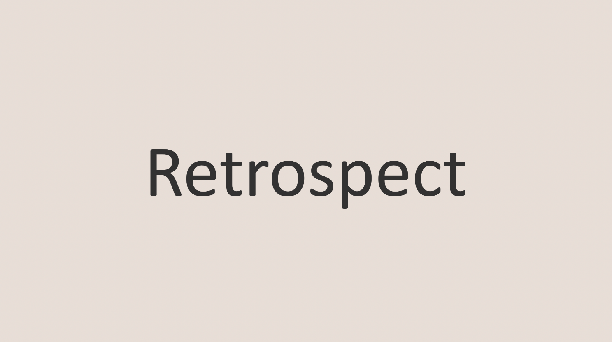

<br>

## 백준

---

- **백준**은 개발자 혹은 개발 직군을 지망하고 있는 예비 개발자들이라면 한번이라도 들어봤을거라 생각한다.

  프로그래밍 및 알고리즘 문제 해결 능력을 향상시키기 위한 온라인 저지 사이트로 유명하며 단순 문제를 푸는것 뿐만이 아니라 서로의 코드를 비교하며 학습할 수 있는 플랫폼으로 유명하다.

- 여러 온라인 저지 사이트 중에서 백준을 선택하여 알고리즘 문제 풀이를 공부한 이유는 문제가 가장 다양하다라는 이유도 있었지만 그 외에도 학습 동기를 불러 일으키는 **솔브닥<a href="https://solved.ac/" target="_blank">(solved.ac)</a>** 커뮤니티 또한 큰 이유 중 하나 였다.

  <br>

  

  <br>

  <center><b>올해 목표였던 골드 티어 👏👏👏</b></center>

  <br>

  백준에서 해결한 문제의 난이도들을 토대로 학습자의 티어(등급)을 분류해서 마치 게임(?)같이 학습 동기를 불러일으키는 솔브닥 커뮤니티 덕분에 목표를 설정하고 꾸준히 공부할 수 있었다.

- 그 외에도 **백준허브**를 통해 <a href="https://github.com/JH8459/Algorithms" target="_blank">깃허브</a>에 자동으로 커밋되는 점 또한 큰 장점 중 하나이다. 👍

- 알고리즘 문제 풀이 공부를 시작하며 스스로 약속했던 작은 목표를 달성하는 과정에서 느낀점과 앞으로 학습 방향을 간략히 적어보려한다.

<br>
<br>

## 학습 방법

---

- 우선 무식한 방법이지만, **새로운 언어를 배우고 싶다**라는 욕심도 충족하고 싶어서 기존에 사용해 본 적없는 **Java**로 언어를 택하였다.

  물론 알고리즘 문제 풀이를 하며 사용하는 언어의 깊이는 얕을거라 생각(입출력에 관련된 문법을 주로 반복하여 사용함)한다.

  그래도 새로운 학습을 하는김에 언어또한 익숙하지 않은 언어로 시작하고 싶어서 해당 언어를 선택하였다.

- 우선 처음 시작은 백준 사이트에서 제공하는 **단계별로 풀어보기**를 선택해서 무작정 풀어보았다.

  

  완전 기초적인 사칙연산부터 시작하므로 코딩 입문자들은 해당 방법으로 시작을 해보시는걸 추천한다.

  초기 목표는 16단계인 스택, 큐, 덱까지 풀어보고자 했으나 같은 유형 풀이를 혼자 반복하다보니 쉽게 질리게 되는 단점이 있었다. (11단계에서 하차하였다.)

  <br>

- 학습을 계속하다보니 알고리즘이라는게 핵심 로직을 기반으로 응용해서 여러 문제를 풀어나가는 구조였다.

  그래서 알고리즘 유형마다 핵심 로직들을 쉽게 설명해주는 **알고리즘 강의** 혹은 **알고리즘 서적**을 찾아보기 시작했다.

  

  <center><del>내돈내산</del></center>

  <br>

  동영상 강의보다는 짧게 짧게 틈틈히 읽어나갈 수 있는 서적을 선택했다.

  다만, 아직 서적을 절반도 보지 못해서 평가를 하거나 후기(모두 다 읽으면 도서 후기로 남기도록 하겠다.)를 남기는건 시기상조이다.

  현재는 알고리즘 유형마다 적용할 수 있는 핵심 로직들을 서적을 토대로 학습한 후, 관련 유형의 문제들을 키워드로 검색 후 반복해서 익숙해질 때까지 풀어보는 학습 방법으로 알고리즘 공부를 하고 있다.

  <br>

- 약 두달간 여러 방법을 시도해보고 있으나 꾸준히 학습을 하는 것 외에 알고리즘 학습 방법의 정답은 따로 없는 듯 하다.


<br>
<br>

## 후기

---

- 앞으로가 중요하다 생각한다.

  솔브닥을 의식해서 너무 등급이나 스트릭을 유지하는 것 그 자체에 매몰되기 보다는 근본적인 알고리즘 풀이 능력을 기르는 것에 집중해야 될 듯하다.

  <center><del>어느 순간부터.. 스트릭깨지는게 신경 쓰이기 시작한다. 😂</del></center>

- 만약 "알고리즘 공부를 어떻게 시작하지?"라는 고민을 가지고 계신 분이 계시다면, 우선 부딫혀보며 스스로 작은 단기 목표들을 세워 동기부여를 해가며 여러 학습 방향을 시도해보는 걸 추천한다.

<br>
<br>

```toc

```
