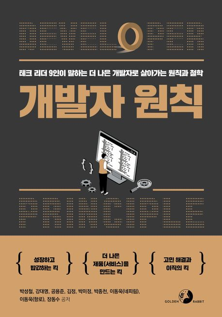
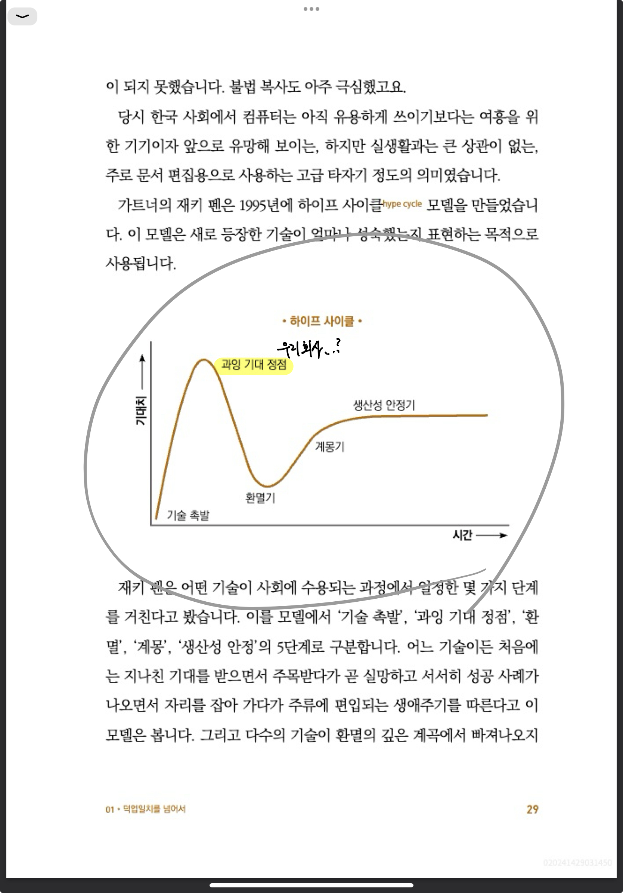

<br>

## 📓 독서후기

---

**「개발자 원칙」** 독서 후기

- 1장. 덕업일치를 넘어서
- 2장. 오류를 만날 때가 가장 성장하기 좋을 때다
- 3장. 소프트웨어 디자인 원칙
- 4장. 나의 메이저 버전을 업그레이드하는 마이너 원칙들
- 5장. 이직, 분명한 이유가 필요해
- 6장. 목표를 달성하는 나만의 기준, GPAM
- 7장. 프로덕트 중심주의
- 8장. 제어할 수 없는 것에 의존하지 않기
- 9장. 달리는 기차의 바퀴를 갈아 끼우기


<br>
<br>

위 모든 챕터를 독서한 후기를 블로그에 후기로 정리까지 해보려한다.<br>
내용 자체가 어렵지 않았고 재밌게 술술 읽혔다! 👏👏👏

모든 챕터가 훌륭했지만 주관적인 인상 깊었던 챕터들만 추려서 간략하게 후기를 남긴다.

<br>
<br>

### 1장. 덕업일치를 넘어서

---

이번장은 가트너의 재키 펜이 고안한 모델인 **"하이프 사이클"** 내용밖에 기억에 남지 않는다. 😆

<br>


<center><strong>"개발자 원칙"</strong> page.29</center>

<br>

재밌게 보았지만 우스운 내용은 아니었다.

대부분의 서비스들의 도태되는 시점은 위 그래프 중 "환멸 단계"에 해당되며, 이는 기술 수용 생애주기에서도 마찬가지라 꼬집는 내용이다.

우리 회사의 서비스도 생각이 나고.. 서비스 뿐만이 아닌 그 어떤것에 대입하더라도 대다수는 공감할 수 있는 모델이라 생각이 들었다.

앞으로 ChatGPT 이후의 그래프는 어떻게 될까? 이것 또한 현재 **"기술 촉발"** 단계이며 위 그래프의 모습을 따라갈지..앞으로 향후 행보 또한 기대해 본다.

<br>
<br>

### 3장. 소프트웨어 디자인 원칙

---

이 챕터는 생각을 아주 많아지는 챕터였다.

무심코 말하고 있던 소프트웨어 <strong>"디자인"</strong>과 <strong>"설계"</strong>란 단어들이 내포하고 있는 개념들이 무엇인지 묻는 내용부터, 쉽게 말하고 있던 <strong>"에자일(Agile)"</strong> 개발론에 대한 정의까지 아주 깊게 생각해 볼 수 있던 챕터였다.

특히나 설계 원칙 중 가장 중요하게 꼽은 원칙을 이렇게 정의하였다.

<br>

> <center>"기획서 작성은 설계에서 가장 중요한 단계이자 방법입니다.<br>기획서에 '화성을 가자'가 아니라 화성을 가려면 탈출 가속도가 얼마 이상이어야 하고, 옮겨야 할 화물의 무게와 부피는 얼마인지 자세히 그리고 '측정 가능한 조건'을 기술해야 합니다."</center>

<br>
<br>

소프트웨어 개발에서 가장 중요한 디자인과 설계 원칙에 대해서 강조 그리고 또 강조를 한다.

특히나, 명시적(기능, 성능, 유지보수, 미적 설계) 소프트웨어 설계와 암묵적(직접적으로 명시 되지 않는 부분들) 소프트웨어 설계에 대한 중요성을 특히나 강조한다.

오퍼레이션(운영) 영역으로 치부되는 암묵적 소프트웨어에 대한 강조는 깊히 또 공감이 되었다.

서비스는 론칭되었다고 개발이 끝나지 않는다 생각한다. 1~2년이라는 기간이 아니더라도 불과 며칠사이만에 새로운 프레임워크등의 등장으로 인해 기존 소프트웨어는 낡을 수 있다 생각한다.

그렇기에 개발자가 코드와 객체지향 수준의 원칙을 넘어 설계의 원칙또한 익혀야 한다는 점에 깊히 공감한다.

<br>
<br>

### 5장. 이직, 분명한 이유가 필요해

---

<strong>"이직"</strong>이란 키워드는 개발자라는 직군 뿐만 아니라 직장인이라며 모두 날카롭게 다가오는 주제라 생각한다.

하지만 개발 직군은 특성상 '성장'이라는 키워드에서 벗어날 수 없는 직군인 만큼, 이직이라는 키워드의 무게감은 다른 직군 대비 무겁게 다가온다고 개인적으로 느낀다. (비개발 직군에서의 6년간의 재직 경험을 빌어 생각한 주관적인 의견입니다.)

내가 개발 직군을 선택했던 가장 큰 이유는 <strong>"공유"</strong>의 즐거움이다.

문학이나 예체능 계열 직군에서는 누군가의 기술 혹은 문장을 가져와서 쓰면 "표절" 혹은 "흉내"라는 비하를 받게된다. 하지만, 개발 직군은 전혀다르다.

서로의 코드 공유를 통해 함께 성장하며 그 "공유" 자체를 권장하는 참 신기한 문화가 신선하게 다가왔다.

오히려 빅테크 기업이라 일컫는 곳들은 서로서로 컨퍼런스 장을 장려하며 아래와 같은 고민을 함께 나눈다.

<br>

> <center>"어떻게 기술을 교류할 수 있을까?"</center>

<br>
<br>

이번 챕터는 단순한 이직을 잘하는, 혹은 몸값을 어떻게하면 부풀리는 방향에 대한 방법론을 설명하는게 아닌, 이직이라는 "도구"를 이용하여 본인의 커리어 레벨을 올리는 방향에 대해 조언과 경험담을 생생하게 전달한다.

선배 개발자로써 주니어들에게 성장에 대한 기준 제시, 그리고 조직이라는 단체 안에서의 개인의 성장을 위한 방향 제시를 본인의 경험을 토대로 제시하는 아주 인상깊은 챕터였다.

<br>
<br>

### 9장. 달리는 기차의 바퀴를 갈아 끼우기

---

챕터의 타이틀부터 인상깊었다.

특히나 <strong>레거시(legacy)</strong>에 대한 표현 방법이 기억에 남는다.

<br>

> <center>"개발자들만큼 레거시를 부정적인 의미로 사용하는 집단이 또 있을까요?"</center>

<br>
<br>

어느 순간 레거시는 곧 기술 부채라는 선입견에 절여져서 나또한 벗어나질 못하고 있었다.

기술 부채를 레거시 탓으로 돌리고 외면하는게 아닌, 바로바로 해결할 수 있는 방향을 모색해야한다는 점에 깊히 공감이 갔다.

<br>
<br>

## 🤔 Understanding

---

- 2024년도 바뀐점으로 팀 단위 격주로 독서 토론을 하고자 결정이 났다.

  그 결정 이후 논의를 통해 첫번째로 선택된 책이다. 👍

- 주니어 개발자 필수 독서리스트에 꼽히기도하고, 목차도 매력적이었으며 저자들도 모두 연혁이 화려한 분들의 경험담들이 매력적으로 다가온 책이었다.

- 만약 위 서적을 구매전 이 게시글을 보셨다면, 주저말고 구매 후 독서 해보시길 추천한다.

<br>
<br>

```toc

```
