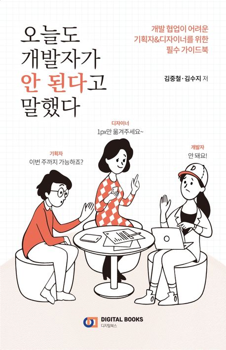
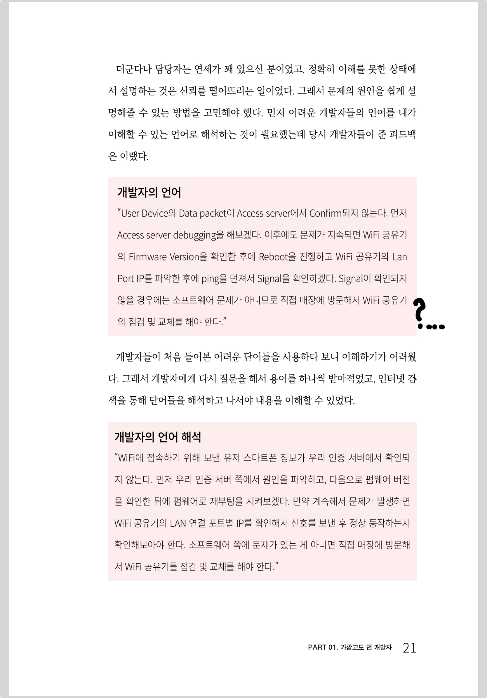

 

## 📓 독서후기

**「오늘도 개발자가 안 된다고 말했다」** 독서 후기

- 1장. 가깝고도 먼 개발자
- 2장. 기획자의 일
- 3장. 디자이너의 일
- 4장. 개발자의 일

 
 

위 모든 챕터를 독서한 후기를 블로그에 후기로 정리까지 해보려한다. 
짧게 요약하자면 개발 지식에 밀접한 내용이라기 보다는 "협업"과 "소통"에 포커스가 맞춰진 도서였다.  

<del>제목 어그로.. 효과는 상당했다.</del>

 
 

### 1장. 가깝고도 먼 개발자

---

개발자의 언어를 지극히 주관적인 관점으로 <del>조금 당황스러운</del> 설명한 내용이 있어 첨부해본다.

 

> "User Device의 Data packet이 Access server에서 Confirm되지 않는다.  먼저 Access server debugging을 해보겠다.  이후에도 문제가 지속되면 WiFi 공유기 의 Firmware Version을 확인한 후에 Reboot을 진행하고 WiFi 공유기의 Lan Port IP를 파악한 후에 ping을 던져서 Signal을 확인하겠다.  Signal이 확인되지 않을 경우에는 소프트웨어 문제가 아니므로 직접 매장에 방문해서 WiFi 공유기 의 점검 및 교체를 해야 한다."

 

<strong>"오늘도 개발자가 안 된다고 말했다"</strong> page.21
 

 

나도 잘 이해가 안가는데.. 아직 진짜 개발자가 되려면 멀었나보다. 😆 
소통할때 기술적인 언어들을 많이 사용하는 개발자들을 설명하고자 극단적인 예시를 가져온듯 하다.

사실 이번 챕터에서 가장 공감가는 부분은 바로 <strong>"목표를 공유한 동료되기"</strong>이었다.

목적지를 모르는 사공들이 탄 배는 저마다 다른 목적지를 생각하며 노를 젓기 때문에 같은 목표를 공유하는 중요성을 강조하였다.

위 주제가 이 서적의 전반적인 공통 주제였다 생각한다.

 
 

### 2장. 기획자의 일

---

이 챕터는 기획자가 하는 업무에 대해서 많이 엿볼 수 있었던 챕터였다. 
또한, <strong>인하우스</strong>와 <strong>에이전시</strong>에 대한 내용 또한 처음 알게되었다.

> <strong>인하우스</strong>는 내부에서 직접 서비스를 만들어 운영하는 방식을 가진 회사, <strong>에이전시</strong>는 클라이언트의 요청에 따라 서비스를 대신 개발해주는 회사.

 

현재 재직중인 회사는 두 가지 성격을 모두 담고있어서 내부 서비스 발전을 위한 업무와 클라이언트의 요청에 따라 정해진 마감기한안에 수행해야하는 업무 또한 같이 진행하고 있다.

두 성격의 회사들에게 요구되는 역량이 모두 충족되어야할텐데 아직은 나 스스로도, 그리고 우리 팀 단위로도 부족하다 느끼고 성장하고자 노력중이다. 

<del>노력의 일환으로 이런 서적을 읽고, 서로의 생각을 공유하는 독서 토론이 올해 상반기부터 진행중이다..!<del>

 
 

아무래도 이번 챕터를 보며 느낀점은 기획자와 PM / PL은 팀의 공통된 목표를 공유할 수 있게끔 노력하는 직군이라는 생각이 들었다.

 
 

### 3장. 디자이너의 일

---

<strong>"디자이너"</strong>란 키워드는 개발자라는 직군과 (특히나 백엔드 개발자) 거리가 멀다 생각했다.

그렇기에 3장은 관심있게 읽진 못했다. 하지만 이번 챕터의 문장 하나는 책을 읽고난 뒤에도 머리속에 오래 머물고 있다.

 

> 
<strong>"디자인은 예술이 아니다."</strong>

 
 

위 문장은 비단 디자인에만 적용되는 문장은 아닌듯하다.

새로운 기술, 새로운 프레임워크, 새로운 언어가 나왔고 성능이 좋다하여도 실제 제품(Production)에 적용하기까진 검증할게 매우 많다.

하지만 새로운 기술을 "써보고 싶다"라는 니즈만으로 개발을 예술(?)처럼 하시는 분들이 있다. <del>실제로 주변에 존재한다.</del>

그래서 항상 입버릇 처럼 팀원들에게 하는 말이 있다. 

"짜잔~ 금지"
 

혼자만의 생각에 매몰되어 뚝딱뚝딱 새로운 기술, 언어를 도입 하는 행위들은 너무.. 리스크가 크기에 입버릇 처럼 말하고 다닌다.

"예술"의 영역은 예술가들에게 필요로하는 분야라고 생각한다. 
비단 이건 디자이너들이 아닌 전 직군 공통적으로 새겨들어야할 내용인듯하여 발췌해보았다.

 
 

### 4장. 개발자의 일

---

4장은 개발자라는 직업이 갖는 의미와 실제 개발자들의 실무 인터뷰 중심으로 풀어나간 챕터였다. 
특히 인상깊었던 건 규모가 큰 기업에서의 TF가 어떻게 이뤄지는지 대략적으로 엿볼 수 있어 좋았다.

그 외에 특별히 인상깊은 부분은 없었다.

비개발자 직군분들은 한번쯤 보면 좋을 내용 위주로 구성이 되어있었다.

 
 

## 🤔 Understanding

- 독서 토론 두번째로 선택된 책이다. 👍

- 제목 어그로가 절반 이상의 존재감으로 다가온다.

- 개발 직군보다는 비개발직군이 한번쯤 읽어보면 좋을 듯 한 도서이다.

 
 

