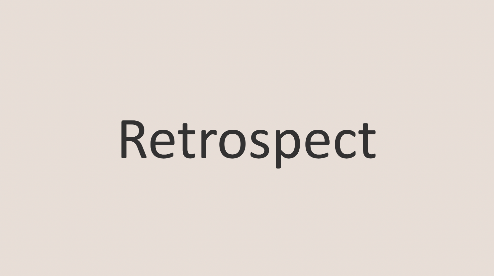
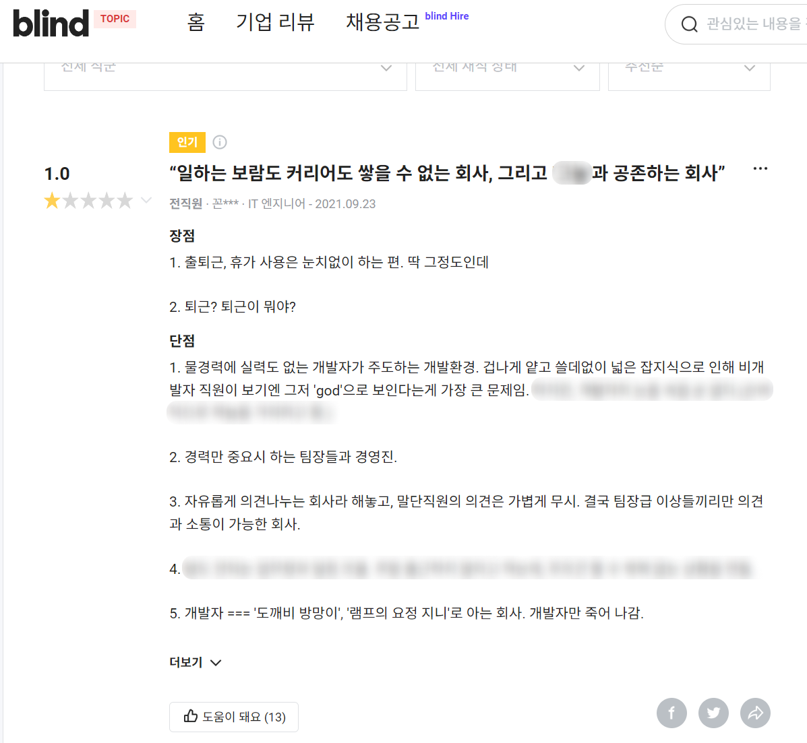
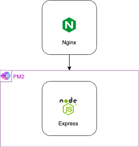
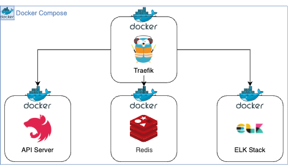
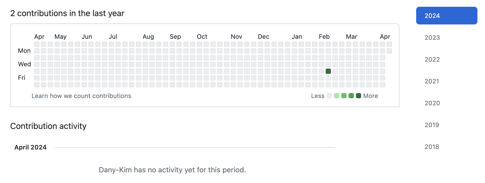
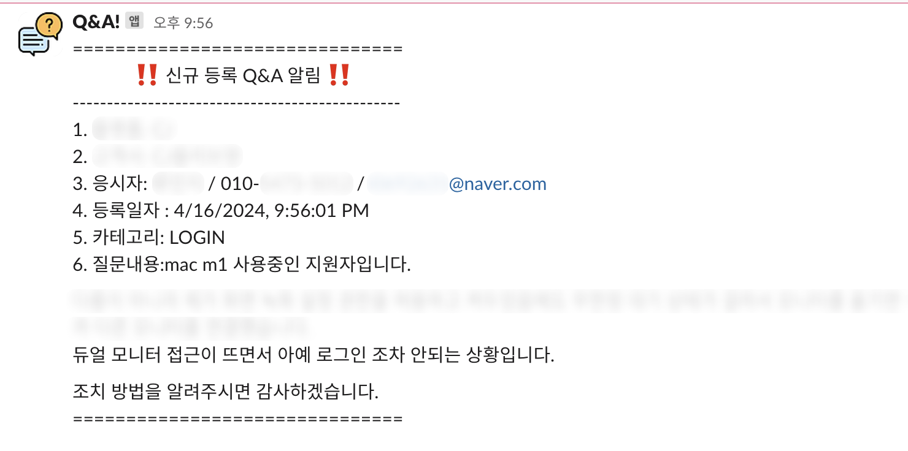
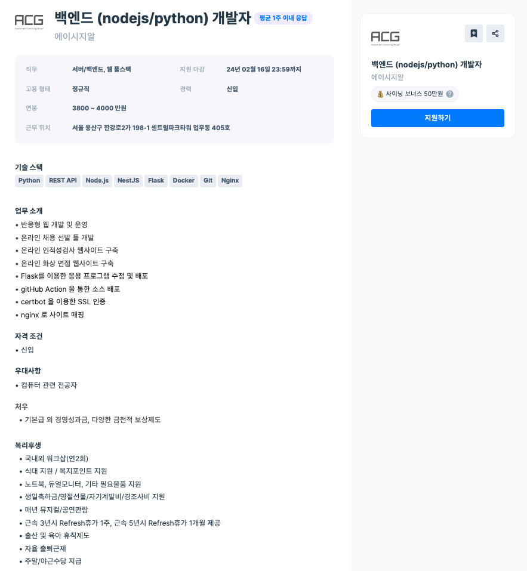
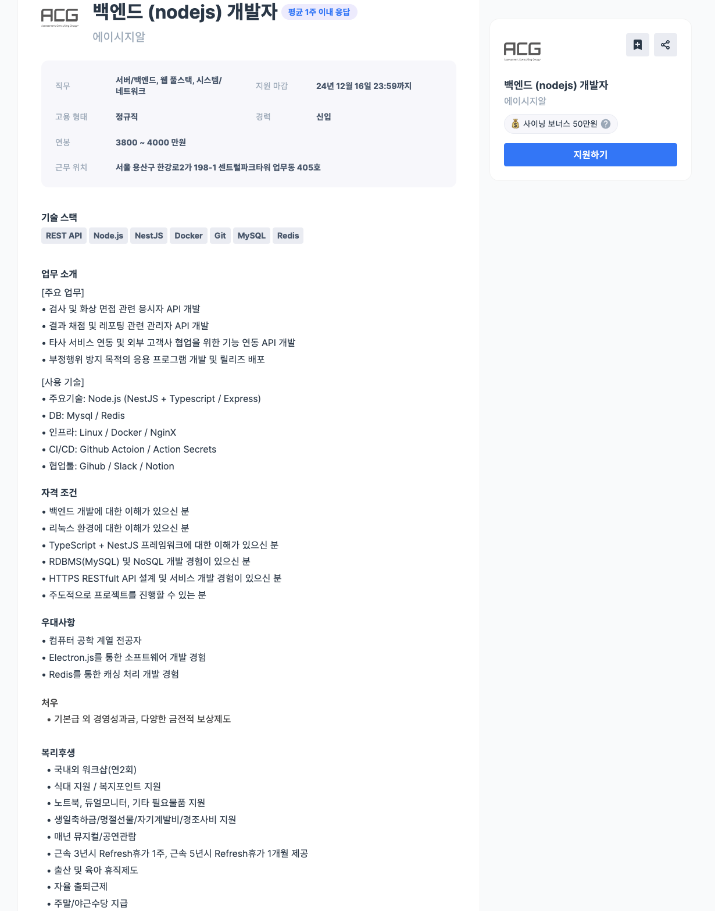

<br>

## 🤔 백엔드 개발자 2년차 회고

2년전 <strong><a href="https://blog.jh8459.com/2022-04-01-RETROSPECT/" target="_blank">「백엔드 개발자 첫 출근 후기」</a></strong>를 남긴지 몇일 안된거같은데, 벌써 2년을 꽉채운 주니어 개발자가 되어버렸다.

지금와서 생각해보면 나는 개발자라는 직군으로 운이 좋은 시기에 전환했던 것 같다. (불황기에 개발자로 취업을 준비하고 계신분들을 응원합니다!! 🙏)

또한, 적성에도 꽤나 맞아서 짤리거나(?) 퇴사를 권유받고 있진 않다. (아직까진 밥 벌어 먹고 잘 살고 있다.)

이번 글에는 지난 2년간 어떤 일을 무슨 마음가짐으로 해왔으며, 그 과정에서 <strong>"나"</strong>라는 인물의 어떤 영향력으로 무엇이 바뀌었는지를 적어보려한다. 그리고 앞으로의 <strong>"나"</strong>는 어떤 방향성을 갖고 개발자로써 성장을 해야하는가에 대한 고민 또한 간략하게 남겨보려한다. <del>지극히도 주관적인 내용일꺼다..!!</del>

참고로 글을 읽는데 이해도를 높히기 위해 현재 소속한 기업의 주요 서비스와 본인을 간략히 소개하자면, B2B 형태로 기업의 인재 채용 솔루션(온라인 화상 인적성검사 등)을 제공하는 서비스를 10여년째 제공중인 기업의 백엔드 개발자로 재직중이다.

<br>
<br>

## 지난 2년간은?

지난 2년간 개발자로써 어떠한 일들을 무슨 마음가짐으로 해왔으며, 그 과정을 간략하게 후기로 남겨보려한다.

<br>
<br>

### 백엔드 기술 아키텍쳐(Hard-Skill)의 변경

---

엥? 첫 문단부터 무슨 신입이 스타트업도 아닌 기업의 기술 스택을 바꿀 수 있느냐? 라고 반문할 수 있겠으나, 신기하게도 사실이다. 아래 블라인드에 기재된 재직중인 회사의 후기를 보면서 이해를 도와보고자 한다.

<br>



<br>

<center><del>불필요한 부분은 블러처리..저희 회사 (이젠) 썩 괜찮아요!!</del></center>

<br>
<br>

21년도 9월에 기재된 후기이다.<br>
나는 22년도 4월에 입사를했으니 작성한 분의 얼굴은 보지 못했다.

우리팀에 머물(?)렀었던 주니어 개발자였던 사람이 남긴 후기인듯하다. (나중에 건너건너 들은 이야기지만 해당시기에 현재 내가 속한 팀의 주니어들의 단체 퇴사가 이뤄졌다 한다..🥲) <del>실제로 나도 현 회사의 입사를 결정할 당시 가장 고민되게했던 기업 후기 중 하나이다.</del>

다만, 해당 기업 후기로 인해 덕(?)을 보았다..해야할까?<br>
21년도 9월부터 약, 6개월 정도의 긴 기간 동안 다시 대규모 신입 채용이 이뤄졌고 그 당시 뽑힌 인재들이 아직 현재 우리팀을 구성하는 주요 인물들로 자리잡고있다. (나를 포함, 대부분 아직 재직 중이다!! 👍)

또한, 후기에서 계속 언급되는 리드 개발자는 팀 구성에서 제외가 되었으며 새로운 팀장의 합류로 인해 완전 새롭게 바뀐 팀 구성원들로 현재 팀이 운영되고 있다.

이런 히스토리로 인해 현재는 완전히 새로운 팀으로 재개편 되었기 때문에 기존에 급하게 만들었던 레거시들을 차근차근 새로운 기술을 채택하여 마이그레이션 할 수 있었다.

뿐만 아니라, 현재 가진 인프라가 갖는 단점을 보완한 아키텍쳐를 새로운 아키텍쳐를 설계해서 사용할 수 있게 되었다.

---

현재 모든 인프라는 IDC(Internet Data Center)에서 서버를 임대하여 구축하고있다. 입사 당시 서버 내부의 백엔드 아키텍쳐 구조를 단순하게 그려보면 아래 그림과 같았다.

<br>



<br>
<br>

서버 1대마다 Nginx를 앞단에 두어 리버스-프록시 구조로 Express 웹서버를 호스팅하고 있다. 또한 웹서버는 PM2의 클러스트 모드로 구동되어 서버의 스레드 갯수 만큼 실행하고 있다.

위 그림과 같은 방식으로 구현된 인프라의 단점 중 가장 큰 단점을 꼽자면 패키지들의 의존성 관리였다.<br>
레거시는 레거시대로 운용되어야하며 새로운 마이그레이션한 신규 웹서버를 한 서버 내부에서 같이 구동하자니 관련된 패키지 버전 관리등이 어려웠기 때문에, 이를 보완한 인프라를 구성하고자 마음 먹었다.

그로인해 <strong>도커</strong>를 사용하여 컨테이너 인프라 환경을 구축하고자 했으며, Express의 너무 큰 자유도는 신입 기준으로 오히려 불편함을 초래할 것 같다는 막연한(?) 생각<del>(Express가 절대 나쁘다! 라는 뜻이 아니다.)</del>으로 <strong>NestJS</strong>라는 정형화되어 있는 프레임워크를 찾아 선택하였다.

그로인해 변경된 현재 서비스 중인 서버 내부의 백엔드 아키텍쳐 구조를 단순하게 그려보면 아래 그림과 같이 변경되었다.

<br>



<br>

한번에 많이 바뀐듯 보이지만, 2년간 꾸준하게 변경해왔다.

처음 시작은 <strong>NestJS</strong>만 단독으로 단일 컨테이너로 구성하였던 아키텍쳐에서 불필요한 DB 커넥션을 줄이기 위해 캐싱 레이어를 도입하고자 <strong>Redis</strong> 컨테이너를 같은 네트워크에 함께 구성하고 싶었다.

이를 위해 컨테이너를 여러개 묶는 <strong>Docker Compose</strong> 환경을 고려할 수 밖에 없었으며, NginX보다는 내부에 묶인 여러 컨테이너 환경을 보다 더 쉽게 모니터링(대시보드 옵션 제공) 할 수 있으며 무중단 배포 운영<del>(아직은 도달하지 못하였지만..)</del>에 유리한 <strong>Traefik</strong>을 도입하였다.

물론 쿠버네티스 등 훨씬 더 진보한 백엔드 아키텍쳐가 존재한다는 사실은 알고 있지만, 닭 잡는데 소 잡는 칼을 들이는 것이 아닐까란 생각으로 우선 현재는 지금 인프라 구성에 만족하며 사용중이다.

<br>

> 언급하지 않은 <strong>ELK Stack</strong>은 현재 개발 진행중이다. 마무리되면 따로 포스팅을 남기겠다.

<br>

결과를 놓고 보면 아직 부족하다.<br>
다만, 느리지만 점진적으로 그래도 좋은 방향으로 개선해보려 노력했다고 스스로 자부할 수 있다. 🥲

<br>
<br>

### 그라운드 룰 및 협업 소프트웨어(Soft-Skill)의 변경

---

입사 당시 내 위로 10년차 이상 개발자 두 분만 계셨다.<br>
새로 꾸려진 현재 팀에서 진행할 프로젝트 기획안과 시스템 설계도를 건네 받은 뒤 깃허브 가입을 하고 난 뒤 바로 물음표를 지었다.

<br>



<center><del>깃허브 구성원들의 잔디는 이런 느낌...이었달까??</del></center>

<br>
<br>

이유를 여쭤보니 다소 적잖이 충격받았던 점은 두 분 모두 "깃허브를 <strong>전-혀</strong> 사용하지 않는다." 라는 점이었다.

물론, 버전관리를 안하시는 이유가 두분 모두 풀스택 개발자로써 거의 모든 프로젝트를 혼자 도맡아서 개발을 진행해서라는 이유를 듣고 납득은했다. <del>(하지만, 우리는 아닌걸..😮‍💨)</del>

그로인해 팀원들과 함께 커밋 컨벤션을 마련하였으며, 이는 슬픈 얘기지만 백엔드 개발자가 팀원의 퇴사로 인해 혼자 프로젝트를 진행하게 되더라도 꼭 지켰다. (결국 혼자 스스로 지켜낸 컨벤션은 현재 신입들의 온보딩 1일차 일정으로 자리매김하였다. 😆)

단순 깃허브를 사용하여 버전관리만 하는 것이 아닌, 더 나아가 Github Action을 통한 CI/CD 파이프라인 또한 자리매김하여 각 Repository에서의 Action Secret을 통한 환경변수의 관리 규칙과 스테이징 별 배포 규칙을 포함한 여러 그라운드 룰을 정립하여 사용중이다.

---

입사 당시 소통을 위한 협업 소프트웨어들은 스카이프 그리고 문서 협업은 주로 이메일로 주고 받는 MS Office(엑셀, 워드.. 등등)를 이용하여 작성한 문서들이 전부였다.

입사 1년차? 쯔음 부터였을까 <strong>"세련되지 않았다."</strong>라는 이유만으로 어느샌가 이런 협업 소프트웨어를 사용하는 사내 문화를 언젠가부터 배척하고 있었던듯하다.

<br>

<strong>"요즘 스카이프 누가 써 슬랙쓰지.."</strong><br>
<strong>"요즘 어떻게 메일만으로 업무 히스토리를 파악해.. 노션이나 지라를 쓰는게 보편적이지.."</strong>

<br>

라는 이유도 없는 막연한 생각이었던거 같다. (하지만, 노션과 슬랙은 그저 그냥 마냥써도 나쁘지 않은 툴들이라 생각한다!)

우선 이러한 협업 툴들의 교체를 위해선 <strong>"근거있는 설득"</strong>이 필요하다 판단하였고 하나씩 하나씩 바꿔나가 보았다.

첫번째로 시도했던건 슬랙이다. <del>정확히는 슬랙 웹훅을 이용한 각종 알림 기능 구현이었다.</del>

온라인 채용 서비스를 운영하는 회사 특성상 공채 시즌 기준으로는 24시간동안 중단없이 온라인 인적성 검사가 진행된다. 그로인해 해당 시즌에는 직원들의 보편적인 퇴근시간 이후에도 쉴틈없이 응사자들의 문의사항이 들어온다.

따라서 실시간으로 응시자들의 문의사항들을 모니터링을 하고자하는 사측의 니즈를 슬랙이라는 메신저 도입을 통해 구현할 수 있다 말씀드렸고 이는 상당히 효과적이었다.

<br>



<center><del>실제로 사용중인 슬랙 웹훅 알림..</del></center>

<br>
<br>

이러한 어필 끝에 결국 사내 메신저는 스카이프에서 슬랙으로 전면 교체가 되었다. (물론, 이는 지극히 주관적인 생각이다. 타이밍이 좋았던걸수도..!! 🥲)

이 계기로 노션까지 도입해보자 한번 더 노를 저어보았다.<br>
우리 회사 좋은 복지 중 하나로 직원들의 자기개발을 위한 도서 구매 지원이 있다.

이를 조금더 체계적으로 관리할 수 있게끔 노션을 통해 사내에 존재하는 도서 목록 DB를 저장하고 이를 슬랙을 통해 상호작용할 수 있는 <strong>슬랙 챗봇앱</strong>을 만드는 작은 사이드 프로젝트를 기획 후 건의하였고, 이를 흔쾌히 대표님께서 승인해주셔서  경영지원팀과 함께 기획단계부터 함께 진행하여 사내 도서관 앱을 만들 수 있게 되었다.

<br>

> <a href="https://blog.jh8459.com/2023-05-01-PROJECT/" target="_blank">SLACK 챗봇 개발하기 (사내 도서관)</a> 후기 바로가기

<br>

현재 우리 회사는 팀 단위로 노션을 통해 업무를 티켓 단위로 관리하고 있으며, 공유문서의 히스토리 관리까지 상당히 넓은 분야에서 잘 활용하고 있다.

물론 나 혼자만의 힘으로 이런 문화를 바꿨다 생각하진 않는다. 하지만, 작은 날개짓을 도와 보탬이 되었다라고는 생각한다.

<br>
<br>

### 인재(개발자)채용 절차의 주도적인 경험

---

다시 한번.. 무슨 주니어 개발자가 신입 채용 절차를 주도적으로 관여할 수 있느냐? 라고 반문할 수 있겠으나, 이 또한 사실이다. 아래 채용 공고 보면서 이해를 도와보고자 한다.

<br>



<center><del>실제로 사용했던 백엔드 신입 포지션 채용 공고..🥲</del></center>

<br>
<br>

개발자를 조금 더 채용해서 팀 규모를 키우자라는 2024년도 계획안이 나왔고, 서류 1차 검토를 주니어 개발자들이 맡게 되었다.

근데 웬걸? 너무나도 우리 팀과 핏이 맞지 않는 지원자들이 너무 많이 지원하였다.<br> 
문뜩, 채용 공고가 이상한가 싶어 채용 플랫폼을 들여다보니 이런 채용 공고를 보게되었다. (어쩐지 파이썬 개발자가 너무 많이 지원하더라..싶었다.)

일단, 백엔드 포지션 신입 채용 공고에 첫 줄이 <strong>"반응형 웹 개발 및 운영"</strong>이라는 점에서 한숨이 쉬어졌다. <del>(심지어, 이 채용 공고는 내가 입사할 당시를 기준으로 잡는다면 한번 가다듬어진거라는...)</del>

우리 회사와 맞지 않는 인재상을 가진 지원자들이 너무 많아, 불필요하게 서류 검토에 업무 시간을 뺏긴다는 이유로 채용 공고를 직접 수정할 수 있는지 건의하였고 설득 끝에 승인을 받았다.

그 결과 아래와 같은 채용 공고로 변경하였다.

<br>



<center><del>훌륭한 채용 공고라하진 못하겠지만, 이로인해 서류 검토하는 시간이 절반 이상으로 줄었다!! 🎉🎉🎉</del></center>

<br>
<br>

직접 수정한 채용공고를 통해 지원한 신입들의 서류 검토까지 직접하였기에 1차 면접(실무진 면접)까지 참여를 권유 받았고, 이로 인해 채용 절차를 일선에서 경험하고 관여할 수 있었다.

<br>
<br>

### 팀 문화 변경

---

마지막으로는 아직 진행중이기에 <strong>"이런 좋은 문화가 정착되었다!"</strong> 라고는 당당히 말은 못하지만, 열심히 정착하려 노력중인 문화가 있어서 소개하고 싶었다.

올해 상반기에 신입이 채용을 통해 새로 들어오고나서 바뀐 점 중 하나는 바로 <strong>"독서 토론"</strong>이다.

격주 단위로 팀 구성원이 한명씩 돌아가며 책(꼭, 개발서적이 아니더라도 좋다!)을 추천하고 읽고 느낀점을 1~2시간 가량 주제없이 토론해보는 시간을 갖고있다.

한달 반 정도 진행 중이며, 진행한 도서 리스트는 다음과 같다. (아직 2회차 진행중이다..🥲)

<br>

- <a href="https://blog.jh8459.com/2024-03-13-BOOK/" target="_blank">「개발자 원칙」</a>
- <a href="https://blog.jh8459.com/2024-03-27-BOOK/" target="_blank">「오늘도 개발자가 안 된다고 말했다」</a>

<br>

도서 후기는 의무는 아니지만, 기록으로 남기지 않으면 쉽게 휘발된다 생각해서 스스로 남겨보고 있다.

2024년 올 한해는 팀원들 모두 입을 모아 이 문화를 정착해보고자한다. 좋은 팀원들과 함께 건강한 문화를 정착하려 노력중이다.

<br>
<br>


## 앞으로는?

솔직히 잘 모르겠다.

2년간 무엇을 해냈으며, 무엇을 그 과정속에서 배우고 성장했는지 이 글을 쓰며 되짚어보니 더욱 더 모르겠다.. 왜냐하면, 2년전의 나는 이런 일을 해낼 수 있을꺼라 생각을 못했다.

하지만 확신할 수 있는건 이 글의 맨 앞장에 있던 블라인드 후기처럼 주어진 환경에 불만하고 불평하다 시간을 보내진 않을 것이다. <del>(물론, 처한 환경이 달랐을꺼라 퇴사를 한 후 블라인드 후기를 남겨주신 선배(?) 개발자의 의견은 존중한다. 🙏)</del>

개발 문화가 부족하다는건 개선할 여지가 많다라는 반증이기도 하다.<br>
적어도 이번 회사를 재직하면서 이 점은 뼈저리게 느꼈다. (과연 2년차 주니어가 이런 전반적인 경험을 모두 해 볼 수 있는 회사가 있을까?)

앞으로 긴 미래는 모르겠지만 적어도 올해는 사람으로써 그리고 개발자로써 빠르게 달려온 2년간 부족했던 부분들을 개선하고 보완하는 한해가 되지 않을까 싶다.

<br>
<br>

아! 그리고 2년만에 회고글을 작성하려니 써내려가야할 내용이 너무 많아 깊은 후회중이다.. 앞으로는 큰 이벤트가 있거나 정기적인 주기로 회고글을 작성해보기로 결심했다. 😀

두서없는 긴 글이지만, 후년의 나를 위해 작성해보았다.

<br>
<br>

```toc

```
