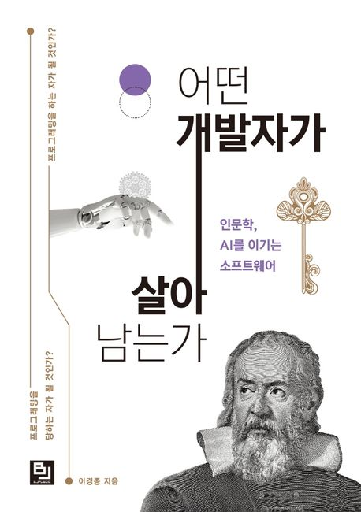
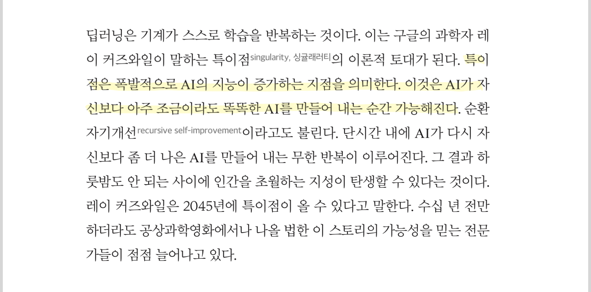
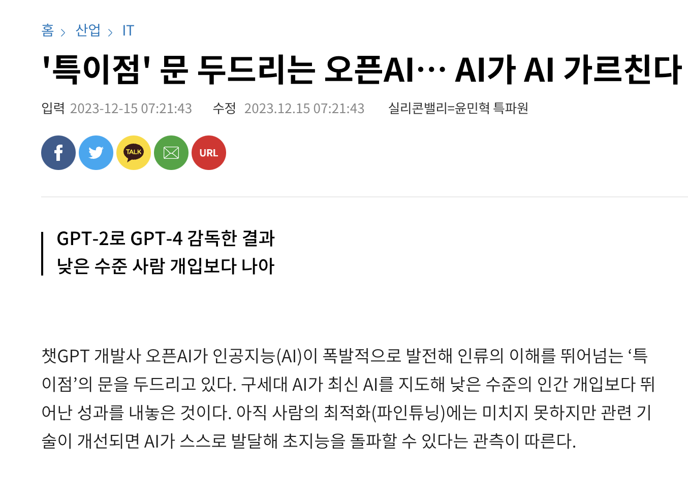
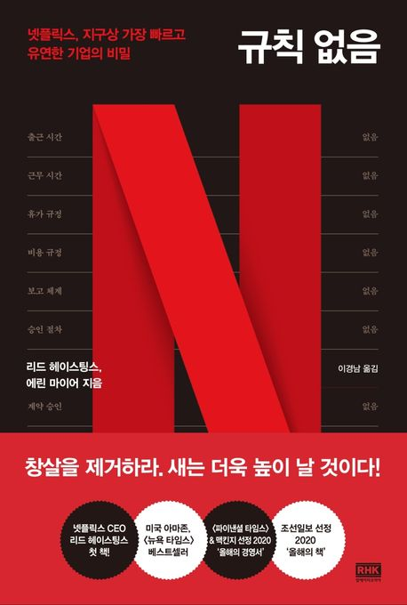

<br>

## 📓 독서후기

---

**「어떤 개발자가 살아남는가」** 독서 후기

- 1장. AI의 시대, 우리는 어디에 있는가
- 2장. 알고리즘 vs 데이터 그리고 창조력 코드
- 3장. 누가(Subject) 무엇을(Object) 어떻게(Project) 해야 하는가
- 4장. 지속적인 개선 - Upgradable Software
- 5장. 팀워크 - 함께 만드는 소프트웨어

<br>
<br>

위 모든 챕터를 독서한 후기를 블로그에 후기로 정리까지 해보려한다.

짧게 요약하자면 정보의 홍수와 더불어 AI로 인하여 산업의 형태가 바뀌는 이 시점에 어떻게 개발자라는 직업으로 살아나갈 수 있는가에 대한 굉장히...인문학적인 내용으로 가득 찬 서적이었다.

아쉬운 점 중 하나는 OpenAI사의 ChatGPT 발표일은 2022년 11월 30일이고 이 책의 출판일은 2022년 3월 30일이라는 점이다.

<center><del>어쩌면 나오지 못할 책이었지 않았을까??</del></center>

<br>
<br>

### 1장. AI의 시대, 우리는 어디에 있는가

---

진보하는 AI / 인공지능 기술과 개발자의 미래에 대한 내용으로 구성되어 있다.

1장에서는 <strong>"특이점"</strong>에 대해 아래와 같이 설명한다.

<br>

> "특이점이란 폭발적으로 AI의 지능이 증가하는 지점을 의미한다. 이것은 AI가 자신보다 아주 조금이라도 똑똑한 AI를 만들어 내는 순간 가능해진다.

<br>


<center><strong>"어떤 개발자가 살아남는가"</strong> page.4</center><br>

<br>



<br>

책이 출판되고나서 불과 1~2년만에 스스로 학습하는 AI들이 등장하고 있다.<br>
저자가 언급한 그 <strong>특이점</strong>은 우리가 살아가는 현재 이시점에 이미 등장하고 무서운 속도로 발전하고 있다고 생각한다.

이제 AI는 경계해야 할 대상이라기보다는 빠르게 받아들이고 활용하는데 초점을 맞추어야한다 생각한다. (물론, 이 책이 말하고자하는 주제가 "AI를 경계하고 배척해야한다." 는 아니다.)

불과 단돈 10$로 일 잘하는 수행비서를 누구나 둘 수 있는 세상이 왔다 생각한다.<br>
즉, 수행비서를 경계하기 보다는 이 특이점을 받아들여 어떻게 활용하여 내 시간을 절약할 수 있는지 고민해야하는 시점이라 생각한다.


<br>
<br>

### 2장. 알고리즘 vs 데이터 그리고 창조력 코드

---

이 챕터의 주된 내용은 아래와 같다.

> <center>데이터가 알고리즘보다 중요하다.</center>

<br>

수많은 공식이 중첩된 논리적 판단보다는 데이터베이스의 경험을 참조로 하는 개연적 판단이 주가 된 것이라 말하는 바이다.

이를 역설적으로 해석해보면, AI의 한계는 "처음"이 아닐까 싶다.

데이터를 기반으로 학습한 AI는 "과거에 그리했으니 미래에도 대체로 그럴 것이다" 라고 판단하고 학습할 수 밖에 없을 것이다.

"처음"은 인간만이 할 수 있는 것이라 생각한다.<br>
무언가 새로운 것을 창조하고 발전해온 문명을 이룬 생명체는 아직 지구에는 인간뿐이라는게 그 증거이지 않을까?

<br>
<br>

이 책에서도 창조의 세가지 경로를 <strong>"탐색"</strong>, <strong>"융합"</strong> 그리고 <strong>"변혁"</strong>이라 설명한다.<br>
자세한 설명은 책을 읽어보는 편이 좋아보이고, 주장하는 주제는 다음과 같다.

수많은 연산을 통해 탐색에 의한 창조는 앞으로 AI에게 맡기고, 지식과 경험의 축적 그리고 사색을 통하여 창조성을 발휘하는 일을 우리가 가야 할 길이라 말한다.

<br>
<br>

### 3장. 누가(Subject) 무엇을(Object) 어떻게(Project) 해야 하는가

---

3장부터는 인문학적인 이야기보다는 <strong>"소프트웨어를 어떻게 만들어야하는가?"</strong> 라는 개발론에 대한 이야기가 많았다.

이번 챕터에는 재밌는 구문이 있어서 가져와보았다.

> <center>내가 해야 해 증후군</center>

보통 고참이고 실력이 뛰어난 개발자들에게 나오는 증후군이라 설명한다.<br>

<center><del>책을 읽으며 회사 내의 특정인물들이 떠올라 토론시간에 언급해보니 모두 같은.. 생각을 하는구나.. 🤣🤣</del></center>

<br>
<br>

물론 실력있는 개발자가 진짜 겪는 증후군일 수도 있다..!!<br> 
그렇다면 조직 차원의 개선이 꼭 필요하다 생각한다.

그리고 내 것이 아닌 것을 가져다가 내것을 더 많이 만드는 뜻을 가진 경제 용어를 빗댄 <strong>레버리지 전략</strong> 또한 와닿았다. (실제로 요즘 우리팀의 고민 중 하나는 <strong>자동화</strong>이다.)

<br>
<br>

### 4장. 지속적인 개선 - Upgradable Software

---

한달간 읽었던 책들 모두 목 놓아 말하는 공통된 점은 다음과 같다.

> "완벽한 프로그램은 없다. 지속적인 개선을 통해 완성도를 높히는 것이 중요하다."

이로인해 개발론 또한 완벽함을 처음부터 추구하는 폭포수(Waterfall) 방법론 보다는 그때 그때 기민하게 대응할 수 있는 애자일(Agile) 방법론이 주류를 이루게 되었다 생각한다.

이 챕터 또한 공통된 이야기를 하기에 빠르게 읽고 넘어갔다.<br>
사실 어떤 개발서적을 보아도 이 주제는 매일 나온다. 😆

<br>
<br>

### 5장. 팀워크 - 함께 만드는 소프트웨어

---

이번 챕터에서 가장 인상 깊었던건 페이스북이 어떻게 주류에 올랐는지에 대한 히스토리였다.

안정화된 플랫폼의 중요성을 꼽으며 소프트웨어 본질에 집중해야한다 설명한다.

> "타사 서비스들이 광고와 수익을 위한 비즈니스 플랫폼을 고민할 때, 페이스북은 성능을 유지하고 안정적인 서비스를 제공할 수 있는 고민을 했다. SNS는 점점 대중화되면 사용자가 늘어나는 것은 필연적이었고, 페이스북의 주된 고민은 늘어나는 트래픽을 어떻게 견디는 것이었다."

사실 서비스가 어느정도 성장했다면 수익화를 어떻게 할지가 가장 큰 고민일텐데, 안정적인 서비스가 늘 1순위 고민이었다라는 점이 참 대단하다 생각이 든다.

<strong>"여러가지 무술을 익힌자보다 한 가지 동작을 1만 번 반복해 연습해온 상대가 더 두렵다."</strong>라 말한 이소룡의 말이 떠 올랐다.

<br>
<br>

또한, 이번 챕터는 저번에 읽었던 <strong><a href="https://blog.jh8459.com/2024-03-27-BOOK/" target="_blank">「오늘도 개발자가 안 된다고 말했다」</a></strong> 서적 처럼 소통에 대한 중요성을 꼽으며 아래와 같은 사례를 예시로 든다.

<br>

<center>"제 쪽에서는 아무런 문제가 없는데요?"</center>
<br>
<center>"(그건 모르겠고) 제 쪽에서는 문제가 있는데요?"</center>

<br>
<br>

글만 봐도 머리가 지끈 아파온다. 😭<br>
프로젝트가 산으로 가지 않게 "소통의 배려"에 대해서 강조한다.

외부로 나가는 소통은 보다 더 명료하게 하고, 외부로 받는 소통에 있어서는 최대한의 융통성과 관용을 보이게끔 노력하자.

<br>
<br>

## 🤔 Understanding

---

- 참.. 출판 시기가 계속 걸리는 책이었다. 

  과연 ChatGPT 이후엔 저자의 생각은 어떻게 바뀌었을까? 이 또한 궁금하다.

- 인문학적인 이야기가 너무 많아서 솔직히 1,2장은 읽기가 힘들었다. 하지만, 말하는 주제는 공감이 갔다.

  언젠가 "프로그래머"라는 직업 자체가 사라질 수 있다고 생각은 해보았다. 다만, 코드는 AI가 써내려가더라도 그 코드 조각물들을 쌓아 올리는 <strong>창조</strong>의 영역은 인간만이 할 수 있지 않을까라고 아직까진 생각한다.

  그러면 직업명이 "빌더(??)"로 바뀌려나.. 아직은 모르겠다.

- 여담으로 이 책 마지막 챕터인 5장의 사잇글인 <strong>"넷플릭스의 철학: 규칙 없음! 단, 솔직하게!"</strong>가 아주 감명깊게 와닿았다. <del>다시 생각해보니 책을 모두 읽었다라는 희열감에 와닿았을 수도 있겠다..</del>

  찾아보니 아래와 같은 책도 있다는 걸 알게되었다.

  <br>

    

  <br>

  우리 팀에서 진행하는 독서 토론은 팀원들 모두 순서대로 도서를 추천해서  읽고 난 후기를 공유하는 시간을 격주로 갖고있다.
  
  내 순번이 오면 해당 도서를 신청해서 같이 읽어 볼 생각이다. 👀

<br>
<br>

```toc

```
