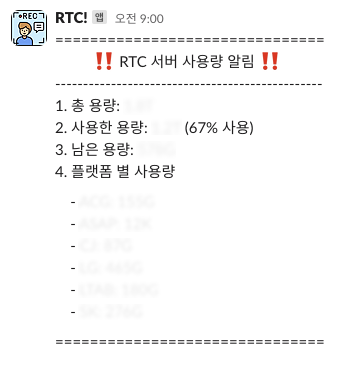

<br>

## ✍️ **T**oday **I** **L**earned

---

Bash Script를 통하여 Slack Incoming Webhook 알림 요청을 수행하고 이를 자동화 하는 과정을 간략히 정리하고 공유하기 위해 글을 남긴다.

<br>
<br>

### 1. 필요성

---

현재 우리 회사의 가장 중요한 서비스를 꼽으라하면 인재 채용을 위한 온라인 인적성 검사이다.

검사에 필요한 내용(문항과 지문 이미지 등)을 제공하는 <strong>API 서버</strong>와 응시자가 유효한 환경에서 검사를 치르고 있는지 웹캠과 화면 공유를 실시간으로 소통하는 <strong>WebRTC 서버</strong>를 구성하여 온라인 응시환경을 제공하고 있다.

뿐만 아니라, 검사가 끝나면 응시자의 검사 녹화 영상을 저장하고 계약 내용에 따라 제공(평균 한달 이상 보관)하고 있다.

수시 채용기간에는 큰 문제가없지만, 상반기 / 하반기 공채 기간에는 큰 리소스가 필요하게 되므로, 해당 슬랙 알림 기능을 구현하여 팀원들 모두에게 자원 유지의 편의성을 제공하기 위해 Bash Script와 슬랙 웹훅 기능을 통해 자원 모니터링 기능이 필요로 했다.

> 시스템 자원을 위한 대쉬보드 구현 또한 고려 대상이었으나, 단순 디스크 자원 체크를 위해 너무 큰 투자라 생각하였기에 간단한 Slack Incoming Webhook으로 구현하였다.

<br>
<br>

### 2. 해결과정

---

Slack Incoming Webhook 수신을 위해 채널을 새로 생성 후 앱 설정(<a href="https://api.slack.com/messaging/webhooks" target="_blank">https://api.slack.com</a> 참고)을 마치면 아래와 같은 cURL 요청 샘플을 받아볼 수 있다.

```
curl -X POST --data-urlencode "payload={\"channel\": \"#my-channel-here\", \"username\": \"webhookbot\", \"text\": \"이 항목은 #개의 my-channel-here에 포스트되며 webhookbot이라는 봇에서 제공됩니다.\", \"icon_emoji\": \":ghost:\"}" https://hooks.slack.com/services/SAMPLE
```

아래와 같은 메시지 알림이 채널에 수신된다면 기본적인 준비는 마친거다.

<br>


<br>

아래와 같은 Bash Script를 작성하여 위 메시지를 커스텀해주었다.

- <strong>ssd.sh</strong>

  ``` bash
  #!/bin/bash

  # /main volume의 디스크 사용량 정보를 가져옵니다.
  disk_info=$(df -h /main | tail -1)

  # "총 용량", "사용한 용량", "남은 용량", "사용률" 순으로 출력합니다.
  total=$(echo $disk_info | awk '{print $2}')
  used=$(echo $disk_info | awk '{print $3}')
  available=$(echo $disk_info | awk '{print $4}')
  use_percentage=$(echo $disk_info | awk '{print $5}')

  # /main/WEBRTC/public/uploads 디렉토리의 하위 디렉토리별 디스크 사용량 정보를 가져옵니다.
  directory1_disk_usage=$(du -sh /main/WEBRTC/public/uploads/directory1 | awk '{print $1}')
  directory2_disk_usage=$(du -sh /main/WEBRTC/public/uploads/directory2 | awk '{print $1}')
  # curl을 통해 Slack에 메시지를 보냅니다.
  curl -X POST --data-urlencode "payload={\"channel\": \"#채널명\", \"text\": \"===============================\n          ‼️ RTC 서버 사용량 알림 ‼️\n------------------------------------------------\n1. 총 용량: $total\n2. 사용한 용량: $used ($use_percentage 사용)\n3. 남은 용량: $available\n4. 폴더 별 사용량\n\n    - 1번: $directory1_disk_usage\n    - 2번: $directory2_disk_usage\n\n===============================\"}" https://hooks.slack.com/services/SAMPLE
  ```

Script 구현 난이도 자체는 높지 않았기에 금방 작성할 수 있었다.

> 다만, 사용하는 디렉토리 구조에 따라 유효하지 않을 수 있기 떄문에 이 글을 보고 해당 기능을 구현하고자하신다면 별도의 커스텀 과정이 꼭 필요하다.

스크립트를 실행해보면 다음과 같은 메시지를 받아 볼 수 있다.

<br>



<br>

그 후엔 `/etc/crontab` 파일을 수정하여 월~금 매일 오전 09시에 위 메시지 알림을 받아보고 있다.

<br>
<br>

## 🤔 Understanding

---

작년엔 구현에 집중했다면, 올해는 불편했던 기능들을 하나씩 자동화 구현을 위해 노력해 볼 예정이다.

추후엔 Bash Script를 이용하여 사람이 하드웨어 리소스는 관여 안 할 수 있게끔 구현해보려한다.

계약기간에 따라 다운로드 링크 제공 기간이 지난 리소스들은 백업 스토리지 공간으로 옮기고, 보관 기간이 지난 영상들은 리소스를 완전 삭제하는 기능까지 구현해 볼 예정이다.

<br>
<br>

```toc

```
