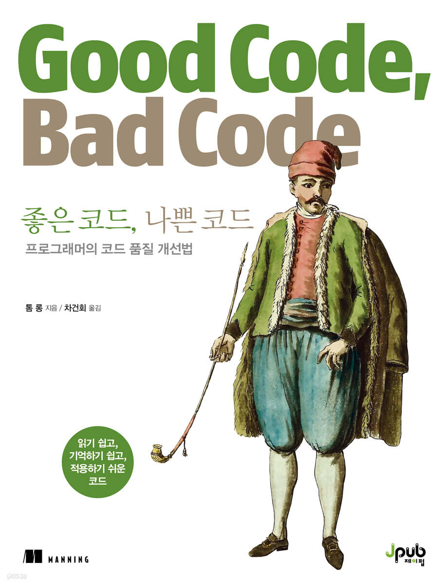
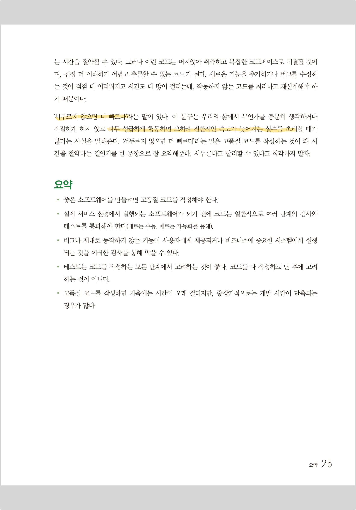
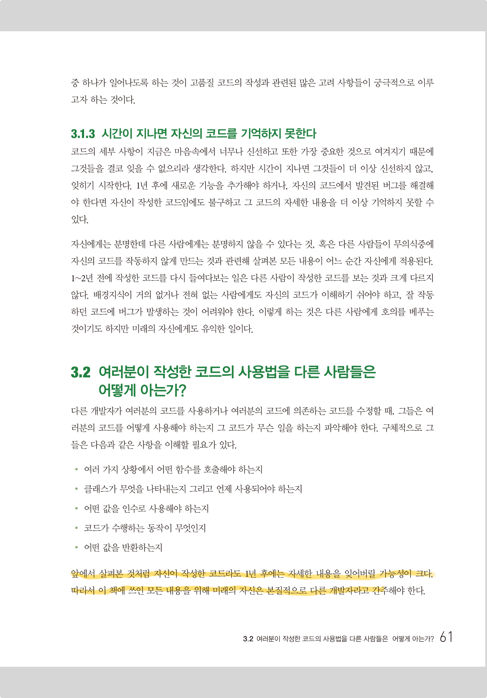
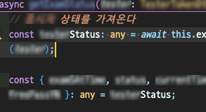
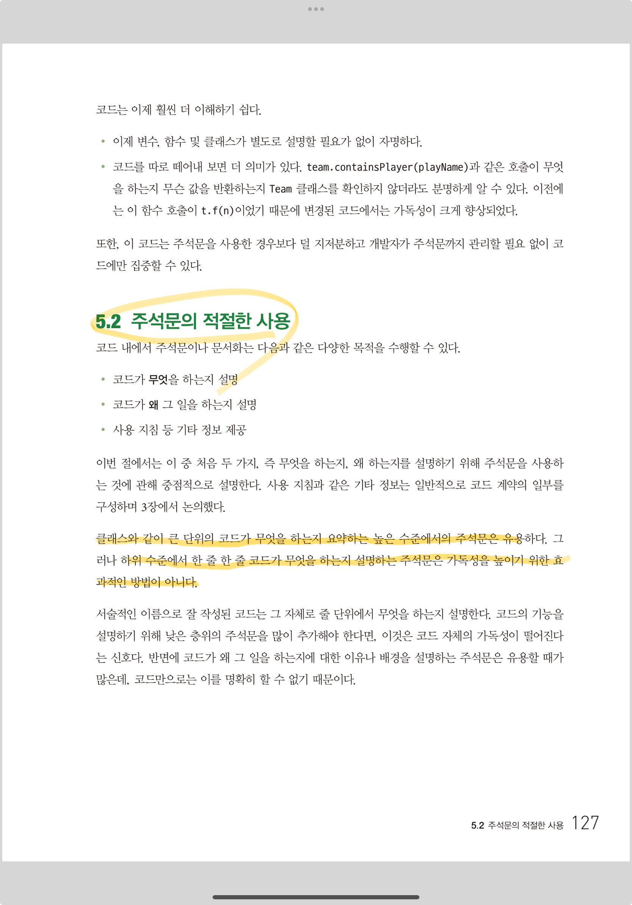
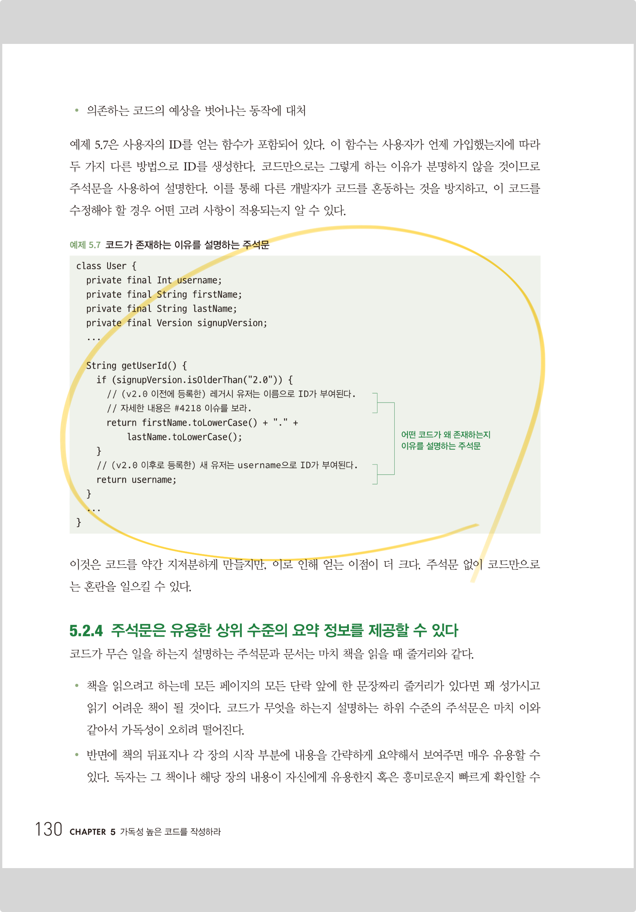

<br>

## 📓 독서후기

---

**「좋은 코드, 나쁜 코드」** 독서 후기

- **PART 1. 이론**

  - 1장. 코드 품질
  - 2장. 추상화 계층
  - 3장. 다른 개발자와 코드 계약
  - 4장. 오류

- **PART 2. 실전**

  - 5장. 가독성 높은 코드를 작성하라
  - 6장. 예측 가능한 코드를 작성하라

<br>
<br>

위 기재된 챕터들을 독서한 뒤 블로그에 후기로 정리까지 해보려한다.

많은 이가 그러하였듯이, 나 또한 개발 서적 중 처음 읽고 독서 후기로 남긴 도서가 **「Clean Code」** 였다.

<br>

---

<details>
<summary><strong>「Clean Code」 독서 후기 바로가기</strong></summary>

- 🔗 <a href="https://blog.jh8459.com/2023-03-20-BOOK/" target="_blank">Clean Code - 1</a>

- 🔗 <a href="https://blog.jh8459.com/2023-04-02-BOOK/" target="_blank">Clean Code - 2</a>

- 🔗 <a href="https://blog.jh8459.com/2023-04-09-BOOK/" target="_blank">Clean Code - 3</a>

- 🔗 <a href="https://blog.jh8459.com/2023-04-16-BOOK/" target="_blank">Clean Code - 4</a>
</details>

---

<br>

6장까지 읽은 후기를 한줄로 요약하자면, **「Clean Code」** 와 유사하다는 생각이 많이 들었다. (<del>아직 모두 읽진 못하였지만!</del>)

하지만, 이 책의 저자는 자신의 주장을 풀어나가는 방식이 조금 달랐다. 어떻게 다른지에 대하여 자세한 내용은 아래에 기재하였다.

<br>
<br>

### 1장. 코드 품질

---

코드 품질이 중요한 이유(<del>당연하지만! 조금 더 구체적으로</del>)에 대해 다루며, 좋은 코드 품질을 가진 소프트웨어가 중장기적으로 가져오는 베네핏에 대해 강조한다. 

1장을 한줄로 요약하자면 다음과 같다고 느꼈다.

<br>

> "서두르지 않으면 더 빠르다."

<br>


<center><strong>"좋은 코드, 나쁜 코드"</strong> page.25</center><br>

<br>

1장은 이 책의 저자가 얘기하고자하는 주제인 "고품질 코드"의 중요성에 대해 언급한다.

신뢰할 수 있으며, 유지보수가 용이하고 버그가 거의 없는 소프트웨어를 이루는 코드에 대해서 뻔하지만 중요한 이야기가 주된 내용이었다.

<br>
<br>

### 2장. 추상화 계층

---

이번 장은 추상화에 대한 근거있는 서술과 다양한 예시가 좋았다.

이 책의 큰 장점이라하면, 다양한 예시가 특정언어로 편향되어 쓰여지지 않았다. 다양한 언어에서 아이디어를 차용한 <strong>의사코드(pseudocode)</strong>를 사용한다는게 가장 큰 장점이라 생각한다.

2장은 다양한 예시(너무 큰 클래스 ~ 층이 너무 얇은 클래스)를 토대로 각각의 장단점을 꼬집는다.

**「Clean Code」** 와 비교하면(<del>계속 비교할 예정이다..</del>) 논란이 있을 만한 주제를 설명할 때는 적당한 예제와 함께 독자들을 이해시켜준다.

그리고 저자의 주장은 <strong>"여러 방법론 중 하나일 뿐"</strong>이라 끊임없이 주장한다.

이번 장에서 이 책이 가진 성격(?)을 고스란히 느낄 수 있었던것 같다.

<br>
<br>

### 3장. 다른 개발자와 코드 계약

---

3장부터는 "개발론"에 대한 내용이 주된 내용이었던거 같다.

다른 개발자..라고 지칭하였지만, 이는 나 자신과의 계약이기도 한다.

<br>

> "자신이 작성한 코드라도 1년 후에는 자세한 내용을 잊어버릴 가능성이 크다. 미래의 자신은 본질적으로 다른 개발자라고 간주해야 한다."

<br>


<center><strong>"좋은 코드, 나쁜 코드"</strong> page.61</center><br>

<br>

이 구문을 읽고 다음날 (<del>하필 오늘..</del>) 21개월 전 코드를 수정하다 경악을 금치 못하였다..

<br>


<center><del>뭐지 이 애니스크립트 + 구조분해 할당은..😮‍💨</del></center><br>

<br>

내가 쓴 코드가 맞나 싶어 <a href="https://www.gitkraken.com/gitlens" target="_blank">GitLens</a>를 통해 보니 내가 맞네..?? <del>21개월 전의 나의 무지가 드러나서 너무 뼈아프게 다가왔다. 🥲</del>

이 코드를 공유하며, 코드 리뷰를 통해 이런 코드들이 코드베이스에 병합되지 않게끔 팀원 모두 노력하자 다짐할 수 있는 계기가 되어 오히려(?) 좋았다.

<br>
<br>

### 4장. 오류

---

중요한 이야기를 담은 장이었다.

저자도 이번 4장은 초입부터 길게 풀어 쓰겠다 미리 선전포고(?)를 했다.

내용은 비록 길었지만 전달하고자하는 주된 내용들을 요약하자면 다음과 같았다.

- 복구할 수 있는 오류와 복구할 수 없는 오류를 구분하여 처리하라.
- 요란하게 실패하라.
- 명시적으로 오류를 전달하라.
- (부록) 컴파일러 경고를 무시하지 말라.

이 외에도 역시나 저자는 중론을 지킨다. "암시적으로 오류를 전달하는 방법"에 대해서도 소개하고 그 둘의 장단점을 꼬집는다. (<del>이젠 익숙하다</del>)

다만, 위 내용을 주된 방법론이라 설명하며 그 근거에 대해서 구체적으로 서술한다.

그리고 나 또한 저자의 생각과 같으며, 같은 방법론으로 예외의 상황을 처리하고 있다.

<br>
<br>

### 5장. 가독성 높은 코드를 작성하라

---

이번 5장 또한 **「Clean Code」** 와 비교하면(<del>그렇다, 또 나왔다.</del>) 전혀 다른 방향으로 방법론을 제시한다.

바로 "주석"에 대한 내용이다.

<br>

> "클래스와 같이 큰 단위의 코드가 무엇을 하는지 요약하는 높은 수준에서의 주석문은 유용하다."

<br>


<center><strong>"좋은 코드, 나쁜 코드"</strong> page.127</center><br>

<br>

**「Clean Code」** 에서는 "주석"은 다음과 같이 표현된다.

- 주석이 필요한 코드는 잘못 쓰여진 코드이다.

<br>

이번 책에서는 올바른 "주석" 사용법에 대해 몇가지 예시로 독자들을 설득한다.

그 중 공감이 가고, 실제로 도입하고 싶은 "주석" 사용 예시를 가져와보았다.

<br>


<center><strong>"좋은 코드, 나쁜 코드"</strong> page.130</center><br>

<br>

주석에 바로 #XXX 같은 이슈 넘버를 언급하는 팁이었다.

어떤 코드가 왜 존재하는지 이유를 설명하기란 비즈니스 히스토리와 연관있기 때문에 쉽지 않다. 주절 주절 길게 쓰기 보다 이슈 넘버를 언급하여 짧고 간결하게 남기는 팁이다.

이건..한번 도입해볼만 하다 생각하여 토론장에서 팀원들에게 공유하였고, 이는 승인되어 써봄직한 로직 부분이 발견되면 도입해볼 예정이다. 👍

<br>
<br>

### 6장. 예측 가능한 코드를 작성하라

---

이번 장은 1장의 <strong>"코드 품질"</strong>과 유사하게 흘러갔다. (<del>앞선 5장 또한 마찬가지였지만!</del>)

오용할 수 있는 코드의 양을 줄이고, 별도의 인수인계 없이 유지될 수 있는 코드를 작성하라는 내용이 주된 내용이었다.

또한, <strong>열거형(enum)</strong> 자료형 처리에 대해 주의하라 강조하였다. (<del>열거형(enum) 자료형을 애용하기에 너무도 반가운 주제였다! 🤩</del>)

최근 나도 아래와 같은 <strong>열거형(enum)</strong> 자료형을 수정한 적이 있다.

``` typescript
export enum GenderEnum {
  MAN = 'M',
  WOMAN = 'W',
  GENDERLESS ='NONE', // 추가된 열것값
}
```

시대가 바뀌며 당연하다 생각하는 것들이 더이상 당연하지 아닐 수 있다. 당연하다 생각하여 <strong>열거형(enum)</strong> 자료형으로 관리하는 것은 큰 오만이다.

그러므로 열것값이 추가될 수 있음을 언제나 대비하는 코드를 습관화 하라 강조한다.

실제 경험했던 사례라 크게 와 닿았다.

<br>
<br>

## 🤔 Understanding

---

앞서 읽은 **「Clean Code」** 와 다르게 이번 **「좋은 코드, 나쁜 코드」** 는 거북하지 않고 쉽게 읽혔다.

앞서 읽은 책의 예시는 모두 <strong>Java</strong>로 구성되어 있기에 예제 코드를 보면 쉽게 흥미가 떨어졌다. 하지만, 이번 책의 예시들은 <strong>의사코드(pseudocode)</strong>로 구성되어 있으며, 예시로 드는 사례에서 또한 여러 언어들(Java, C++, JavaScript, TypeScript 등등..)을 포괄적으로 언급하여 흥미도가 높았던게 큰 장점이었다.

<br>

> 실제로 매직값 사례로 <strong>JavaScript</strong>의 `indexOf()` 함수의 -1 리턴값이 언급될 때는 눈이 동그라졌다. 😳

<br>

절반정도 읽고 난 후기로는 1~2년차 주니어들이 읽기에는 좋은 서적(<del>특히나, 유지보수 업무를 담당하고 있다면 더욱 더</del>)이라 생각한다.

총 평을 말하기엔 아직 절반 가량의 분량이 남았기에 제대로 된 독서 후기는 마저 읽고 남겨보도록하겠다.

<br>
<br>

```toc

```
