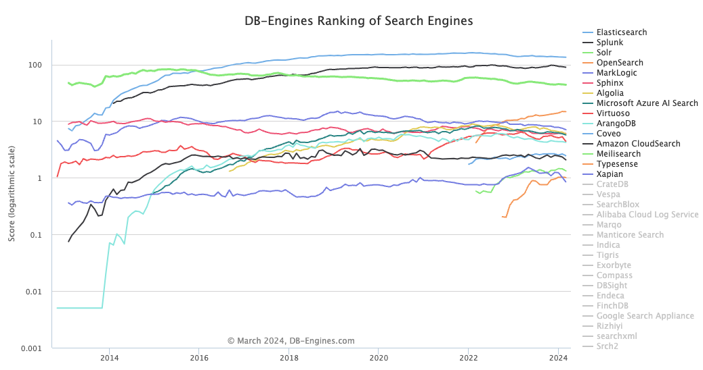
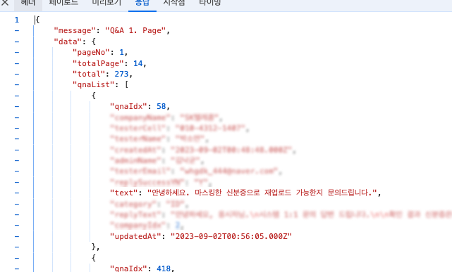

<br>

## ✍️ **T**oday **I** **L**earned

---

엘라스틱 서치를 이용한 검색 엔진을 도입하게 된 배경과 구현 과정의 프로세스에 대해서 간략히 정리하고 공유하기 위해 글을 남긴다.

<br>
<br>

### 1. Elasticsearch?

---
<strong>Elasticsearch</strong>는 아래와 같이 요약할 수 있다.

- <strong>Elasticsearch</strong>는 Apache Lucene기반의 Java 오픈 소스 분산 검색 엔진이다.
- <strong>Elasticsearch</strong>를 통해 방대한 양의 데이터를 신속하게(거의 실시간) 저장, 검색, 분석을 수행할 수 있다.
- <strong>Elasticsearch</strong>는 검색 엔진으로 단독으로 사용되기도 하며, ELK(Elasticsearch / Logstash / Kibana) 스택으로 사용되기도 한다.

위와 같은 특성 때문에 이러한 <strong>Elasticsearch</strong>는 대규모 로그 파일 관리나 실시간 검색 서비스 등과 같이 대용량 데이터를 빠르게 처리해야 하는 경우 유용하게 사용될 수 있다.

<br>


<center>검색엔진 중 독보적인 사용량을 자랑한다. 👍</center><br>

<br>

세부적인 내용은 뒤로하고 이번 포스팅에선 <strong>ELK</strong>(Elasticsearch / Logstash / Kibana) 스택을 도입하게된 배경과 구현 과정의 프로세스에 대해서 간략히 남겨보도록하겠다.

> 현재 시각화를 위한 Kibana는 아직 도입전이다. 추후 모든 ELK 스택 구현이 완성되면 다시 한번 포스팅을 남기도록하겠다.

<br>
<br>

### 2. ELK 스택 도입 배경

---

이전 포스팅 내용 중 회사에서 운영 중인 온라인 채용 서비스는 24시간 내내 실시간으로 응시자들의 문의사항들을 모니터링하고 있다는 사례를 공유한 적 있다.

> <a href="https://blog.jh8459.com/2024-04-01-RETROSPECT/" target="_blank">백엔드 개발자 2년차 회고 🤔</a>

이렇게 쌓이는 Q&A들은 DB에 쌓고 정기적으로 분석하여 자주 묻는 질문(FAQ) 제작등에 활용되고 있다.

<br>


<center>한계 없이 DB에 쌓이는 무수한 데이터들..😮</center><br>

<br>

기존 서비스는 Mysql의 `LIKE` 기능을 이용한 검색 방식을 사용하고 있었다. 이는 띄어쓰기나 단어의 순서등 검색어가 정확히 일치해야했기 때문에 기능적인 측면에서 부족함이 많았다.

또한, Q&A 테이블 특성상 한계없이 쌓이기 떄문에 이는 장기적으로 검색 속도에서도 저하가 올거라 예측되었기에 검색 엔진의 도입을 결정하게 되었다.

독보적인 사용량과 수많은 레퍼런스를 자랑하는 Elasticsearch을 도입하지 않을 이유가 없었다.

<br>
<br>

### 3. ELK 스택 도입 과정

---

<strong>Elasticsearch</strong>과 <strong>Logstash</strong>을 구축하는 과정을 자세하게 남겨보았다. (개발환경에 따라 구축하는 과정은 상이할 수 있기 때문에 참고만 하길 바란다.)

<br>
<br>

#### 3-1. Elasticsearch 구현

---

우선 간략히 요약하자면 아래와 같은 순서로 진행하였다.

- 개발 환경에 맞는 elasticsearch (0.00.0) image 다운로드
- 단일 노드 환경 (single-node)으로 설정
- `elasticsearch` 컨테이너의 `data` 디렉토리 볼륨 설정
- `traefik` 컨테이너가 실행된 후 `elasticsearch` 컨테이너가 실행되도록 `depends_on` 옵션 설정

<br>
<details>
<summary>docker-compose.yml <strong>코드 보기</strong></summary>

``` yml
  // ...(생략)

  elasticsearch:
    image: docker.elastic.co/elasticsearch/elasticsearch:0.00.0
    environment:
      - node.name=elasticsearch
      - cluster.name=es-docker-cluster
      - discovery.type=single-node 
      - bootstrap.memory_lock=true
      - "ES_JAVA_OPTS=-Xms512m -Xmx512m"
      - xpack.license.self_generated.type=basic
      - xpack.security.enabled=false
      - xpack.security.enrollment.enabled=false
      - http.host=0.0.0.0
    volumes:
      - ./elastic/es01/data:/usr/share/elasticsearch/data:Z
    ports:
      - 1111:9999
    networks:
      - net_default
    depends_on:
      - traefik
```
</details>

<br>
<br>

#### 3-2. Logstash 구현

---

이 또한 간략히 요약하자면 아래와 같은 순서로 진행하였다.

- `elasticsearch` 이미지와 동일한 버전<strong>(중요)</strong>의 `logstash` 이미지를 다운로드한다.
- Logstash와 연결할 DB관련 정보는 `.env` 파일에서 관리되도록 설정
- `path.data` : Logstash 데이터 저장 경로 설정
- `elasticsearch` 컨테이너가 실행된 후 `logstash` 컨테이너가 실행되도록 `depends_on` 옵션 설정
- MariaDB와 jdbc 플러그인을 연결하기 위한 <a href="https://dev.mysql.com/downloads/connector/j/?os=26" target="_blank">mysql-connector</a> jar 파일 볼륨 설정
- `config`, `pipeline`, `logs` 디렉토리 볼륨 설정

<br>
<details>
<summary>docker-compose.yml <strong>코드 보기</strong></summary>

``` yml
  // ...(생략)

  logstash:
    image: docker.elastic.co/logstash/logstash:0.00.0
    environment:
      - DB_HOST=$DB_HOST
      - DB_PORT=$DB_PORT
      - DB_DATABASE=$DB_DATABASE
      - DB_USERNAME=$DB_USERNAME
      - DB_PASSWORD=$DB_PASSWORD
      - xpack.monitoring.enabled=false
      - xpack.monitoring.elasticsearch.hosts=["http://elasticsearch:9999"]
      - http.host=0.0.0.0
      - http.port=8888
      - path.data=/usr/share/logstash/data

    volumes:
      - ./elastic/ls/jars/mysql-connector-j-8.3.0.jar/:/usr/share/logstash/logstash-core/lib/jars/mysql-connector-j-8.3.0.jar # mysql 사용을 위한 jdbc-connector 다운
      - ./elastic/ls/config:/usr/share/logstash/config:Z
      - ./elastic/ls/pipeline:/usr/share/logstash/pipeline:Z
      - ./logs/logstash:/usr/share/logstash/logs
    ports:
      - 8888:8888
    networks:
      - net_default
    depends_on: 
      - elasticsearch  
```
</details>
<br>
<br>

그 후 `pipelines.yml` 파이프라인을 정의한다.

- `path.config` : 각 파이프라인 설정 파일이 위치하는 경로

<br>
<details>
<summary>pipelines.yml <strong>코드 보기</strong></summary>

``` yml
# 온라인 문의 데이터 적재 파이프라인
- pipeline.id: main
  pipeline.workers: 1
  pipeline.batch.size: 1
  path.config: '/usr/share/logstash/pipeline/logstash-main.conf'

# 파이프라인 추가 가능
...
```

</details>
<br>
<br>

그후 파이프라인 설정 파일 `logstash.conf`를 정의한다.

- `input`: JDBC 플러그인을 사용하여 데이터베이스와 연결한다. 이 중 `schedule` 설정은 Logstash가 `statement`에 기재된 SQL 쿼리를 실행하는 주기를 설정하는 옵션이다.
- `filter`: 이 부분에서는 mutate 필터를 사용하여 자동 생성되는 `@version`과 `@timestamp` 필드를 제거한다.
- `output`: 여기서는 Elasticsearch 플러그인을 사용하여 데이터를 Elasticsearch에 색인한다. `qnaIdx` 필드의 값을 가져와서 각 document의 ID로 사용한다.

<br>
<details>
<summary>logstash.conf <strong>코드 보기</strong></summary>

``` conf
input {
  # jdbc 플러그인 → DB 연동 관련
  jdbc {
    jdbc_validate_connection => true
    jdbc_driver_library => "/usr/share/logstash/logstash-core/lib/jars/mysql-connector-j-8.3.0.jar"
    jdbc_driver_class => "com.mysql.cj.jdbc.Driver"
    jdbc_connection_string => "jdbc:mysql://${DB_HOST}:${DB_PORT}/${DB_DATABASE}?useUnicode=true&characterEncoding=utf8&serverTimezone=Asia/Seoul"
    jdbc_user => "${DB_USERNAME}"
    jdbc_password => "${DB_PASSWORD}"
    lowercase_column_names => false
    use_column_value => true
    tracking_column => "updatedAt"
    tracking_column_type => "timestamp"
    schedule => "*/5 * * * * *"
    statement => "SELECT 
                    qna.qna_idx AS qnaIdx, 
                    ...(생략)
                    qna.qna_avail AS qnaAvail
                  FROM 
                    ${DB_DATABASE}.qna AS qna 
                  LEFT JOIN 
                    ${DB_DATABASE}.t1 AS t1 ON qna.t1_idx = t1.t1_idx 
                  LEFT JOIN 
                    ${DB_DATABASE}.t2 AS t2 ON qna.t2_idx = t2.t2_idx
                  WHERE 
                    (qna.updated_at > :sql_last_value AND qna.updated_at < NOW())
                  ORDER BY 
                    qna.updated_at ASC"
    last_run_metadata_path => "/usr/share/logstash/pipeline/last-run-metadata/last-value-1.yml"
  }
}


filter {
  # mutate → 필드 변환 관련
  mutate {
    remove_field => ["@version", "@timestamp"]
  }
}


output {
  # elasticsearch 플러그인 → elasticsearch 적재 관련
  elasticsearch{
    hosts => ["http://elasticsearch:9999"]
    ssl_verification_mode => none
    index => "main-test310"   
    document_id => "%{qnaIdx}"
    template => "/usr/share/logstash/pipeline/template-main.json"  
    template_overwrite => true  
  }
}
```
</details>
<br>
<br>

마지막으로 Elasticsearch의 인덱스 설정을 정의하는 JSON 객체인 `template.json`을 구현한다.

- `max_ngram_diff`: `min_gram`과 `max_gram` 사이의 최대 차이를 설정하는 옵션이다. 이 설정은 `ngram` 토크나이저가 생성할 수 있는 n-gram의 크기 범위를 제한한다.
  - 예를 들어, `min_gram`이 2이고 `max_gram`이 3인 경우, "hello"라는 단어는 ["he", "el", "ll", "lo", "hel", "ell", "llo"]와 같이 2개 또는 3개의 연속된 문자로 분리된다.
- `number_of_shards`: 인덱스를 구성하는 샤드(Elasticsearch에서 데이터를 분산 저장하는 기본 단위)의 수를 설정하는 옵션
- `number_of_replicas`: 데이터의 가용성과 병렬 검색 처리량을 높이 목적을 가진 샤드의 복제본 수를 설정하는 옵션
- `my_ngram_analyzer`: 사용자 정의 분석기이며 이 분석기는 `my_ngram_tokenizer`를 사용하여 텍스트를 n-gram으로 분리하고, `lowercase` 필터를 적용하여 모든 토큰을 소문자로 변환한다.
- `my_ngram_tokenizer`: `min_gram`과 `max_gram` 사이의 크기를 가진 n-gram을 생성한다. (문자, 숫자, 구두점, 심볼, 공백이 포함된 토큰을 생성한다.)

<br>
<details>
<summary>template.json <strong>코드 보기</strong></summary>

``` json
{
    "index_patterns": ["main-*"],
    "priority": 1,
    "template": {
        "settings": {
            "max_ngram_diff": 30, 
            "number_of_shards": 1,
            "number_of_replicas": 1,
            "analysis": {
              "analyzer": {
                "my_ngram_analyzer": {
                  "tokenizer": "my_ngram_tokenizer",
                  "filter": ["lowercase"]
                }
              },
              "tokenizer": {
                "my_ngram_tokenizer": {
                  "type": "ngram",
                  "min_gram": 2,
                  "max_gram": 30,
                  "token_chars": [
                      "letter",
                      "digit",
                      "punctuation",
                      "symbol",
                      "whitespace"
                  ]
                }
              }
            }
        },
        "mappings": {
            "properties": {
                "qnaIdx": {
                    "type": "long"
                },
                // ...(생략)
                "createdAt": {
                    "type": "date"
                },
                "updatedAt": {
                    "type": "date"
                },
                "qnaAvail": {
                    "type": "date"
                }
            }
        }
    }
}
```
</details>

<br>
<br>

## 🤔 Understanding

---

기존에 사용중인 데이터를 Row(행) 단위로 한 줄씩 저장시키는 상황에서의 `LIKE` 검색 방법은 테이블의 첫행부터 마지막행까지 전체 데이터를 탐색하면서 데이터들을 찾아내야 할 수 밖에없었기에 속도적인 측면에서 점점 더 느려질꺼라 예상되었다.

- SQL `LIKE`를 사용하여 DB 테이블을 조회하는 방식

  ``` sql
  // 문의사항에 '안녕하세요' 텍스트가 포함되어있는 데이터를 출력하는 방식
  SELECT * 
  FROM qna 
  WHERE qna_text LIKE '%안녕하세요%'
  ```
  
뿐만 아니라, 정확히 <strong>"안녕하세요"</strong>이라는 단어가 포함되어 있어야만 했기에 검색 품질또한 보장받지 못하는 상황이 발생할 수 밖에 없었다.

<br>
<br>

결과적으로 이번 <strong>ELK 스택</strong>의 도입을 계기로 현재 기준으로 약 200-300ms 소요되던 검색 시간을 50-100ms 내외로 감소시켰으며, 검색어를 연속된 문자로 분리하여 검색하기 때문에 검색 품질또한 향상시켰다. (아래와 같이 검색어 중간에 공백이 존재해도 유사한 검색어에 대한 결과를 얻을 수 있게 되었다.)




<br>

ELK 스택 도입만으로 속도과 성능 두 마리 토끼를 모두 잡았다 생각한다. <del>(다만, 동시성은 살-짝 잃어버렸다. 🥲)</del>

아직 초기 구현단계라 개선해보고 싶은 사항들이 많다. (시간이 허용한다면, 여러 사용자 정의 분석기들을 비교 분석하여 도입해보고 싶다.)

앞으로 검색 엔진 개선은 꾸준히 해나가볼 예정이다. 다음에도 좋은 개선 사례가 있다면 블로그 포스팅으로 간략하게 남겨보도록하겠다.

<br>
<br>

```toc

```
