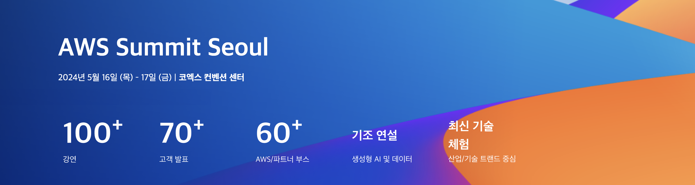

 

## AWS Summit Seoul 2024

작년 11월에 다녀온 <strong><a href="https://blog.jh8459.com/2023-11-15-RETROSPECT/" target="_blank">SDC23 삼성 개발자 컨퍼런스</a></strong>이후로 오랜만에 남기는 컨퍼런스 참석 후기이다.

작년부터 회사에서도 이런 컨퍼런스 참석을 권장하고있으며, 올해 또한 참석하여 어느덧 사내 문화로 자리잡고 있다.

올해 많은 컨퍼런스 중 **AWS Summit Seoul 2024**를 선택한 이유는 국내 최대 규모의 개발 컨퍼런스이기 때문에 최신 기술에 대한 인사이트를 쉽게 얻을 수 있으며, AWS를 이용한 클라우딩 기반 인프라로 전환을 성공한 기업들의 귀중한 경험을 훌륭한 연사들을 통해 엿보기에 너무 좋은 기회라 생각했기 때문이었다.

**5월 16일(목)** / **5월 17일(금)** 양일간 모두 참여하였으며, 컨퍼런스를 다녀 온 후기를 남겨보려한다.

 
 

## 신청 방법

너무도 간단하게 신청하였다.

특별한 제한사항(티켓팅, 추첨제 등등)도 없었으며, <a href="https://aws.amazon.com/ko/events/summits/seoul/" target="_blank">AWS 웹페이지</a> 내 이벤트 탭을 통해 지원 신청을 완료하였다.

참가 신청 링크가 열린 뒤 팀 내부 회의를 통해 참석을 결정 후 일주일 정도 뒤에 모든 팀원들이 함께 참가 신청을 하였다. <del>조기마감이 되었단 소식은 들었지만 3월 말 ~ 4월 초까지 몇 주간은 유효하게 지원 신청을 받았던 걸로 기억한다..</del>

참가 신청이 완료되면 신청 완료 메일을 수신하였고, 행사 하루 전날 아래와 같은 리마인드 메일이 발송되었다.

 

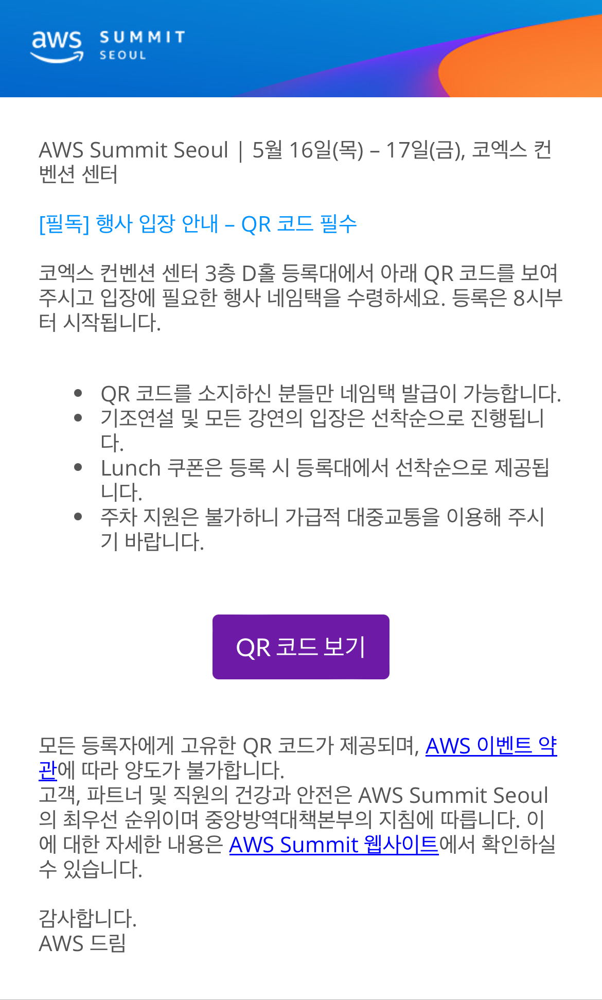

행사 당일 아침에도 동일한 메일이 한번 더 발송된다!
 

 

컨퍼런스 참석 후 알게되었지만 29,000명 이상의 참가 신청이 수용되었다 들었다!!.. 실제로도 수많은 스태프들까지 고려하면 행사 규모와 크기가 대단하다라는 생각뿐이 안들었다. 👍

**AWS Summit Seoul** 참석을 고민중이시라면 우선 빠른 참가 신청 접수 후 고민은 나중에 하시는걸 추천한다.

 
 

## 1️⃣ Day-1

코엑스 컨벤션 센터 3층 D홀에 도착 후 등록대로 가서 사전에 지급받은 QR코드를 확인 후 네임카드(+선착순 식권)를 지급받았다.

발급받은 네임카드는 NFC방식으로 동작(<del>추측!!..🥲</del>)하며 세션 입장시 혹은 EXPO 부스 방문시 태그 후 행사에 참여할 수 있었다.

행사장에 도착하면 도착 순서에 따라 기조연설을 듣기 위한 자리를 배정받는데, 메인홀은 자리가 모두 찼는지 아래 사진과 같은 외부 부스로 자리를 배정받았다.

 

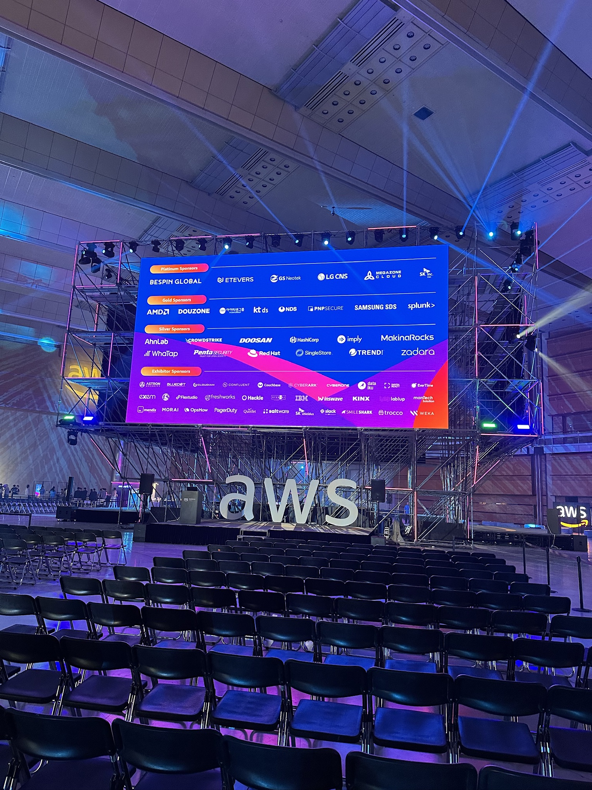

실제로 보면 엄청 웅장했다! 👍
 

 

10주년이 된 **AWS Summit** 첫째날의 기조연설은 클라우딩 기반 인프라가 10년이라는 기간에 걸쳐 요즘 트렌드로 자리잡은 이유와 GenAI(생성형 AI)의 화두를 중점으로 컨퍼런스는 시작하였다.

 

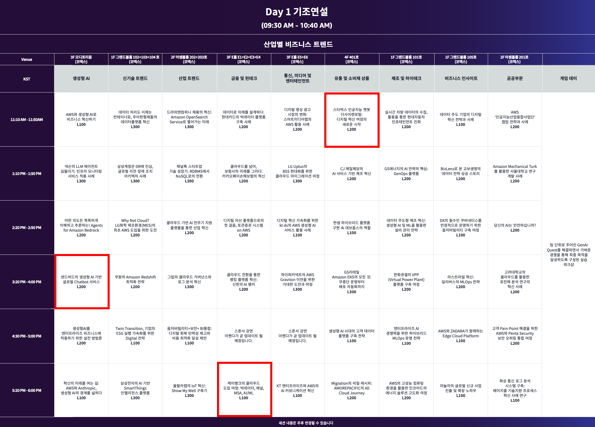

<del>표로 보니 열심히 안들었..🥲</del>
 

 

**Day-1**에는 위와 같은 일정(+기조연설)으로 세션에 참여하였다. 참석한 세션들을 타이틀만 요약하자면 아래와 같다.

- **스타벅스 인공지능 챗봇 더사이렌포탈**
- **센드버드의 생성형 AI 기반 글로벌 Chatbot 서비스**
- **케이뱅크의 클라우드 도입 여정: 빅데이터, 채널, MSA, AI/ML**

선택 기준은 행사 전 민주적인 절차로 진행되었다. 팀원들 모두 투표로 원하는 세션을 선택하였고 시간대 별 최다 득표 세션들을 골라서 참석하였다.

내가 세운 기준은 현재 우리 회사에 적용해보면 좋은 기술 세션과 클라우드 도입을 성공시킨 기업의 성공 사례를 통해 인사이트를 얻을 수 있는 세션을 우선 순위로 꼽아 투표를 하였다.

각 세션마다 참석 후기는 아래에 남겨보았다.

 
 

### 스타벅스 인공지능 챗봇 더사이렌포탈

---

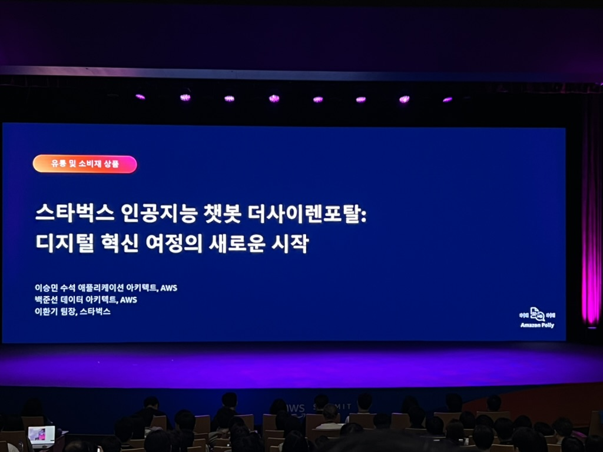

스타벅스 앱에 챗봇 기능이 있었나..? 라는 호기심으로 신청했던 세션.
 

 

<strong>"더사이렌포탈"</strong>은 파트너들의 업무 효율 증강을 위한 챗봇 AI이었다. 이번 세션에서는 해당 서비스 개발과정과 아키텍쳐를 소개하고 어떤 결과물을 이뤄냈는지 설명을 들을 수 있는 시간이었다.

전체적인 챗봇의 구성요소를 요약하자면 다음과 같았다.

1. 사내 문서부터 검색 가능한 인덱스까지 적재하는 **인덱스 파이프라인**
2. 인덱스부터 프롬프트에 삽입될 컨텍스트까지 고도화 하는 **검색 증강**
3. 프롬프트와 RAG의 품질을 수치로 측정하고 지속적으로 개선할 수 있는 **평가 파이프라인**
4. 실제 사용자가 접근해서 사용하는 챗봇 **어플리케이션**

위 네가지 단계를 거쳐 서비스를 배포하는 과정에 대한 전반적인 기술적인 고민과 어려움을 공유하는 자리였다.

 

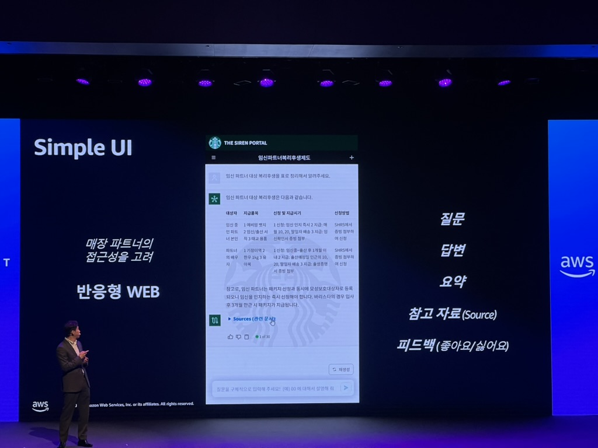

파트너 직원 출산 관련 복리후생에 대한 챗봇 응답 결과 👀
 

실제 개발 과정 중 이슈가 가장 많았던 분야는 기술적인 부분들보다는 문서 통합이 가장 어려웠다 말씀해주셨다. 통합 데이터를 구축을해야했는데, 문서기반 정보와 DB를 기반으로 한 정보들의 Format이 다르기에 정보를 합치는 과정이 제일 순탄치 않았다고 하셨다.

 

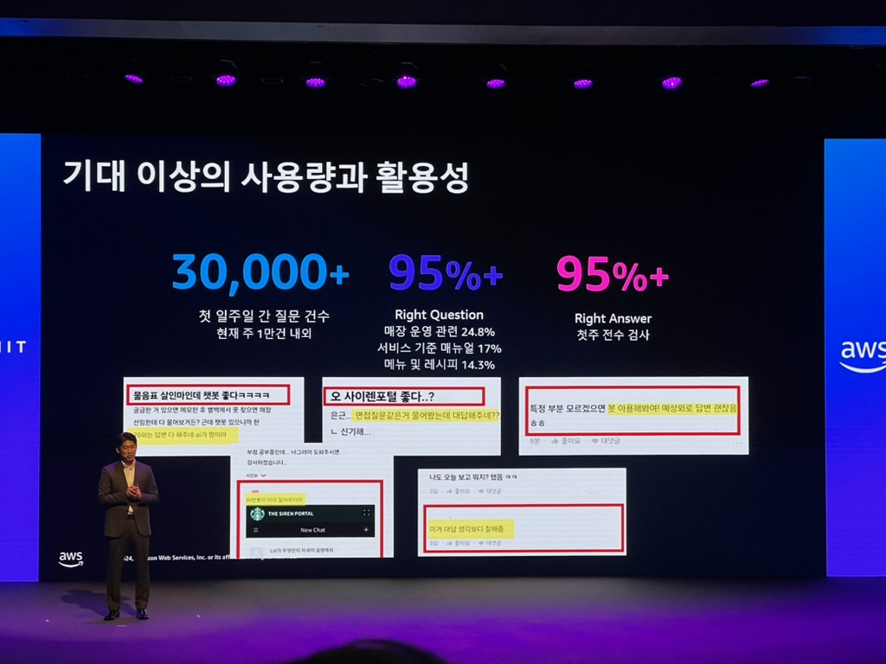

블라인드에서도 좋은 평가를 받는다고 한다. 👍
 

위 일련의 과정들을 모두 거친거에 비해 단순한 내부 직원용 서비스를 우선 배포하였으며 실제로 내부 직원들 평가 또한 좋은 호응을 받았다고 한다.

직원들의 생산성 향상이 곧, 브랜드의 평판까지 이어지기 때문에 성공적인 결과물이란 생각이 들었다.

서비스를 출시 후 이 말씀을 강조하셨다.

 

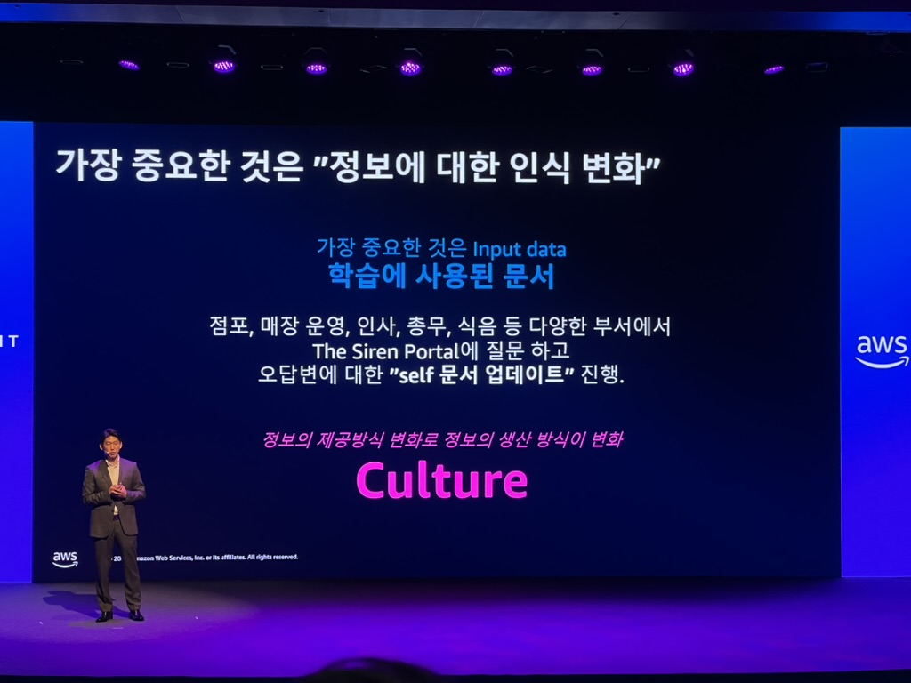

 

실제로 챗봇 서비스를 개발하는 과정에서 부서마다 업무 관련 문서들을 검토하는 과정에서 발견된 오류와 오탈자 검수를 스스로 진행하는 모습을 보였으며, 이를 기반으로 노후화 된 정보를 스스로 갱신하는 현상이 벌어졌다 후일담을 공유해주셨다.

모든 부서들의 협업으로 학습에 사용할 최신화 된 문서를 얻을 수 있게되었으며 이를 기반으로 문화를 바꿀 수 있다 하셨다.

 

> 입사시 파트너들에게 제공되던 업무 가이드 문서 철들을 이제는 링크 몇줄로 전달할 수 있게 되었다. 👍

 

앞으로 스타벅스의 생성형 AI가 어디까지 발전하는지 고객 입장으로도 기대가 된다.

매달 새로이 출시하는 식음료 제품이 나의 구매내역을 기반으로 선호도를 미리 제공해준다던지.. 등등 생성형 AI를 탑재한 새로운 스타벅스의 미래가 궁금해진 세션이었다.

 
 

### 센드버드의 생성형 AI 기반 글로벌 Chatbot 서비스

---

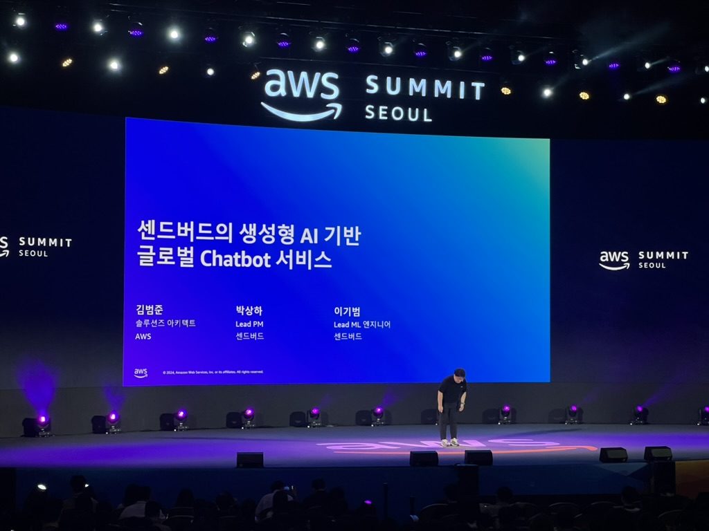

어쩌다 보니 생성형 AI 기반 챗봇 서비스 세션만 골라듣는..
 

이번 세션은 글로벌 기업으로 자리잡은 센드버드의 대표 서비스인 챗봇 서비스를 엿보고자 참석하였다. <del>사실 이번 세션은 큰 감흥은 없었다. 🥲 (지극히 주관적인 의견!!..)</del>

이번 세션을 요약하자면, AWS를 활용하여 어떻게 생성형 AI 서비스를 구축하는지에 대한 전반적인 아키텍쳐 설명과 함께 생성형 AI 서비스를 배포할 때 주의할 점들에 대한 전반적인 내용을 공유하는 시간이었다.

AWS에서 어떤 인프라 서비스를 활용하여 구축하는지에 대한 내용은 매년 새로운 기술이 출시함에 따라 바뀔 수 있는 내용이라.. 아직 우리 회사는 이런 서비스 개발 출시를 염두해둔 회사가 아니므로 간단하게 듣고 넘겼다.

이 중 흥미로운 점은 특정 주제 차단 또한 중요하며, 생성형 AI의 높은 자유도를 억누룰 수 있는 Rule-Base 챗봇의 결합 또한 필연적으로 진행해야한다는 주제였다.

 

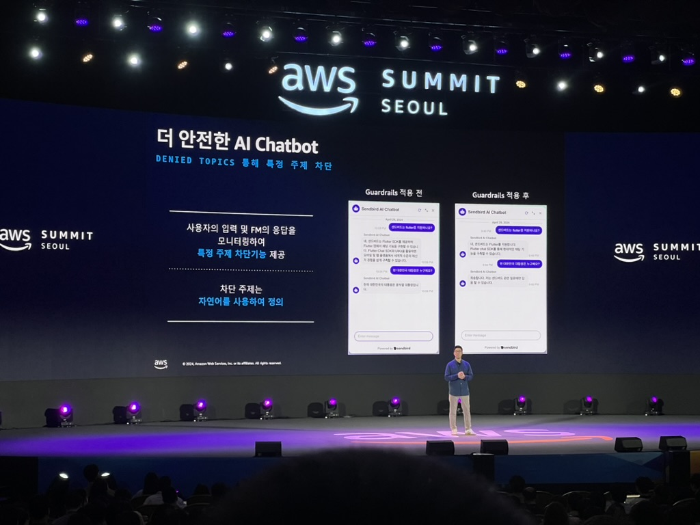

챗봇의 높은 자유도 또한 문제가 될 수 있다.
 

전반적인 내용이 AWS 인프라 서비스를 어떻게 사용하여 생성형 AI 서비스 구축하는지에 대한 흐름도를 소개해주는 세션이었기 때문에 생성형 AI 출시를 바로 앞둔 기업이라면 좋은 세션이었을거라 생각한다.

 
 

### 케이뱅크의 클라우드 도입 여정: 빅데이터, 채널, MSA, AI/ML

---

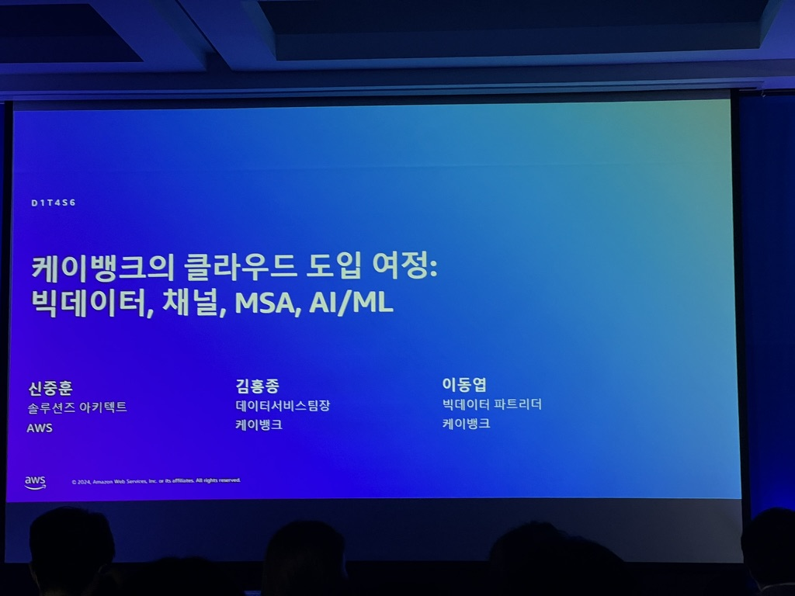

개인적으로 <strong>Day-1</strong> 세션 중 가장 재밌었다. 👍
 

**Day-1** 중 마지막으로 선택한 세션이었고 케이뱅크는 평소에도 잘 쓰고 있는 뱅킹앱이기도 하고 우리나라 최초의 온라인 전용 은행이기에 신청한 세션이었다. 주제 또한 **클라우드 도입**, **MSA** 등 현재 우리 회사에서도 직면하고 있는 문제점이기도 하기에 세션 진행전부터 기대가 높았고, 생각 이상으로 내용 또한 훌륭해서 너무 재밌게 듣고왔다.

기존에 서버 임대해서 잘 쓰고 있는데 <strong>"AWS를 왜 써야해?"</strong>라는 질문에 대하여 근거있는 해답을 제시하였으며, 그에 따라 결과 또한 시각화하여 잘 소개한 세션이었다.

우선 첫번쨰로 꼽아주신 내용은 <strong>제품 출시속도 가속화</strong>였다.

 

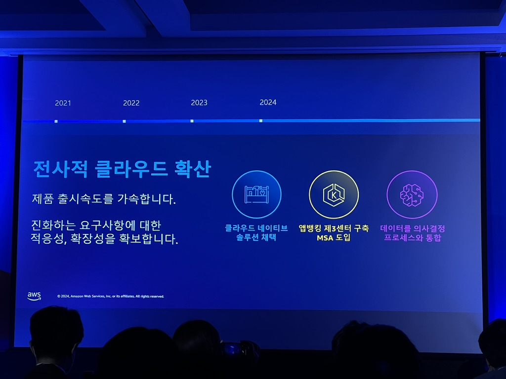

원하는 만큼 쉬운 확장이 큰 장점 ✅
 

온프레미스 환경에서는 서버 확장이 사측에서 결정이 되더라도 실제로 인프라를 구축하는 시간 소요, 혹은 원하는 장비 구매에 어려움이 있다면 예측 어려운 시간 소요 등이 발생한다.

실제로 머신러닝을 위한 GPU 고성능 서버는 1년 이상의 구매 대기시간이 소요된다한다..👀
 

반면 클라우드 기반으로 인프라를 구축할 시 클릭한번으로 의사결정을 바로 실현할 수 있기 떄문에 제품 출시를 가속화하는데 큰 도움이 되었다 하였다. (하드웨어 장비 노후화 등의 이슈에서도 탈출하는건 덤!..)

 

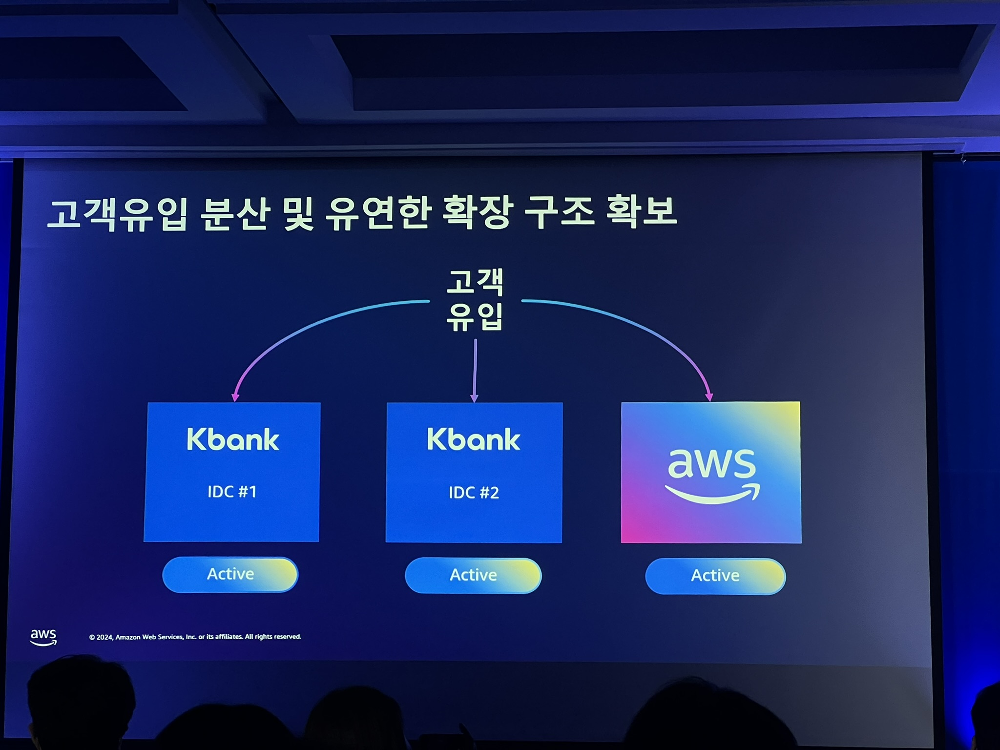

한번에 한 발자국씩 👣
 

실제로 케이뱅크도 한번에 모든 인프라를 클라우딩 기반으로 변경한건 아니고 2021년 09월 부터 클라우딩 기반 인프라 구축 의사 결정이 되었으며, 하이브리드 구조부터 시작하여 2023년 05월 기점으로 모든 인프라를 클라우딩 기반 인프라로 모든 서비스를 마이그레이션 완료하였다 한다. (2년도 안걸렸다.. 대단하다 👍👍👍)

이런 유연한 인프라를 얻었기에 MSA 또한 자연스레 고민할 수 있었다 한다.

클라우딩 인프라도입으로 인프라 스케일을 자유롭게 키우고 줄일 수 있게되어 서비스를 모듈화해서 배포할 수 있게 되었기에 기존 모놀리식을 탈피하고 단계적으로 MSA 방식으로 바뀔 수 있게되었다 설명해주셨다.

 

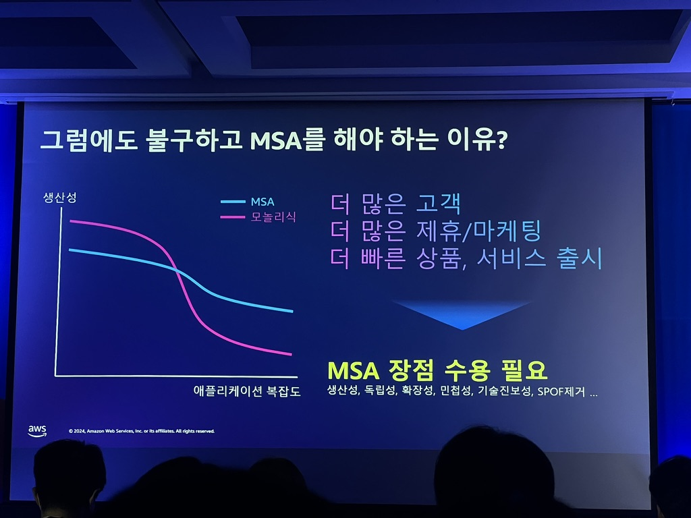

 

이번 세션을 통해서 금융감독위원회에서도 이러한 클라우딩 기반 인프라에 대해서도 긍정적으로 바라본다는 후일담을 공유해주셨는데, 이 또한 케이뱅크가 얼마나 클라우딩 인프라에 대하여 진심인지 느낄 수 있었던 대목 중 하나였던것 같다.

개인적으로 현재 재직 중인 회사에서 인프라 롤 모델을 잡자면 케이뱅크를 선택할 만큼 지금 우리 회사에서 직면하고 있는 문제를 모두 개편한 좋은 레퍼런스를 얻었다. 아주 유익한 세션이었다.

 
 

## 1️⃣ Day-2

어제 받은 네임카드는 다시 쓸 수 있었고 어제와 마찬가지로 코엑스 컨벤션 센터 3층 D홀에 도착 후 재입을 하니 식권을 다시 지급받았다. <del>이틀 모두 점식 식사 제공이라니!!..👍</del>

어제와 마찬가지로 기조연설을 듣기 위해 자리를 배정받았다. 어제와 마찬가지로 메인홀은 자리가 모두 찼는지 아래 사진과 같은 외부 부스로 자리를 배정받았다 🥲.

이틀차 기조연설을 요약하자면 **"비즈니스 모델에 맞는 아키텍쳐 구축, 그로인한 효율적인 비용 감축"** 정도로 요약할 수 있을 것 같다.

개발자들의 연예인 이동욱 CTO님도 참석하여 연사하셨는데 그 중 기억에 남는건 인프랩의 AWS 비용이 연 3억 가량..?? 인프라 비용 또한 무시할 요소가 아니라는 점을 강조하셨다.

전반적으로 여러 연사님들의 공통된 의견은 집중해야할 부분은 투자와 기술을 집중하여 안정적으로 운영해야하며, 그 외에 부분들은 적절한 아키텍쳐로 구축하여 시스템을 효율적으로 운영하는데 초점을 맞춰야한다라고 말씀해주셨고 공감되었다.

 

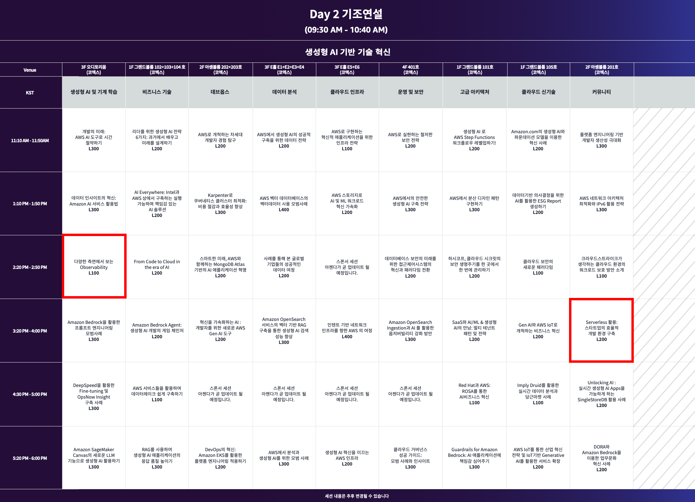

밀린 업무와 미팅까지 함께 병행해야 했기 때문에 오늘은 많은 세션을 참석하진 못하였다. 🥲
 

 

**Day-2**에는 위와 같은 일정(+기조연설)으로 세션에 참여하였다. 참석한 세션들의 타이틀만 요약하자면 아래와 같다.

- **다양한 측면에서 보는 Observability**
- **Serverless 활용: 스타트업의 효율적 개발 환경 구축**

각 세션마다 참석 후기는 아래에 남겨보았다.

 
 

### 다양한 측면에서 보는 Observability

---

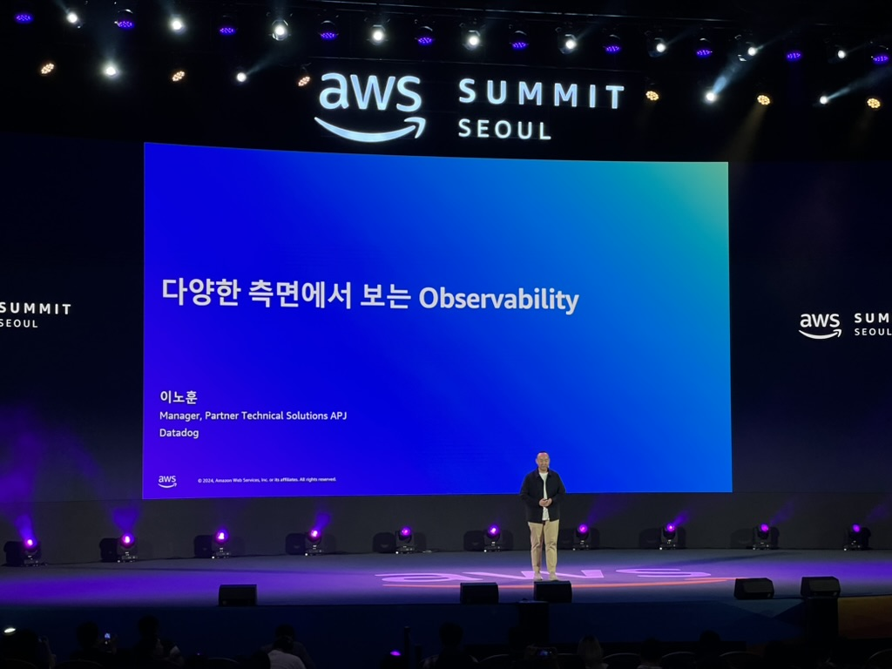

 

익숙한 기업인 Datadog에서 **Observability**의 중요성에 대해서 꼬집어 주는 세션이었다.

이번 세션을 요약하자면, 웹 애플리케이션을 모니터링하는 4가지 요소인 골든 시그널(Golden Signals)을 모니터링 하는 기준에 대한 설명과 적절한 사례를 제품 홍보(?)와 약간 버무려 설명해주셨다.

 

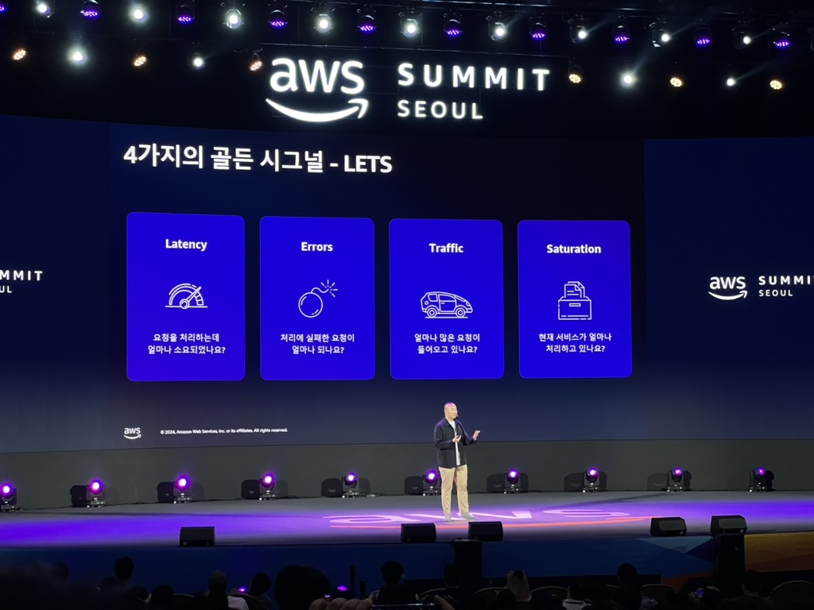

4가지 요소 LETS. 이미 업계에서는 많이 쓰이는 용어인듯하다!..👀
 

 

사실 이러한 모니터링 툴(Whatap, Sentry 등등)은 항상 좋다 생각한다. 다만, 지출되는 비용과 이러한 모니터링 도구에 대한 필요성을 개발팀이 아닌 경영진이 얼마나 필요로하는지에 대한 니즈가 부합해야 도입이 가능하더라..(경험상 🥲)

그렇기에 오 좋구나.. 하는 시선으로 이번 세션을 참석하였다.

 
 

### Serverless 활용: 스타트업의 효율적 개발 환경 구축

---

마지막으로 참석한 세션은 스타트업에서 AWS 클라우딩 기반 인프라 서비스를 이용하며, 어떻게 효율적으로 개발 환경을 구축한지에 대한 사례를 두 기업의 개발자들이 나와서 설명해주셨다.

 

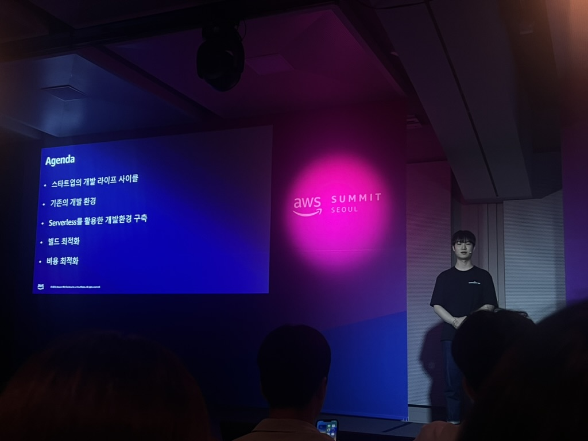

중요 포인트는 비용 최적화!!..💰
 

 

두 기업 모두 주제는 달랐지만 쟁점은 같았다.

스타트업의 최대 고민인 어떻게하면 <strong>"허리띠를 졸라 맬 수 있을까?"</strong>라는 주제였다. 사실 이는 모든 기업의 공통된 쟁점이긴하지만 빠르게 매출을 내야하는 부담을 가진 스타트업 기업들은 이런 고민이 더욱 클 수 밖에 없다 생각한다.

**Day-2** 기조 연설 주제와도 유사했지만 조금 더 스타트업 기업의 관점에서 깊게 들어 볼 수 있었던 세션이었다.

 
 

## 후기

너무 큰 행사장이었으며, 이런 큰 컨퍼런스 경험이 없어서 너무 헤맸다. **Day-1**은 길을 잃고 헤매다 듣고 싶었던 세션을 놓치는 어이없는 🥲 경험도 하였다.

듣고 나서 생각이 많아지는 세션부터 쉽게 쉽게 듣고 나온 세션까지 다양한 경험을 돈 한푼 안들이고 쉽게 얻어온 좋은 기회였다.

세션 후기만 남겼지만, EXPO에서도 다양한 기업들이 출범하여 자사 서비스들을 홍보하는 자리도 있었다.

 

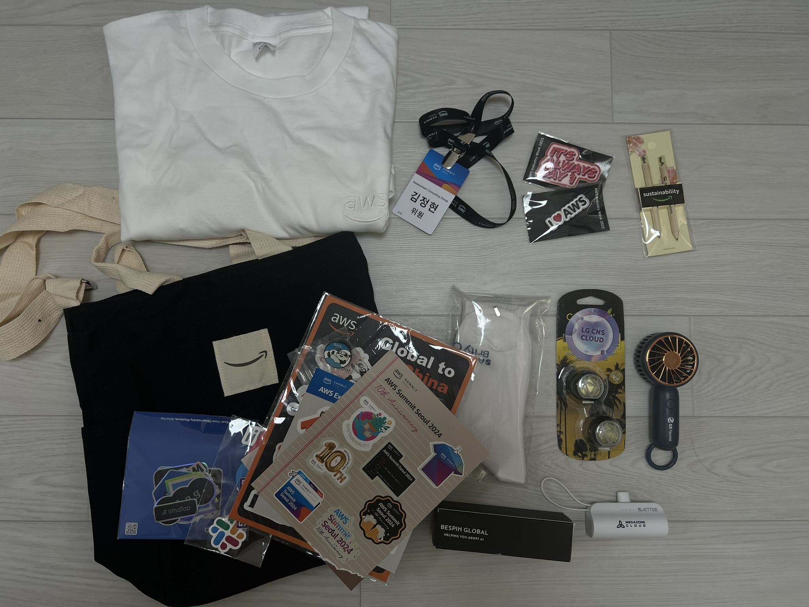

개인정보를 대가로 많은 경품을 얻어왔다..🥲
 

 

또한, AWS의 신규 생성형 AI기능들을 체험해볼 수 있는 공간들 또한 재밌게 모두 즐기고 왔다.

컨퍼런스 기간 동안 몇몇 기업은 서비스 홍보를 하러나온건가..라는 의문이 들긴했지만, 새로운 트렌드에 관련한 인사이트와 같은 고민을 가진 기업들의 해결과정 그리고 성공사례를 눈으로 귀로 직접 들을 수 있는 좋은 기회임은 반박할 수 없었다.

이번 컨퍼런스에서 경험한 일부분들을 접목해나갈 수 있게 된다면 또 다른 후기로도 남겨보도록하겠다.

 
 

