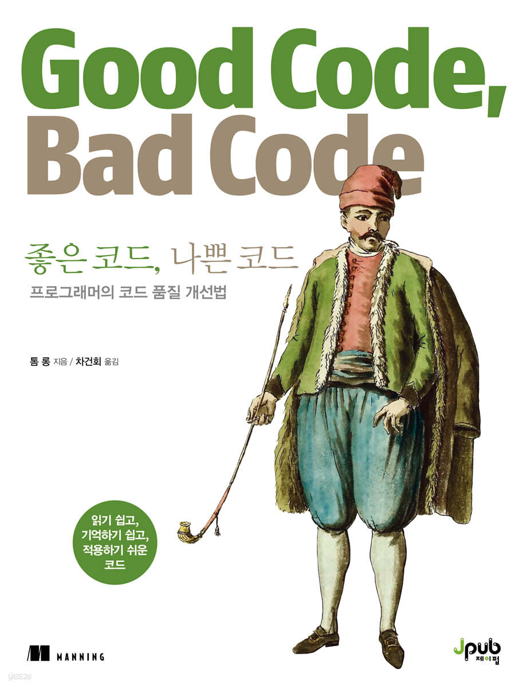

<br>

## 📓 독서후기

**「좋은 코드, 나쁜 코드」** 독서 후기

- **PART 2. 실전**

  - 7장. 코드를 오용하기 어렵게 만들라
  - 8장. 코드를 모듈화하라
  - 9장. 코드를 재사용하고 일반화할 수 있도록 하라

- **PART 3. 단위 테스트**

  - 10장. 단위 테스트의 원칙
  - 11장. 단위 테스트의 실제

<br>
<br>

<a href="https://blog.jh8459.com/2024-04-24-BOOK/" target="_blank"><strong>「좋은 코드, 나쁜 코드 - 1」</strong></a> 에 이어서 남은 챕터들을 모두 독서한 뒤 후기를 마저 남겨보려한다.

4~5월은 회사 특성상 상반기 공채 시즌으로 인해 굳이 나누자면 성수기에 가깝기에 격 주 간격으로 진행하던 <strong>"독서토론"</strong> 일정에도 조금 차질이 있었다. (<del>절대 절대 읽기 싫어서 미룬게 아니다.. 🥲</del>)

이번 책은 아무래도 어려운 내용도 있었고 업무적으로 바빴던 시기이기도 해서 한 권을 모두 읽는데 약 한달 이상의 시간이 걸리긴 하였지만 그래도 한권을 모두 읽고 난 뒤의 총평을 남길 수 있게 되어 기쁘다.

<br>
<br>

### 7장. 코드를 오용하기 어렵게 만들라

---

"코드를 오용하기 어렵게 만들라" 7장의 주된 내용 간단하다. 

이 책에서도 제품 디자인과 비교하여 잘 설명해준다.

<br>

> "식품 가공기의 많은 디자인은 뚜겅을 제대로 부착해야만 작동한다. 이것은 손가락이 날 근처에 있을 때 실수로 날이 회전하는 것을 방지하기 위한 것이다."

<br>


<center><strong>"좋은 코드, 나쁜 코드"</strong> page.202</center><br>

<br>

코드도 제품과 마찬가지로 오용하여 잘못사용하지 않게끔 설명하는 것이 중요하다 강조한다.

"불변 객체를 사용하는 것을 고려해라", "디자인 패턴을 잘 선택하여라", "지나친 일반 유형은 피하라".. 등등 좋은 글과 사례들은 잘 읽히진 않았지만 🥲 매번 강조해도 부족한 내용들이다.

특히, 시간 처리에 대한 주의사항은 실무 환경에서도 많이 겪는 이슈들이기에 공감이 많이 갔다. (+자바스크립트 진영에서 `js-joda` 서드 파티 라이브러리 추천도 기회가 되면 꼭 써볼 예정이다.)

<br>
<br>

### 8장. 코드를 모듈화하라

---

이번 장은 "코드의 재사용성" 관점으로 코드 모듈화에 대한 필요성을 강조하는 챕터였다.

특히나 **의존성 주입** 사용을 많이 강조하였는데, 실제로 내가 쓰고 있는 프레임워크인 NestJS 진영에서도 실제로 많이 쓰이는 방법론이기 때문에 흥미롭게 읽어나갈 수 있었다.

실제로 우리는 기능을 담당하는 단위별로 모듈을 나누고 모듈을 구성하는 서비스 단위로 의존성 주입을 통하여 서로의 기능을 공유하고 있다.

> **AuthService** 에서 2차 인증을 하기 위하여 문자 발송이 필요하다면 **NotificationModule**의 **SmsService**를 주입받아 사용한다.

그리고 **상속**에 대한 주의사항 또한 흥미롭게 읽은 주제 중 하나였다.

사실 무차별 상속으로 인하여 원하는 의도 이상의 기능을 노출할 수 있기에 추상화 계층이 복잡해 질 수 있다는 주의사항이었다.

7장과 8장은 객체 지향 프로그래밍(OOP) 관점으로 바라 본 코드 설계의 주의사항을 전반적으로 환기시키는 챕터였다. (<del>그래서 재미..는 너~~무 없었다. 😂</del>)

<br>
<br>

### 9장. 코드를 재사용하고 일반화할 수 있도록 하라

---

이번 챕터에서는 가장 흥미로웠던 문장을 꼽으라면 아래 문장을 꼽고싶다.

<br>

> "섣부른 최적화를 피하라."

<br>


<center><strong>"좋은 코드, 나쁜 코드"</strong> page.283</center><br>

<br>

개인적인 의견으로 최적화는 **"구현"** 단계 보다는 **"유지보수"** 단계 이후에 생각할 수 있는 요소라 생각하기도 하기 때문에 위 내용에 대해서는 깊히 공감하였다.

우선 구현에 집중한 뒤, 어느 부분에서 메모리 누수가 있는지 혹은 코드의 중복이 있는지 등등.. 기타 개선할 수 있는 요소들을 관측과 측정을하면서 개선해나가는 것이 개발자로써 가장 중요한 덕목이라 생각한다.

<br>
<br>

### 10장 ~ 11장. 단위 테스트

---

10장과 11장은 묶어서 한번에 후기를 남겨보려 한다. 

우선 <strong>"단위 테스트"</strong>라는 주제는 개발자 서적을 여러권 읽을 때마다 항상 나오는 주제이기도하며 언젠가는 테스트 코드를 작성해야지..하며 미뤄둔 숙제같은 내용이기 떄문이다.

우선 이번장을 읽으며 가장 공감되었던 부분은 아래와 같다.

<br>

> "고전주의자 classicist : 때로는 '디트로이트 학파'라고 일컬어진다. 목과 스텁은 최소한으로 사용되어 야 하고 개발자는 테스트에서 의존성을 실제로 사용하는 것을 최우선으로 해야 한다고 주장한 다. 실제 의존성을 사용하는 것이 가능하지 않을 때, 페이크를 사용하는 것을 선호한다. 목과 스 텁은 실제 의존성이나 페이크를 사용하는 것이 불가능할 때만 최후의 수단으로 사용되어야 한다."

<br>


<center><strong>"좋은 코드, 나쁜 코드"</strong> page.344</center><br>

<br>

뒤 이어 저자도 해당 이론에 동조하는 주장을 펼친다.

사실 거창하게 풀어서 쓴 글이지만 가짜 객체등을 생성해 내서 전반적인 테스트를 수행하는 것은 왠지 모를 거부감이 든다랄까.. 물론, 지극히 개인적인 의견입니다.

아무튼 이번 책에서도 **PART 3**가 모두 단위 테스트에 대한 내용으로 구성되었을 만큼, 그에 대한 중요성을 강조하고 있다. 

창피하게도 이런 개발 서적을 읽을 때마다 강조되는 테스트 코드의 중요성을 읽고 나서도 아직까지 테스트 코드를 작성하지 않고 있었다. (<del>급변하게 바뀌는 비즈니스 요구사항 때문에 구현이 바빴다..라는 핑계를 대본다.</del>)

<br>
<br>

쇠뿔도 단김에 뽑아보려고 간단한 비즈니스 서비스 로직에 유닛 테스트를 적용해보았다.

<br>


<center>실제로 여러 비즈니스 요구사항 때문에 사용되고 있는 응용프로그램 배포 목적의 electron-builder</center><br>

<br>

창피하게도 테스트 코드가 검증하는 커버리지가 아주 작고 소중하다. 😅

앱을 빌드하는 과정에서 휴먼 에러를 방지하는 목적으로 우선 작성해본 아주 간단한 테스트 코드이며 점차 테스트 커버리지를 넓혀 볼 생각이다.

실제로 테스트 코드를 작성해보니 조금 더 깊게 책의 내용이 다가왔으며, 이 시점을 기준으로 코드를 작성할 때 테스트 코드를 염두하고 작성해보려고 노력해보고자 한다.

<br>
<br>

## 🤔 Understanding

우선 스스로 뿌듯한 점은 개발 서적을 여러 권을 읽으며 항상 나오는 **단위 테스트**를 "나중에 도입해야지.." 라고 미루고 미뤘던 숙제를 드디어 실제 서비스 로직에 도입하였다. (<del>너무나도 늦었지만 말이다. ⏰</del>)

그저 관행처럼 책을 읽으며 독서 후기만 남기는 걸 넘어서 실천까지 이어질 수 있었던건, 팀 단위로 **함께** 책을 읽으며 느낀 점을 서로 공유하고 서로의 생각과 보고 느낀점을 시각화 하여 보여주는 **토론**까지 이어졌기 때문이지 않을까라고 생각한다.

이렇게 너무나도 좋은 문화임에는 분명하지만, 책을 쫓겨 읽는 듯한 후일담이 많이 공유되었기에 (나 또한 그러했다. 😂) 이번 책을 이후로 격주가 아닌 한달 단위로 책을 읽고 느낀 점을 공유하기로 일정을 조율하였다.

<br>
<br>

이번 책에 대한 전반적인 내용을 요약하자면 **「좋은 코드, 나쁜 코드 - 1」** 총평에서도 언급했듯이 **「Clean Code」** 순한 맛이랄까??..

특정 언어에만 매몰되지 않고 다양한 언어(특히 자바스크립트 진영)들의 경우의 사례가 많아서 너무 좋았다. 다시 시간을 되돌린다면 **「Clean Code」** 보다는 해당 책을 먼저 읽었을 것 같다.

불편하지 않고 쉽게 읽을 수 있는 주니어 개발자 필독..보다는 권장도서로 꼽고 싶다.

<br>
<br>

```toc

```
