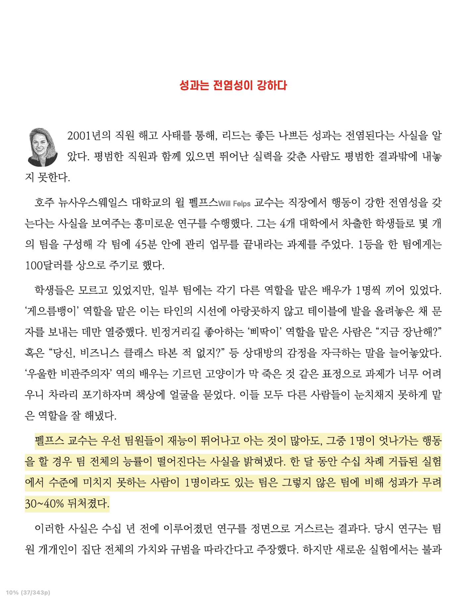
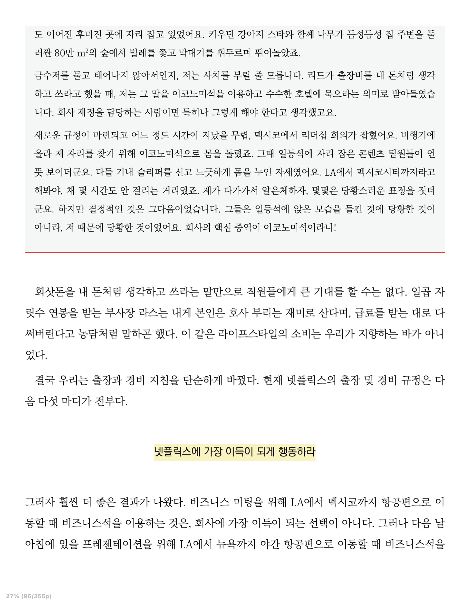

<br>

## 📓 독서후기

---

**「규칙 없음」** 독서 후기

- **1부. 자유와 책임의 문화로 가는 첫 단계**

  - 1장. 비범한 동료들이 곧 훌륭한 직장이다
  - 2장. 자신의 생각을 있는 그대로 말하라(긍정적인 의도로)
  - 3-1장. 휴가 규정을 없애라
  - 3-2장. 출장 및 경비 승인을 없애라

- **2부. 자유와 책임의 문화로 가는 다음 단계**

  - 4장. 업계 최고 수준으로 대우하라
  - 5장. 모든 것을 공개하라
  - 6장. 어떤 의사결정도 승인받을 필요가 없다

- **3부. 자유와 책임의 문화를 강화하는 법**

  - 7장. 키퍼 테스트
  - 8장. 피드백 서클
  - 9장. 통제가 아닌, 맥락으로 리드하라

- **4부. 세계를 무대로**

  - 10장. 이제는 세계로!

<br>
<br>

한마디로 책을 요약해보자면, 넷플릭스라는 거대한 기업의 조직 운영 방침서를 엿볼 수 있었던 책이었다. (<del>"넷플릭스"이기 때문에 가능한 것이지 범용성 있는 적용은 어려워보인다..🥲</del>)

개발서적과는 거리가 멀지만 훌륭한 조직 문화를 배울 수 있다는 점에서는 누구에게나 추천을 해주고 싶은 책이었다. (특히나 조직의 경영진들이라면!)

넷플릭스 성공신화를 담은 **「규칙 없음」** 독서 후 개인적으로 인상 깊었던 챕터들만 추려서 간략하게 후기를 남겨보려한다.

<br>
<br>

### 1장. 비범한 동료들이 곧 훌륭한 직장이다

---

1장의 내용("인재 밀도")이 곧 넷플릭스라는 기업의 조직 운영이 이뤄질 수 있는 밑바탕이라 생각한다.

"인재 밀도"라는 단어는 10장까지 계속하여 끊임없이 등장한다. 넷플릭스는 뛰어난 소수의 인재의 중요성이 아닌, 모든 조직 구성원이 뛰어나야한다라는 점을 강조한다.

<br>

> "팀원들이 재능이 뛰어나고 아는 것이 많아도, 그중 1명이 엇나가는 행동을 할 경우 팀 전체의 능률이 떨어진다는 사실을 밝혀냈다. (생략) 수준에 미치지 못하는 사람이 1명이라도 있는 팀은 그렇지 않은 팀에 비해 성과가 무려 30~40% 뒤쳐졌다."

<br>


<center><strong>"규칙 없음"</strong> 1장. 비범한 동료들이 곧 훌륭한 직장이다.</center><br>

<br>

1장의 길이는 짧았지만, 이 책을 관통하는 주된 주제였다. 이후의 내용은 높은 인재 밀도를 필두로 펼쳐지는 넷플릭스만의 조직 운영 방침을 설명한다.

<br>
<br>

### 2장. 자신의 생각을 있는 그대로 말하라(긍정적인 의도로)

---

2장의 주제는 조직 구성원들을 높은 인재 밀도를 가진 구성원들로 채웠다면, 그 다음은 솔직한 문화를 조성하는 것에 초점을 맞추라는 내용이었다.

넷플릭스 회사의 실제 사례들을 예시로 들어가며 솔직한 문화를 도입한 과정들을 자세히 서술해나간다.

<br>

> 우리는 솔직한 것을 싫어한다. (그러면서도 솔직하기를 바란다.)

<br>


<center><strong>"규칙 없음"</strong> 2장. 자신의 생각을 있는 그대로 말하라(긍정적인 의도로)</center><br>

비판을 듣는 건 항상 불편하다. 하지만, 건전한 피드백 루프를 만들고 모든 직원이 피드백을 원활히 주고 받을 수 있는 환경(이 책에선 <strong>"4A 피드백 지침"</strong>이라 설명한다.) 이 조성된다면 얻을 수 있는 이점에 대해서 설명한다.

> <details>
> <summary>4A 피드백 지침</summary>
> 
> - 피드백을 줄 때
>   - AIM TO ASSIST (도움을 주겠다는 생각으로 하라)
>   - ACTIONABLE (실질적인 조치를 포함하라)
> - 피드백을 받을 때
>   - APPRECIATE (감사하라)
>   - ACCEPT OR DISCARD (받아들이거나 거부하라)
> </details>

솔직한 문화가 정착되면 얻는 이점과 함께 어려움 또한 설명하며, 이를 위해 모든 조직 구성원들이 함께 노력해야함을 강조한다.

<br>
<br>

### 3장. 휴가 규정을 없애라 / 출장 및 경비 승인을 없애라

---

3장의 내용은 유사해서 한번에 후기로 남긴다.

주된 내용은 높은 인재밀도를 기반으로 투명하고 솔직한 기업 문화가 자리잡았다면, 불필요한 통제를 제거할 수 있다라는 내용이었다.

<br>

> 넷플릭스에 가장 이득이 되게 행동하라

<br>


<center><strong>"규칙 없음"</strong> 3-2장. 출장 및 경비 승인을 없애라</center><br>

단순한 지침만으로 모든 직원들이 올바른 선택을 할 수 있도록 맥락을 제시하고, 이를 남용하는 직원이 있다면 그를 해고하고 그 사실을 공개하여 다른 사람들이 결과를 납득하게해야 한다는 것이 넷플릭스가 선택한 조직 운영 방침이다. <del>(한국에서 자리잡기는 어려워보인다. 🥲)</del>

사실 3장 부터는 "넷플릭스"니까 가능한 운영 방침이지 않나라는 생각이 들었다. (따라서 챕터별 후기는 3장까지이다. 🥲) 국가별로 자리잡은 조직 문화라는 큰 뿌리가 있기에 <strong>범용적</strong>인 방침이 될 순 없다 생각은 들었다.

<br>
<br>


## 🤔 Understanding

---

책을 읽는 내내 "나는 과연 밀도있는 인재일까?"라는 생각을 하게되었다. 

<p><center><del>이 책을 모두 읽고 난 뒤는 슬프게도 "아니다"에 가까워졌다.</del></center></p>

한국 조직 문화에 길들여진 탓에 개선할 수 있는 점들이 보여도 피드백을 하기보다는 스스로 침묵하려 노력했고, 무언가를 이루기 위해 열심히 노력하기 보다는 그저 그럴듯한 성과를 내보였다. 즉, <strong>"특출"</strong> 보다는 <strong>"평범"</strong>에 가까워 지고 있었다. 그 누구에게도 미움도 받지 않는 그런 평범한 상태 말이다.

이 책에서는 미움을 받을 용기를 내기를 권장한다. 물론, 여기서 말하는 미움이라는건 건강한 비판을 뜻한다.

언제부턴가 남에게 상처주거나 미움받기 싫은 마음 때문에 솔직하게 말하는 것을 꺼리게 되었는데, 상대방에게 설령 미움을 받을지라도 "건전한 방법"으로 피드백을 주고, 반대의 경우에도 "감사한 마음"으로 피드백을 받아드릴 수 있도록 노력을 해야겠다.

물론, 이 책 1장에서 나왔듯이 높은 인재 밀도는 기본이다. 배움을 멈추지 말고, 그저 그런 결과물이 아닌, 매사에 최선을 다 할 수 있는 밀도 있는 인재가 되기 위한 노력 또한 반드시 수반되야한다.

<br>
<br>

3월 부터 시작한 독서 토론 중 <strong>「규칙 없음」</strong>은 처음으로 선택한 비개발 카테고리이다.

- <a href="https://blog.jh8459.com/2024-03-13-BOOK/" target="_blank">「개발자 원칙」</a>
- <a href="https://blog.jh8459.com/2024-03-27-BOOK/" target="_blank">「오늘도 개발자가 안 된다고 말했다」</a>
- <a href="https://blog.jh8459.com/2024-04-09-BOOK/" target="_blank">「어떤 개발자가 살아남는가」</a>
- <a href="https://blog.jh8459.com/2024-04-24-BOOK/" target="_blank">「좋은 코드, 나쁜 코드」 - 1</a>
- <a href="https://blog.jh8459.com/2024-05-21-BOOK/" target="_blank">「좋은 코드, 나쁜 코드」 - 2</a>

매번 읽던 개발 서적들의 흔한 패턴에서 벗어나 생각도 깊어지고 흥미로운 조직에 대해서 간접 경험을 할 수 있었다. 앞으로는 종종 비개발 카테고리의 도서들도 찾아서 함께 읽기로 하였다.

다음 책은 아마도 소통과 관련된 책이 되지않을까 싶다. 책을 읽는 주기는 한달 간격으로 이전 보다 길어졌지만, 긴 호흡동안 여러 방면으로 책을 읽어볼 수 있어져서 좋은듯하다.

```toc

```
