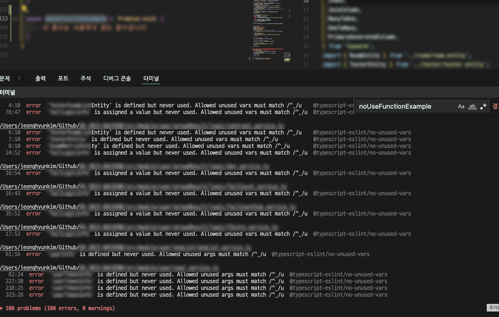
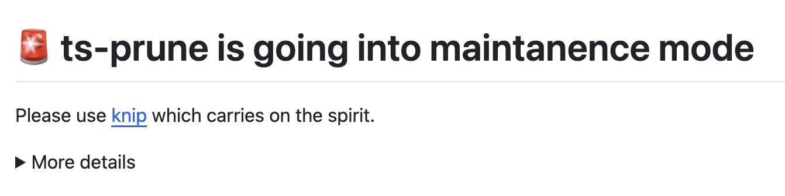
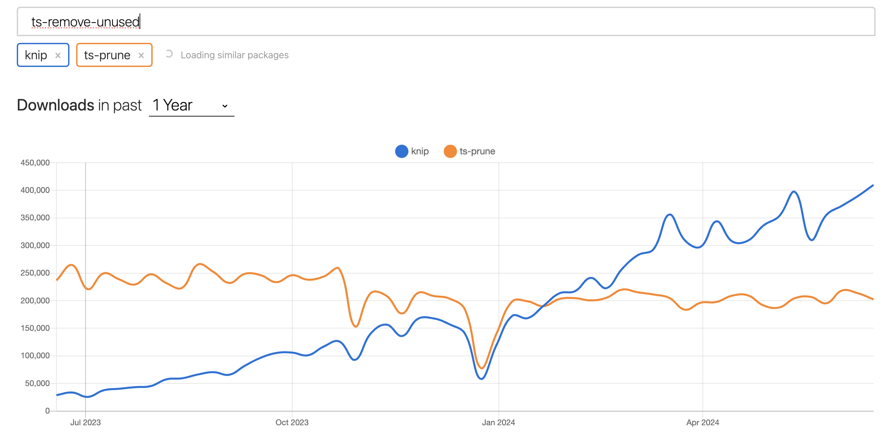
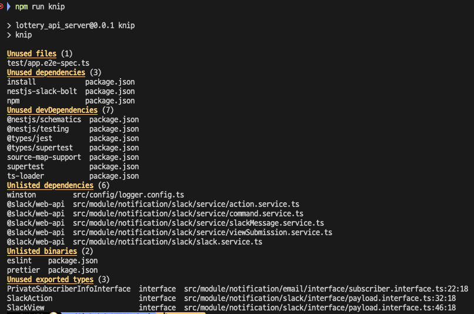

<br>

## ✍️ **T**oday **I** **L**earned

유지보수하는 과정에서 발생하는 Dead Code들을 쉽게 파악하고자 도입했던 개발 관련 도구들을 사용해본 경험에 대해서 간략히 정리하고 공유하기 위해 글을 남긴다.

> **Dead Code** 란?
>
> 실행이 되지 않는 코드를 뜻한다. 불필요한 코드들은 성능에 영향을 미칠수도 있으며, 휴먼 에러를 발생시키는 방해요소이다.

`ESLint`의 <strong><a href="https://typescript-eslint.io/rules/no-unused-vars/" target="_blank">no-unused-vars</a></strong>과 `Knip` 라이브러리를 간략히 설명해보고 어떤 걸 선택했는지 간략하게 후기로 남겨보도록 하겠다.

<br>
<br>

### 1. Dead Code의 발생 이유

---

모두 다른 환경에서 개발하고 있기 떄문에 보편적인 이유가 될 순 없겠지만 보통 나의 경우에는 API가 더이상 사용되지 않을 때, 혹은 새로운 기획안을 반영 하고 난 뒤 기존 코드를 제거하지 않았을 때에 <strong>Dead Code</strong>가 많이 발생되었다.

물론 코드를 바로 바로 정리하는 습관을 들이신 훌륭한 분들은 물음표를 지을 수 있겠지만 적어도 나는 위 이유로 가장 많이 불필요한 <strong>Dead Code</strong>를 양산시켰다.

 <p align = "center"><del>"이거 진짜 지워도 돼??, 잘 돌아가니, 일단 그냥 두자. 🥲"</del></p>

이렇게 발생한 <strong>Dead Code</strong>들은 시스템을 이해 / 유지보수하기 어렵게 만들고 있으며, 미비하겠지만 성능에 악영향을 준다.

<br>
<br>

### 2. ESLint

---

`ESLint`는 이미 사용중인 코드 컨벤션 검증 도구이었기에 부담없이 <strong><a href="https://typescript-eslint.io/rules/no-unused-vars/" target="_blank">no-unused-vars</a></strong> 옵션을 추가하여 현재 사용중인 프로젝트에 적용시켜보았다.

<br>
<details>
<summary>.eslintrc.js<strong> 코드 보기</strong></summary>

``` javascript
{
  "rules": {
    "@typescript-eslint/no-unused-vars": [
      "error",
      {
        "args": "all",
        "argsIgnorePattern": "^_",
        "caughtErrors": "all",
        "caughtErrorsIgnorePattern": "^_",
        "destructuredArrayIgnorePattern": "^_",
        "varsIgnorePattern": "^_",
        "ignoreRestSiblings": true
      }
    ]
  }
}
```
</details>

<br>


<center><strong>무려 108건의 미사용 변수 확인 🥲</strong></center><br>

적은 노력으로 이미 많은 <strong>Dead Code</strong> 검출이 가능했으나, 사용하다보니 사용하지 않는 클래스(`DTO`, `Interface` 등등)들 부터 미사용 함수들까지 검출해보고 싶다는 욕심이 더 생겼다.

<br>
<br>

### 3. Knip

---

GPT부터 여러 관련 자료들을 찾아본 결과 몇가지 <strong>Dead Code</strong> 정리 도구들을 찾아내었고 그 중 `Knip`을 선택하였다.

> - <a href="https://github.com/nadeesha/ts-prune" target="_blank"><strong>ts-prune</strong></a> (2023/12/07 지원 종료)
> - <a href="https://github.com/line/ts-remove-unused" target="_blank"><strong>ts-remove-unused</strong></a> (라인에서 공개한 오픈소스)
> - <a href="https://github.com/line/ts-remove-unused" target="_blank"><strong>knip</strong></a> (지원 중단 된 `ts-prune`에서 추천 도구로 언급)
  
<br>
<br>

이 외에도 여러 추천 도구들이 많았지만 `knip`을 선택한 이유는 우선 `ts-prune`에서의 README.md 파일에서 얻은 신뢰성.


<center><del>정신을 계승하다니..😮</del></center><br><br>

그리고 NPM 라이브러리 통계(<a href="https://npmtrends.com/" target="_blank">npm-trends</a>)였다.

 <br>

`ts-remove-unused` 는 무슨 이유인지 집계되지 않기에 자연스럽게 `knip`을 선택하였다.

우선 라이브러리 설치 후 기본 설정값으로만 실행해보니, 아래와 같은 결과를 얻었다.



이 외에 기능들을 <a href="https://knip.dev/" target="_blank">공식 홈페이지</a>를 통해 둘러 보니 사용되지 않는 파일, Export, 타입 및 외부 패키지들을 식별하는 도구였다.

이 외에도 `Auto-fix`등의 기능들도 지원하려는 모습 또한 보이던데 이건 조금 더 써봐야 할 듯하다.

<br>
<br>

## 🤔 Understanding

결론은 둘다 쓰기로 마음 먹었다. 👍

물론 안쓰는 코드를 바로 바로 정리하는 습관을 들이는 것이 가장 중요하지만, 이런 몸에 익어야하는 습관들을 바로 고치기는 어렵다 생각한다.

위 설명한 정적 코드 분석 도구들을 활용하여 좋은 습관을 강제로(?)라도 들여볼 생각이다.

우선 `ESLint`의 `no-unused-vars` 옵션을 활용해서 안쓰이는 변수들을 에러로 검출하는 컨벤션을 두어 안쓰이는 코드들은 앞으로 <strong>에러</strong>로 간주 하려한다.

`Knip`의 실행 결과를 JSON 포맷으로 된 결과물로 저장하여 테스트 코드로 활용할 수도 있을 것 같다.

- `knip-output.json`를 활용한 테스트 코드 샘플

  ``` typescript
  test('🏴‍☠️ Dead Code 테스트', () => {
    const knipOutput = JSON.parse(fs.readFileSync('knip-output.json', 'utf-8'));
    expect(knipOutput.unused.length).toBe(0);
  });
  ```
<br>

아직 사용해보진 않았지만, 팀원들과 논의해볼 만한 주제라 생각했다. 최근에 <strong>"좋은 코드"</strong>를 설명해주는 책들을 많이 읽었음에도 불구하고 실천해보려는 노력까지는 안 이어진 듯하다. 어렵지 않은 이런 사소한 노력부터 시작해보려 한다.

앞으로도 좋은 코드를 위한 노력을 꾸준히 해봐야 겠다.


<br>
<br>

```toc

```
