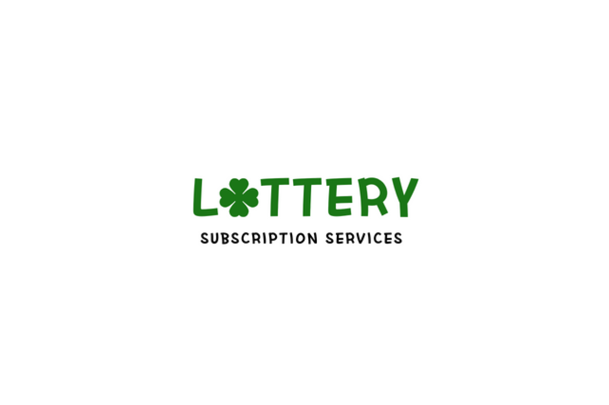

<br>

## LOTTERY 🍀

### 1. 개발 목적

개인적인 취미(?)로 매주 복권을 구매하고 있다. 로또는 QR코드로 당첨 결과를 손쉽게 제공해주지만, ~~(배아프지만)~~ 당첨 금액 정보를 찾고자 할땐 네이버나 동행복권 사이트로 접근해서 당첨 결과를 찾아봐야 했다.

또한, 스피또 복권도 종종 판매점 입고율과 남은 당첨 매수를 확인하고 전략적(?)으로 접근해서 구매하고 있는데 이를 확인하고자 동행복권 사이트 접속이 점점 많아졌다.

이런 행위가 비효율적이라 생각했고 이는 <strong>"구독 형태로 받아보게하면 되겠는데?"</strong>라는 생각으로 이번 프로젝트를 진행하게 되었다.

<br>
<br>

### 2. 구조 설계
---

우선 간단한 서비스이고 혼자 개발하고 인프라를 구축하고 운영해야하기 때문에 손쉽게 서비스들을 한데 모아 관리할 수 있는 구조로 구현하고 싶었다.

따라서, <strong>Kubernetes</strong>를 새로 학습해서 인프라를 구축하는 방향보다는 익숙한 <strong>Docker Compose</strong> 방식으로 간단하게 여러 서비스들을 정의하고 배포하고자하였다.

AWS EC2를 사용해서 인스턴스에 모든 서비스들을 <strong>Docker Compose</strong> 컨테이너 환경으로 구성하고자 하였으며 구성한 서비스 아키텍쳐는 아래와 같다.


<br>

실제 위와같은 아키텍쳐로 EC2 인스턴스에서 동작하고 있으며 세부적인 사항은 아래에서 자세히 설명하겠다.

<br>
<br>

#### 2-1. 리버스 프록시 서버 (Traefik)
---

우선 컨테이너 환경으로 여러 서비스(크롤링 서버, API 서버 등등)를 개발하기로 결정하였고 이 서비스들을 묶기 위한 리버스 프록시 서버를 어떤 프레임워크를 사용할지 선택해야 했다.

`NginX`와 `Traefik`이 보편적인 선택지였으며 그 중 나는 `Traefik`을 선택하였다.

- 손쉬운 설정으로 <a href="https://doc.traefik.io/traefik/operations/dashboard/" target="_blank">대쉬보드</a> 구현 가능한 점

  
  <center>실제 사용 중인 화면 예시 👍</center><br>

- 자동으로 Let’s Encrypt 인증서를 발급하고 갱신하는 기능이 내장된 점

이 외에도 이미 사용 중이기에 학습을 위한 시간을 할애하지 않아도 되는점 등등의 이유로 선택하게 되었다.

<br>
<br>

#### 2-2. 크롤링 서버 (Express)
---

크롤링 서버는 어떠한 기능도 제공하지 않고 365일 24시간 내내 지정한 시간에 특정 페이지에 접근하여 데이터를 수집해야하므로 API 서버와 따로 분리해서 구성하였다.

<br>

- 여러 기능을 제공하는 API 서버가 부하를 견디지 못해서 컨테이너가 재 시작되더라도 크롤링 서버는 항시 작동해야한다.
- API 서버가 의도치 않은 에러로 동작하지 않아도 크롤링 서버는 항시 작동해야한다.

<br>

위 조건을 충족해야하므로 API 서버와 별도로 분리하여 크롤링 서버를 설계하여 사용하였다. 어떠한 기능도 제공하지 않으므로 단순하다. (아래 기능만을 착실히 수행한다.)

```typescript
// Routes
app.use('/', indexRouter);
app.use('/health', healthRouter);

// Lotto Crawler
const lottoRule = new schedule.RecurrenceRule();

lottoRule.dayOfWeek = [0, new schedule.Range(0, 6)];
lottoRule.hour = 3;
lottoRule.minute = 0;
lottoRule.tz = 'Asia/Seoul';

lottoSchedule(lottoRule);

// Speetto Crawler
const speettoRule = new schedule.RecurrenceRule();
speettoRule.dayOfWeek = [0, new schedule.Range(0, 6)];
speettoRule.hour = 9;
speettoRule.minute = 0;
speettoRule.tz = 'Asia/Seoul';
```
<br>

따라서, 단순한 구조가 필요하므로 (상대적으로) 구조가 복잡한 `NestJS`보다는 자유롭고 간단한 프레임워크인 `Express`를 선택해서 사용하였다.

<br>
<br>

#### 2-3. API 서버 (NestJS)
---

다음으로 이번 프로젝트의 핵심 기능을 제공하는 API 서버는 익숙한 프레임워크인 `NestJS`를 사용하였다.

API 서버는 <strong>LOTTERY🍀</strong>의 주요 기능을 모두 담당한다.

<br>

- <strong>LOTTERY🍀</strong> Repository의 Watch를 클릭한 유저들을 `Github API`를 사용하여 정기 메일링 서비스
- `Bolt` 라이브러리를 사용하여 슬랙 앱을 통한 여러 기능을 제공하는 서비스
- 슬랙 앱 사이트 문의하기 및 기타 외부 API 제공

<br>

정기적인 스케줄링을 통해서 메일이 발송되어야 하고 슬랙 앱을 통해 외부의 요청을 받아 정보를 전달해야 하므로 다중 인스턴스 구조로 구성되었다. (다중 인스턴스 환경에서 동시성 문제는 과거 포스팅 기술 내용을 도입하였다.)

> 📌 <a href="https://blog.jh8459.com/2024-04-21-TIL/" target="_blank">다중 인스턴스 환경에서 동시성을 해결하기 위한 Redis 분산락 구현하기
</a>

<br>

이 외에도 아직 여러 기능들이 계속 도입될 예정이므로 아직 꾸준히 개발이 진행중이기도 하다.

- "문의하기" 작성시 실시간 알림 모니터링 기능
- 답변 또한 슬랙(개인 채널)에서 이메일 템플릿을 사용하여 답변 기능
- 테스트 코드 작성

<br>
<br>

#### 2-4. 캐싱 서버 (Redis)
---

크롤링 서버에서 얻은 복권 당첨 정보들은 정규화된 후 DB에 저장된다.

최신 회차 정보들은 자주 사용될 텐데, 매번 DB에 접근하여 가져오게 되면 불필요한 커넥션이 발생하고 DB 서버가 성능이 좋지 않으므로 (개인 NAS 서버에 올려두고 사용중이다.) 정보 전달시 낮은 속도로 제공될 수 있다.

- 이는 예전 사내 도서관 슬랙 앱 개발시 이미 겪은 이슈였다.

  > 📌 <a href="https://blog.jh8459.com/2023-05-01-PROJECT/" target="_blank">SLACK 챗봇 개발하기 (사내 도서관)</a> 

<br>

정보 전달 속도를 보장하기 위해 Redis를 활용해서 빠른 속도로 공유할 수 있게 설계하였다.

- 정보를 저장하는 서버(크롤링 서버)와 전달하는 서버(API 서버)가 서로 분리되어 설계되어 있으므로 Redis 캐싱 레이어를 두어 두 서버간의 물리적인 격차를 최대한 좁히고자 도입하였다.

<br>
<br>

#### 2-5. 정적 웹사이트 호스팅 서버 (NginX)
---

제일 마지막에 구현된 서비스 컨테이너이다. (기획 단계에서는 고려대상이 아니었다. 🥲)

슬랙 앱을 슬랙 앱 디렉토리에 배포하고자 앱을 출시하려하니 <a href="https://lottery.jh8459.com/" target="_blank">슬랙 앱 소개 웹 페이지</a>가 필수적으로 제출되어야했다.

- 앱 설치 버튼을 내포해야하고, 어떤 정보들을 수집하고 관리하는지 그리고 피드백을 받을 수 있는 고객 지원 페이지 또한 내포되어야했다.

따라서, 간단하게 정적 웹 사이트로 웹 사이트 퍼블리싱 후 배포하기 위한 목적으로 설계에 포함되었다.

<br>
<br>

### 3. 개발 과정 중 어려움
---

모든 과정이 순탄하지 않았지만 하나만 꼽자면 슬랙 앱을 배포하는 과정이 제일 난관이었다. (아직도 심사 받기위한 최소 조건을 충족하지 못했다. 😮‍💨)

  
  <center><strong>까다로운 슬랙 앱 출시 과정 😂</strong></center><br>

<br>

심사 피드백 봇에서 먼저 잡혀서 정식 심사 제출은 못하였다. (내용을 요약하면 아래와 같다.)

- <strong>슬랙 앱 소개 웹 페이지가 올바르지 않은 양식이다.</strong> (✅ 슬랙 앱 웹 페이지 배포 완료)
- <strong>사용하지 않는 권한이 포함되어있다.</strong> (✅ 불필요 권한 정리 완료)
- <strong>10개 이상의 워크스페이스에 설치되어야한다.</strong> 

<br>

다른건 스스로 해결이 가능한데, 10개 이상의 워크스페이스 설치는 타인의 도움을 받아야한다. 🥲 (프로젝트 개발이 완료되면 개발자 커뮤니티 같은 곳에 홍보를 해볼까 생각중이다.)

<br>
<br>

---

이 외에도 <strong>"혼자"</strong> 개발하기 때문에 사용성이 편한지, 실제로 유용한지에 대한 테스트를 해보기가 너무나도 어려웠다.

그래서 실제로 기능이 하나씩 구현될 때마다, 주변에 있는 팀원들에게 먼저 많이 홍보도하고 피드백 요청을 많이 드렸던거 같다.

  
  <center><strong>「규칙 없음」</strong> 의 4A 피드백이 이럴 때 쓰는건 아닌거같은데.. 🤣</center><br>

결국 아무리 작은 사이드 프로젝트라도 <strong>"혼자"</strong>서는 해결하지 못하는 요소가 분명히 발생한다라는 점이 가장 어려운 점이 아니었나 싶다.

<br>
<br>

## 🤔 Understanding

이번 프로젝트는 정말 작은 아이디어인 복권 당첨 정보를 <strong>"구독 형태로 받아보게하면 되겠는데?"</strong>로 시작하였다.

실제로 처음 기획 단계에서는 로또 당첨 결과만 <strong>LOTTERY🍀</strong> Repository의 Watch를 눌러준 유저들에게 정기 구독 이메일 정보를 발송해주는 형태로 기획되었었다.

개발 후 주변사람들에게만 출시해봐도 정말 여러 피드백을 받은 것 같다.

- 저는 깃허브 계정이 없는데요? (비개발 직군)
- 로또 말고 스피또도 알려주세요.
- 앱 소개 웹 사이트 모바일 환경에서 너무 불편해요.

<br>

여러 건전한 피드백을 토대로 꾸준히 발전할 수 있었던거 같다.

좋은 서비스를 만들기 위해 먼저 개발을 시작하고, 사용자들로부터 피드백을 받아 점진적으로 개선해 나가는 개발 방식<strong>(애자일(Agile) 개발 방법론)</strong>의 필요성을 다시 한번 몸으로 느낄 수 있었다.

아직 완성된 프로젝트가 아니기에 아직 개발해 나가야할 부분들이 많이 남아있고, 정식으로 슬랙 앱 디렉토리에도 심사 받은 <strong>LOTTERY🍀</strong> 앱을 꼭 배포해보고 싶다.

<br>
<br>

```toc

```
