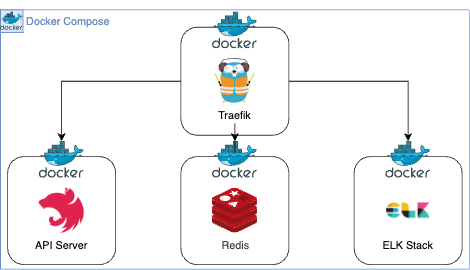

<br>

## ✍️ **T**oday **I** **L**earned

다중 인스턴스로 구성된 환경에서 동시에 임계 자원에 접근하려는 상황(동시성)을 제어하기 위해 도입한 방법을 간략히 정리하고 공유하기 위해 글을 남긴다.

<br>
<br>

### 1. 문제점

---

현재 사내에서 사용중인 서비스 구성도는 아래 사진과 같다.

<br>



<br>

이 구성도 내부에서 <strong>API Server</strong>는 Docker compose 환경에서 `replicas` 옵션으로 구성하여 쓰레드 갯수 만큼 다중 인스턴스 환경으로 구성되고 있다.

여러개의 인스턴스로 구성되어 있기 때문에 스케쥴링 작업 등 여러개의 인스턴스가 동시에 같은 자원을 요구하는 작업에서 반복적인 에러가 리포팅되고 있었다.

<br>
<br>

### 2. 해결방안

---

우선 키워드를 먼저 언급하자면 <strong>"동시성 제어(concurrency control)"</strong>였다.

비슷한 레퍼런스를 찾고자하니 많은 솔루션들이 나왔다.

기억나는 솔루션 중 참고 될 만한 자료들은 링크로 따로 남겨두겠다.

<br>

> <a href="https://medium.com/nodejs-server/node-schedule-pm2-8f7831ed231e" target="_blank">🔗 PM2 환경에서 중복되지 않는 스케쥴링 구현</a>
>
> <a href="https://sg-choi.tistory.com/602" target="_blank">🔗 스프링 환경에서 스케쥴러 락 (ShedLock)</a>

<br>

위 두가지 방법들이 대다수가 사용하는 솔루션이었다.

각각 내포하는 뜻은 다음과 같다.

<br>

1. `replicas` 옵션으로 복제된 각각의 인스턴스의 컨테이너 번호를 알아내어 특정 번호의 인스턴스만 실행되게 한다.
2. 스케쥴링 작업이 실행되기 전 우선권을 얻은 뒤 우선권을 얻은 인스턴스만 스케쥴링 작업이 실행되게 한다.

<br>

`replicas` 옵션은 유동적으로 변하기도하고 각각 내부 인스턴스의 상황은 그때 그때 변하기 때문에 고정 번호의 인스턴스만 실행되게하는건 리스크가 있다 판단하였다. 따라서, 두번째 방향으로 리팩토링을 진행하였다.

여러개의 인스턴스가 공통으로 사용하는 자원을 활용하여 우선권을 선점여부를 판단하여 "Lock"을 걸어야하므로 <strong>Redis</strong>를 활용하였다.

스프링 환경의 `ShedLock` 기능과 유사한 <strong>"분산락"</strong>을 구현해보았다.

<br>
<br>

### 3. 변경점

---

검색해보니 RedLock 알고리즘(권장) 등 이러한 분산 환경에서 쓰이는 여러 알고리즘들이 있다는걸 알게되었다.

우선 현재 사용중인 스케줄링들은 정산이나 비용에 관련된 데이터 정합성에 아주 민감한 비즈니스 로직은 아니므로 간단한 알고리즘으로 구현해보았다.

<br>

- <strong>redis.service.ts</strong>

  ``` ts
  @Injectable()
  export class RedisService {
    constructor(@InjectRedis() private redis: Redis) {}

    // Lock 유지 시간 (5분)
    private readonly lockDuration = 60 * 5;

    async setLock(key: string): Promise<string> {
      // Lock 획득
      const lock: string = await this.redis.set(key, 'LOCK', 'EX', this.lockDuration, 'NX');

      return lock;
    }

    async unLock(key: string): Promise<void> {
      // Lock 해제
      await this.redis.del(key);
    }
  }
  ```

- <strong>scheduler.service.ts</strong>

  ``` ts
  @Cron(CronExpression.MONDAY_TO_FRIDAY_AT_9PM)
  async scheduler(): Promise<void> {
    const lockKey = 'LOCK_KEY';
    const lock = await this.redisService.setLock(lockKey);

    if(!lock) return;

    try {
      // 스케쥴링 로직
    } finally { 
      await this.redisService.unLock(lockKey);
    }
  }
  ```

<br>
<br>

## 🤔 Understanding

코드 구현 난이도 자체는 높지 않았다.

다만, "데이터의 정합성" 이라는 큰 개념아래에서 동시성을 제어하여야 한다는 걸 인지하지 못했다면 평생 해결하지 못할 이슈였다.

분산 환경에서 고려해야할 것이 많다라는 점을 충분히 인지할 수 있었던 시간이었다.

<br>
<br>

