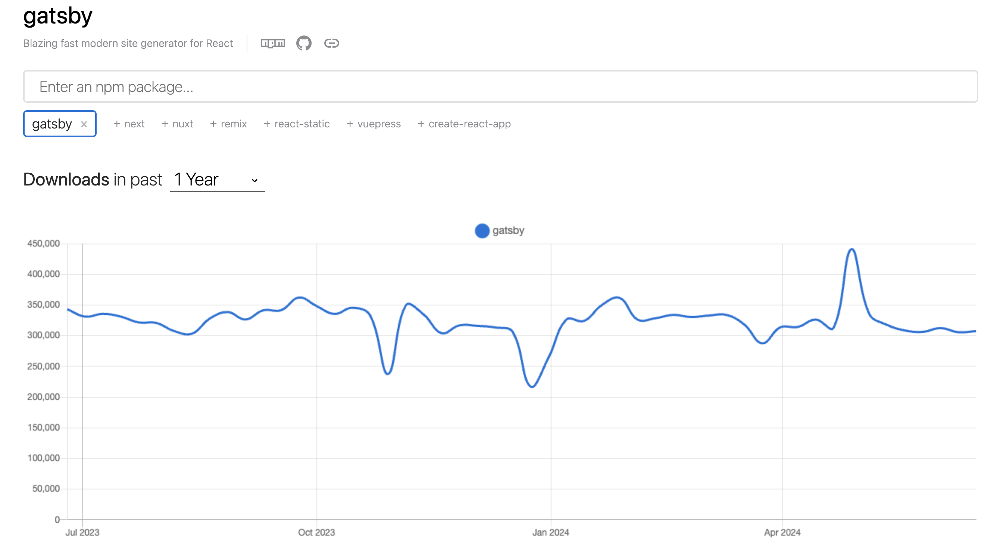
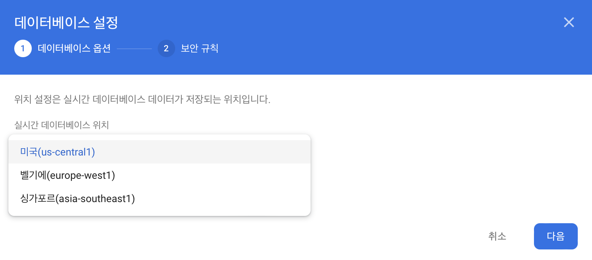
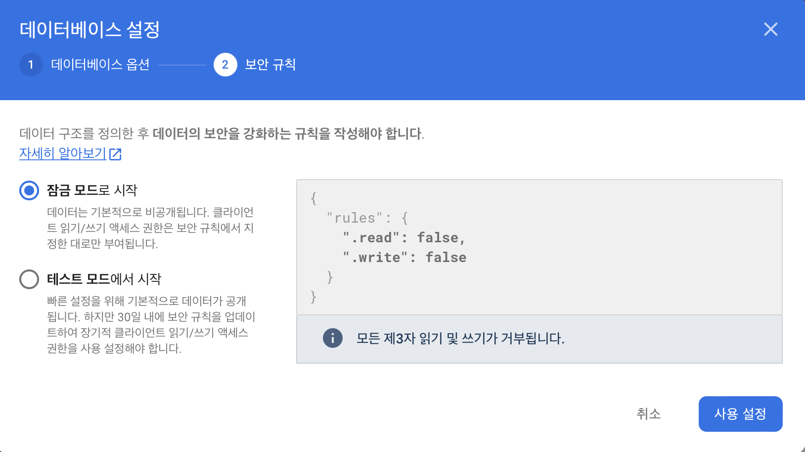
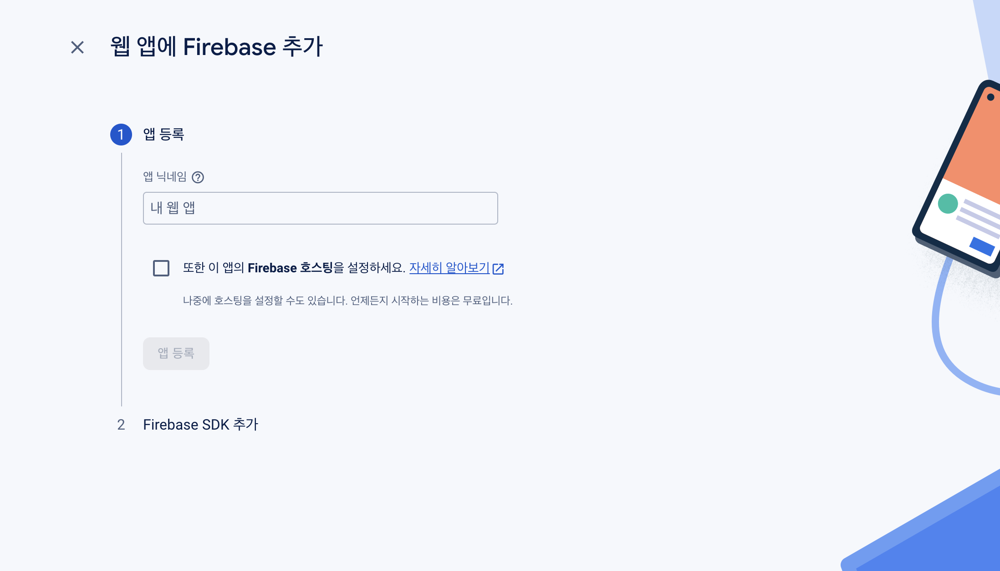

<br>

## ✍️ **T**oday **I** **L**earned

현재 운영중인 기술 블로그는 <a href="https://pages.github.com/" target="_blank">Github Pages</a>에서 공식적으로 지원하는 `Jekyll`을 사용하여 만들다가 현재는 `Gatsby`라는 프레임워크를 사용해서 기술 블로그를 운영하고 있다.

아무래도 정적 웹이트이다 보니 한계점이 많았지만 `Gatsby`에서 제공하는 플러그인을 통해 `Firebase`의 서버리스 서비스를 연동하고 조회수(View)를 노출시킨 과정을 경험을 간략히 정리하고 공유하기 위해 글을 남긴다.

<br>
<br>

### 1. Gatsby (정적 사이트 생성기)

---

우선 간략히 위에서 설명하였지만 `Gatsby`는 이미 꾸준히 많은 유저들이 사용 중인 검증된 <strong>정적 웹 사이트 생성(Static Site Generator)</strong> 프레임워크이다.

<br>


<center><strong>이미 많은 사용자를 보유중! 👍</strong></center><br>

아무래도 React를 기반하여 만들어진 프레임워크이다 보니 보다 익숙한 문법으로 빠르게 웹 사이트를 배포가 가능한 장점때문에 손이 많이 갈 수밖에 없다.

또한, 여러 플러그인들을 제공하기 때문에 손 쉽게 추가 기능들을 구현하기가 편리하다.

단점을 뽑아보자면.. 위에서 언급한 여러 플러그인들을 통한 확장성은 개발자의 손을 거쳐 만들어진다. <del>(즉, 개발자가 게으르면 기능 추가가 어렵다.)</del>

이번 포스팅 목적인 <strong>"게시글에 조회수 기능 구현"</strong>을 위해서 `Gatsby` 플러그인 중 <strong>gatsby-plugin-firebase</strong>를 사용하여 `Firebase`의 <strong>Realtime Database</strong> 서비스를 연동시켜보았는데, 이 과정 모두가 사용자의 손을 거쳐서 탄생할 수 밖에 없었다.

하지만 그럼에도 불구하고, 손 쉬운 문법과 다양한 플러그인으로 정적 웹 사이트 생성 프레임워크 중에서는 손에 꼽힐 프레임워크라 말할 수 있다.

<br>
<br>

### 2. Firebase (BaaS)

---

`Firebase`는 <strong>BaaS(Backend-as-a-Service)</strong> 플랫폼으로 개발자가 모바일 및 웹 애플리케이션을 쉽게 생성 및 실행할 수 있도록 도와주는 서비스이다.

<br>


<center><strong>양질의 서버리스 서비스들을 제공한다. 👍</strong></center><br>

기술 블로그에 사용된 기능은 실시간으로 데이터를 동기화하는 실시간 데이터베이스(Realtime Database)를 사용하였다.

물론 RDB와 웹 서버를 구현해볼까도 생각해보았지만, 필요한 기능의 범위(조회수 노출)가 굉장히 작았으며, 기술 블로그의 MAU또한 무료로 이용가능한 사용량이었기 때문에 `Firebase`의 실시간 데이터베이스(Realtime Database) 서비스를 이용해 보자 결정내렸다.

<br>
<br>

#### 2-1. Firebase Realtime Database 프로젝트 생성

---

우선 `Firebase` 콘솔의 Realtime Database 탭을 클릭하여 데이터 베이스를 만들어주었다.

다음으로 지역(Region) 설정과 보안 규칙을 설정해주었다.

<br>


<center>선택지가 많지 않다. <del>잘 모르니 미국 선택 🥲</del></center>

<br>


<center>우선 잠금모드로 생성 후 보안 규칙을 수정해주었다.</center>

<br>

DB 생성이 완료되면 아래와 같이 보안 규칙을 수정해주었다.

- 수정된 보안 규칙

  ``` json
  {
    "rules": {
      ".read": true,
      ".write": true,
    }
  }
  ```

<br>
<br>

#### 2-2. Firebase 프로젝트 생성

---

Realtime Database 생성이 완료되었다면, 프로젝트를 생성해준다.

<br>


<center>호스팅 여부는 나중에 선택해줘도 된다.</center>

<br>

간단하게 앱 닉네임을 작성해주면 아래와 같은 앱에 SDK를 추가하기 위한 정보를 확인해볼 수 있다.

- SDK 설정 및 구성

  ``` javascript
  // Import the functions you need from the SDKs you need
  import { initializeApp } from "firebase/app";
  // TODO: Add SDKs for Firebase products that you want to use
  // https://firebase.google.com/docs/web/setup#available-libraries

  // Your web app's Firebase configuration
  const firebaseConfig = {
    apiKey: "XXXX-XXX_XXXX_XX",
    authDomain: "blog-xxxxx.firebaseapp.com",
    databaseURL: "https://blog-xxxxx-default-rtdb.firebaseio.com",
    projectId: "blog-xxxxx",
    storageBucket: "blog-xxxxx.appspot.com",
    messagingSenderId: "000000",
    appId: "0:000000:web:xxxxxx"
  };

  // Initialize Firebase
  const app = initializeApp(firebaseConfig);
  ```

여기까지 준비를 마쳤다면 이제 `Gatsby`의 <strong>gatsby-plugin-firebase</strong> 플러그인을 사용하여 `Firebase` DB 서비스를 사용해주면 된다.

<br>
<br>

### 3. Gatsby 플러그인을 통한 Firebase 연동

---

우선 주의해야할 사항을 먼저 언급하고 시작하겠다. <del>버전 이슈때문에, 2시간 가까이 날려먹었다.</del>

> `Firebase`의 v9+ 이후부터는 모듈 방식이 개편되었다. (Firebase의 모듈 크기를 줄이고, 앱의 로딩 시간을 개선하기 위해 도입되었다 한다.) 

따라서, 다운로드 수가 가장 많은 <a href="https://www.gatsbyjs.com/plugins/gatsby-plugin-firebase/" target="_blank"><strong>gatsby-plugin-firebase</strong></a> 플러그인이 아닌 <a href="https://www.gatsbyjs.com/plugins/gatsby-plugin-firebase-v9.0/" target="_blank"><strong>gatsby-plugin-firebase-v9.0</strong></a>을 설치해주어야한다.

위 주의사항만 잘 체크하면 공식문서 대로 설치시 별 문제없이 동작한다.

현재 나는 `blog-template.js` 파일에 아래와 같은 코드로 `Firebase` 저장소를 사용하고 있다.

- blog-template.js

  ``` javascript
  import firebase from 'gatsby-plugin-firebase-v9.0';
  import { getDatabase, ref, set, get, child, update } from 'firebase/database';

  function BlogTemplate({ data }) {
    const [viewCount, setViewCount] = useState(0);

    // ...(생략))

    useEffect(() => {
      // DB에 사용될 key값 ('/' 문자를 제거한 블로그 포스트 문서명이다.)
      const key = curPost.slug.replace(/\//g, '');
      // Firebase 연동
      const database = getDatabase(firebase);
      const postRef = ref(database, 'posts/' + key);

      get(child(ref(database), `posts/${key}`))
        .then((snapshot) => {
          if (snapshot.exists()) {
            const currentViews = snapshot.val().views;

            if (process.env.NODE_ENV !== 'development') {
              const updatedViews = currentViews + 1;

              update(postRef, { views: updatedViews });
              setViewCount(updatedViews);
            } else {
              setViewCount(currentViews);
            }
          } else {
            if (process.env.NODE_ENV !== 'development') {
              // key 값이 존재하지 않으면 1으로 설정
              set(postRef, { views: 1 });
              setViewCount(1); // 상태 업데이트
            }
          }
        })
        .catch((error) => {
          // ...(생략)
        });
    }, [siteUrl, curPost.slug]);

    return (
      // ...(생략)
    );
  }
  ```

개발 환경과 실제 운영되고 있는 블로그 환경 각각 다르게 조회수 정책을 가진 단순한 기능을 쉽고 빠르게 구현할 수 있었다.

<br>
<br>

## 🤔 Understanding

조회수 노출시키기 위해 먼 길을 돌아왔다. 하지만, 이런 맛에 기술 블로그를 운영하는거라 생각한다.

서버리스 서비스 중 하나인 `Firebase` <strong>찍-먹</strong> 해보며 느낀점은 간단한 토이 프로젝트들은 이런 서비스들을 잘 활용해도 충분해보였다. (아쉬운점을 꼽자면, RDB인 PostgreSQL을 사용해보고 싶었지만 비용을 지불해야 사용가능했다. 🥲)

대중적인 서비스들은 앞으로 조금씩 사용해봐야겠다라는 생각이 들었다. 사내에서 기획한 서비스의 규모가 작은 경우 적재적소에 어떤 서비스를 사용해야 할 지 안목을 기르도록 다양한 경험을 이어나가보겠다.

<br>
<br>

