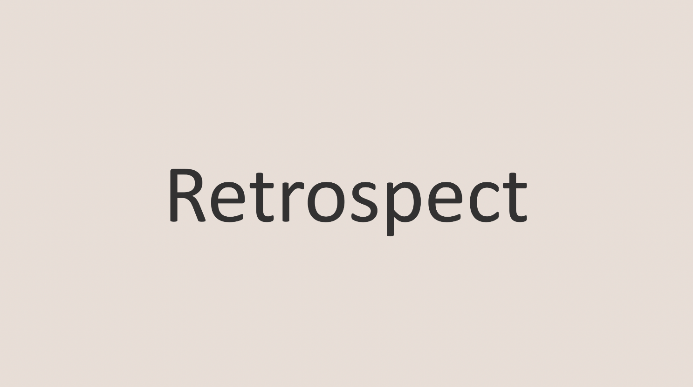

 

## 🤔 첫 이직 후 회고

개발자가 된 지 어느덧 3년이 넘었지지만, 지금의 회사로 이직한 지는 4개월이 조금 넘어 회고글을 남기게 되었다.

짧은 기간이지만 나는 이전 직장에서는 경험하지 못했던 많은 것들을 배우고 있다. 단순히 더 큰 트래픽, 더 복잡한 도메인, 더 많은 팀원이 있는 환경 때문만은 아니다. “개발자답게 일한다”는 것은 무엇인지, 그 문장이 실무에서는 어떤 의미를 갖는지 다시 이해하게 되었기 때문이다.

첫 직장에서 배울 수 없었던 것들을 지금의 팀에서 채워가고 있다.

 
 

### 1. 첫 번째 직장, "혼자 하는 개발"의 위험성을 배우다

---

나는 비전공자에서 개발자가 되었고, 개발자로써 첫번째 직장에서는 온라인 채용 서비스를 만들었었다. 재직하는 동안 몇 번 포스팅도 남긴적이 있다.

> [백엔드 개발자 첫 출근 후기](https://blog.jh8459.com/2022-04-01-RETROSPECT/) 
> [백엔드 개발자 2년차 회고](https://blog.jh8459.com/2024-04-01-RETROSPECT/)

전 직장에선 온라인 인적성 검사 같은 온라인 채용 서비스를 개발했었다.

  

개발자로 처음 일을 한다는 설렘도 있었지만, 지금 돌아보면 그보다 훨씬 큰 감정은 막막함이었다.

누군가에게 “이 설계가 맞는가?”, “이 코드를 이렇게 짜도 괜찮은가?”를 물어볼 대상이 없었다. 코드를 써내려가고 요구사항을 구현하는 것 자체는 가능했지만 그 코드가 왜 그렇게 되어야 하는지, 어떤 설계 원칙을 따를지는 오롯이 나 스스로 결정할 수 밖에 없었다.

개발은 결국 수많은 선택의 연속인데 선택의 기준을 알지 못한 채 혼자 판단해야 하는 일은 생각보다 훨씬 고단했다.

지금은 설계 방향이나 코드 구조에 대해 AI에게 물어보고, 잘못된 접근을 빠르게 되짚는 것도 가능하지만 그때는 내가 가진 경험과 검색 능력이 전부였다. 스택오버플로와 블로그 글을 뒤적이며 비슷한 사례를 찾아보는 것이 최선이었고 내가 하고 있는 방식이 옳은지 틀린지 검증해줄 도구도 사람도 없었다.

그래서 더 자주 멈췄고, 더 자주 돌아갔고, 더 자주 헤맸다. "혼자 성장해야 한다"는 부담감은 지금보다 훨씬 무겁게 느껴졌다.

지금 와서 돌아보면, 그 시절에 가장 부족했던 건 기술이 아니라 올바르게 선택할 수 있는 기준을 함께 고민해줄 환경이었다.

가장 힘든점을 꼽자면 "혼자"라는 점 이었다.

  

그러다 보니 당연하게도 코드 리뷰 문화가 없었다. 내가 합당한 방향으로 작성했는지, 위험한 로직은 없는지, 도메인 규칙을 오해한 것은 아닌지 어떤 피드백도 받을 수 없었다.

신입 개발자에게 코드 리뷰는 "검토"가 아니라 "학습"의 과정인데 그 배움을 얻을 수 없었던 건 지금 생각해도 너무 아쉬운 부분이다.

PR은 하루 일과 보고서처럼 작성되었으며, 이런 식의 PR은 먼 미래에 이력을 추적하거나 변경을 이해하기 어려웠다. (기능 단위, 도메인 단위로 정돈되지 않은 변경사항은 히스토리 파악을 거의 불가능하게 만든다.)

이 작은 차이가 장기적으로 얼마나 큰 생산성 손실을 만드는지 지금에 와서야 뼈저리게 깨달았다.

  

### 2. 그럼에도 불구하고 첫 직장에서 좋았던 점은?

---

이 외에도 기획 문서가 없다는 것도 큰 어려움이었다. 타 부서와 협업할 때마다 필요한 정보를 정리한 문서가 존재하지 않아, 이야기 형태로 전달되는 요구사항을 그 자리에서 스스로 해석해야 했다.

결국 내가 직접 기획 문서를 작성하고 정리한 내용을 다시 타 부서에 설명하며 협업을 주도할 수밖에 없었다. 지금 생각하면 이 과정은 개발 업무라기보다는 기획·프로덕트 매니징·커뮤니케이션을 모두 혼자 떠안는 작업에 가까웠다. 문서를 만드는 데에 너무 많은 시간이 들었고, 요구사항을 오해해 다시 정리해야 하는 일도 적지 않았다.

그런데 아이러니하게도, 이 경험이 지금의 나를 만들었다고 느낀다. 당시에는 힘들기만 했던 “요구사항을 스스로 정리하는 과정”이 어느 순간 내 사고방식을 완전히 바꾸어 놓았다.

> 덕분에 지금의 나는 단순히 기획 문서를 받아 개발하는 것이 아니라, 문제를 먼저 스스로 정의해보며 필요하다면 기획을 재구성하는 개발자로 성장했다 생각한다.

요구사항을 그대로 받는 데서 그치지 않고, 문제를 다시 정의하는 능력이 생겼다.

  

이전 회사에서는 생존을 위해 억지로 했던 행동이었지만, 현 직장에서는 그 능력이 오히려 강점이 되었다. 대충 전달된 요구사항을 그대로 구현하는 것이 아니라 문제의 본질을 먼저 이해하고, 불명확한 부분을 직접 정의하거나 더 나은 흐름으로 바꿔 제안할 수 있는 개발자가 된 것이다.

지금 와서 돌아보면, 그때의 혼란스러웠던 경험들이 결국 소통하는 방법, 문제를 정의하는 방법, 그리고 협업을 주도하는 방법을 스스로 터득하게 만든 시간이었다.

 
 

### 3. 두 번째 직장, "개발자답게 일한다"는 감각을 배우다

---

글을 쓰는 시점은 이직 후 4개월 정도 지났다.

짧은 시간이지만, 나는 여기서 개발자라는 직업의 본질을 다시 배우고 있다. 첫 회사에서 부족했던 부분들이 여기서는 모두 체계화된 문화와 프로세스로 자리 잡고 있었다.

 
 

### 3-1. 활발하고 건강한 코드 리뷰

---

현재 개발팀에서는 PR을 올리면 반드시 리뷰가 달린다. (브런치 규칙에 의해 하나 이상의 승인이 있어야한다.)

그것도 단순히 “네이밍 바꿔주세요” 수준의 피드백이 아니라,

- 이 로직은 도메인 규칙과 맞는지
- 예외 케이스는 누락되지 않았는지
- 유지보수성을 높이기 위한 더 나은 방법은 없는지
- 데이터 흐름이 일관성을 유지하는지

첫 PR은 머지되는 과정에서 55개의 리뷰가 달렸다.

  

이러한 기준을 바탕으로 서로의 코드를 세심하게 검토한다. 처음엔 리뷰가 부담스러웠지만, 지금은 리뷰가 가장 빠르게 성장하는 배움의 통로라는 걸 실감하고 있다.

또한, 기능 / 변경 의도 단위로 PR을 정리한다. 하루의 작업 내역을 일기처럼 적어 올리던 첫 회사와는 정반대였다. PR 제목과 커밋 내용을 보기만 해도 “왜 이 변경이 필요한지”, “무엇을 해결하려는지”를 이해할 수 있도록 컨벤션이 존재한다.

이 단순한 문화적 차이가 코드를 읽는 능력, 리뷰의 질, 히스토리 관리, 유지보수성에 얼마나 큰 영향을 주는지 몸으로 느끼고 있다.

 
 

### 3-2. 기획 단계의 정보가 명확하게 보인다

---

현 회사에서 기획은 Figma, Notion, Confluence로 구조화한다.

그냥 화면만 있는 것이 아니라,

- 도메인 정의
- 예외 케이스
- 흐름도
- 목적과 의도

이런 것들이 세심하게 정리되어 있다. 물론 처음부터 완벽할 순 없지만, 적어도 실시간으로 소통하며 기획안도 함께 발전되고 있음을 느끼고 있다.

이러한 잦은 소통 덕분에 개발자는 기획을 수동적으로 받는 존재가 아니라, 기획의 의도를 판단하고 기술적 관점에서 피드백할 수 있는 주체가 된다.

 
 

### 4. 배운 것: 실무 적응을 가르는 다섯 가지 능력

---

이 두 회사의 경험을 비교하며 나는 개발자가 실무에 적응하는 데 필요한 "지표"를 좀 더 명확하게 이해하게 되었다.

 
 

1. **혼자 하지 말 것 — 학습은 피드백의 속도로 결정된다**

    혼자 개발해도 코드를 완성할 수는 있다. 하지만 “제대로 된 코드”를 만들기 위해서는 반드시 피드백이 필요하다.
    초기에는 그것이 반드시 사수여야 한다고 생각했지만, 지금은 조금 다르게 생각한다.

    한 명의 사수가 모든 문제를 해결해줄 수 있는 시대도 이미 지났다. 오히려 다양한 배경과 경험을 가진 사람들이 코드를 바라보고 의견을 주고받을 때, 개발자는 훨씬 빠르게 성장할 수 있다 생각한다.

2. **문제를 정의하는 능력을 키우기**

    기획이 명확하면 개발은 빠르지만, 실무에서 그런 기획은 드물다. 그래서 요구사항을 스스로 해석하고, 문제를 다시 정의할 줄 아는 능력이 필요하다.

    “무엇을 만들 것인가”보다 “왜 만들고 무엇을 해결하려는가”를 묻는 사람이 더 빠르게 성장한다.

3. **흐름을 이해하는 능력**

    코드는 전체 시스템의 작은 조각일 뿐이다. 도메인, 비즈니스 흐름, 데이터 이동 경로를 이해하는 순간 버그의 원인도, 최적의 설계 방향도 훨씬 선명하게 보이기 시작한다.

    부분이 아니라 전체를 보는 시야가 실무형 개발자를 만든다.

4. **일관성과 기록의 힘**

    좋은 PR, 분명한 커밋 메시지, 정리된 문서는 지금의 나뿐 아니라 미래의 우리를 위한 투자다.

    일관된 기록은 히스토리를 명확하게 만들고, 유지보수를 쉽게 만든다. 이는 곧, 팀의 생산성을 높이는 가장 간단한 방법이다.

5. **협업은 기술만큼 중요한 능력**

    현직장에서 가장 크게 느낀 점은, 개발자에게 필요한 것은 기술뿐만이 아니라는 사실이다.

    기획·디자인·운영과의 협업에서 중요한 것은 맥락을 이해하고 명확하게 소통하는 능력이다. 문제를 설명하고 이해관계를 조율하는 힘이 있을 때, 기술은 비로소 효과적으로 활용된다.

 
 

## 🤔 Understanding

입사 후 3개월은 단순히 새로운 환경에 적응하는 시간을 넘어, 그동안 놓치고 있던 개발 프로세스와 협업 방식을 다시 점검하는 기간이었다.

첫 회사에서는 리뷰 문화가 부재했고, 기획 문서나 협업 구조도 체계적이지 않았다. 그 환경에서는 코드의 품질을 객관적으로 판단하기 어렵고, 개발 프로세스 자체를 스스로 정의해야 하는 상황이 반복됐다. 결과적으로 기능은 만들 수 있었지만, 더 나은 구조나 협업 방식에 대해 고민할 여지는 적었다.

반면, 현 직장에서는 이러한 부분이 정반대의 방식으로 진행되고 있다. 리뷰를 통해 코드를 여러 시각에서 검토받고, 정리된 기획 문서를 기반으로 문제를 해석하고, PR과 문서화 과정에서 변경 의도를 명확하게 설명하는 것이 기본 흐름이다. 이 과정에서 자연스럽게 설계 기준, 도메인 이해, 시스템 흐름 등을 다시 익히게 되었다.

3개월 동안의 경험은 단순히 새로운 도구나 기술을 배우는 것이 아니라, **"개발자로서 일을 어떻게 해야 하는가"** 라는 기준을 다시 세우는 과정에 가까웠다.

문제를 정의하는 방식, 리뷰를 활용하는 방식, 협업 과정에서 고려해야 할 요소 등 실무에서 반복적으로 필요한 기본기를 다시 정비할 수 있었다.

이 글은 단순한 이직한 회사에 대한 후기라기보다는 개발자로서 현재 어떤 기준을 갖고 일하고 있는지 그리고 앞으로 어떤 방식으로 성장해야 하는지를 스스로 정리해본 기록이다.

 
 